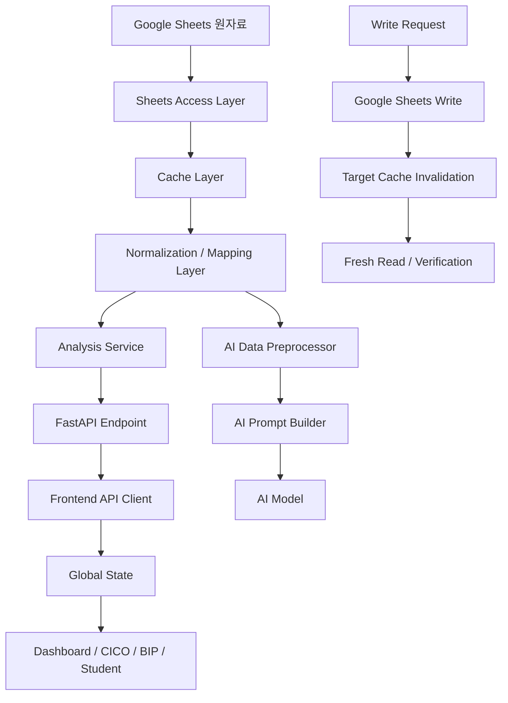
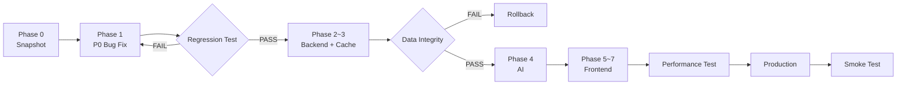

Antigravity 2.0 + Gemini 3.7 Flash High 최종 MASTER PROMPT
아래부터는 그대로 메모장에 저장해서 Antigravity에 주는 최종본으로 작성합니다.
======================================================================
PBSTeam 2.0 — MASTER IMPLEMENTATION DIRECTIVE
Antigravity 2.0 + Gemini 3.7 Flash High
======================================================================

PROJECT
PBSTeam / 특수학교 학교차원 긍정적행동지원(PBST/PBIS) 통합 의사결정 플랫폼

PRIMARY GOAL
현재 PBSTeam의 핵심 데이터와 기능을 보존하면서 런타임 오류, 성능 병목,
보안 취약점, 중복 분석로직, 하드코딩, 대형 단일 컴포넌트 구조를 제거한다.

최종 제품은 단순 Dashboard가 아니라 아래의 의사결정 흐름을 지원해야 한다.

학생 관찰
→ 데이터 정규화
→ 패턴 확인
→ FBA 기능 가설
→ 경기 Be-Able EBP 후보
→ 교사/팀 선택
→ Visual BIP
→ 실행
→ 실행충실도
→ 결과 검토
→ 유지·수정·추가평가 결정


======================================================================
0. NON-NEGOTIABLE DATA PROTECTION RULE
======================================================================

다음 7개 Sheet의 원자료와 컬럼 구조를 절대 변경·삭제·재작성하지 않는다.

1. Log_Main
2. TierStatus
3. 3월
4. 4월
5. 5월
6. 6월
7. 7월

금지:
- 컬럼 이름 변경
- 컬럼 순서 변경
- 기존 데이터 이동
- 기존 데이터 삭제
- schema migration
- 자동 header 수정
- 자동 Sheet 재생성
- 보호 Sheet가 없을 때 새 Sheet 생성
- "복구" 명목의 원본 쓰기

읽기 Adapter를 사용하여 차이를 흡수한다.

작업 전:
각 보호 Sheet에 대해
- sheet title
- header list
- row count
- column count
- header hash
를 snapshot으로 저장한다.

작업 후 동일 값인지 regression test한다.

하나라도 바뀌면 배포 실패로 처리한다.


======================================================================
1. CURRENT STACK — PRESERVE
======================================================================

Frontend:
- Next.js 14
- React 18
- TypeScript
- Recharts
- Axios

Backend:
- FastAPI
- Python
- Pydantic v2
- Google Sheets / gspread

현재 Framework를 전면 교체하지 않는다.

필요한 경우 작은 dependency 추가는 허용한다.

목표:
REUSE > REFACTOR > REPLACE

무조건 Rewrite하지 않는다.


======================================================================
2. EXISTING ASSETS TO REUSE
======================================================================

가능한 한 다음 자산을 유지한다.

backend/app/services/normalize.py
- 시간대 파싱
- 과정별 시간구간
- 장소 정규화
- 기능 정규화
- 행동유형 정규화
- 발생횟수 파싱

backend/app/services/evidence_packet.py
- Python deterministic computation
- compact evidence packet
- LLM에는 이미 계산된 사실 전달

CICO
- batch update
- debounce 저장
- 월별 입력구조

기존 Google Sheets 연결

Local LLM / Gemini Provider 구조

Behavior 입력 흐름

유용한 차트 컴포넌트


======================================================================
3. KNOWN P0 DEFECTS — FIX BEFORE FEATURE DEVELOPMENT
======================================================================

P0-01 BIP API
backend/app/api/endpoints/bip.py가 존재하지 않는
fetch_bip_by_code를 호출하는 문제를 제거한다.
실제 repository 함수와 interface를 통일한다.

P0-02 Tier2 toggle
toggle_tier2_status 내부의 undefined client 사용을 제거한다.

P0-03 Tier update type mismatch
endpoint가 string tier를 전달하지만
service는 5개 O/X dict를 기대하는 불일치를 제거한다.

P0-04 Authentication
현재 plaintext password comparison을 제거한다.

P0-05 Frontend localStorage authentication
사용자 객체를 localStorage에 저장한 것을 인증 근거로 사용하지 않는다.

P0-06 Frontend-only authorization
학생 데이터를 Browser로 가져온 뒤 권한을 검사하지 않는다.
Backend에서 먼저 접근권한을 확인한다.

P0-07 CORS
Production allow_origins=["*"] 금지.
허용 Origin allowlist 사용.

P0-08 Fake TierStatus fallback
API 장애 시 하드코딩 학생 210명 명단을 생성하지 않는다.
DATA_UNAVAILABLE 오류를 명시적으로 표시한다.

P0-09 Automatic Tier classification
analytics 코드의
count/intensity 기반 Tier2/Tier3 자동 판정을 제거한다.

TierStatus가 Tier의 Single Source of Truth다.

분석 시스템은:
"TIER 변경"
이 아니라
"지원단계 검토 신호"
만 만든다.

P0-10 Hardcoded BIP hypothesis
데이터가 없을 때
신체적공격, 과제회피, 급식/전이 등의 가설을 자동 삽입하지 않는다.

데이터가 없으면:
INSUFFICIENT_DATA

P0-11 Regex AI parsing
긴 AI 텍스트를 Regex로 1~8 BIP 필드에 나누는 방식을 제거한다.

AI Output:
JSON Schema
→ Pydantic validation
→ API
→ typed UI

P0-12 Log_Main auto creation
Log_Main을 찾지 못하면 자동 생성하지 않는다.

CRITICAL_DATA_CONTRACT_ERROR를 발생시킨다.


======================================================================
4. SECURITY ARCHITECTURE
======================================================================

Authentication을 Backend 중심으로 재설계한다.

PBST2_Users 또는 기존 Users에서:

ID
PasswordHash
Role
ClassID
Name
Active

비밀번호는 Argon2id 또는 동급의 password hash를 사용한다.

로그인 성공 시:
- HttpOnly
- Secure in production
- SameSite
설정된 signed session/JWT cookie를 사용한다.

Frontend localStorage는 인증 근거로 사용하지 않는다.

Backend dependencies:

get_current_user()
require_admin()
require_teacher_or_admin()
require_student_access(student_code)

권한:
ADMIN
- 전교 데이터
- 학생/계정 관리
- 정책 설정

TEACHER
- 배정 학급 또는 명시적으로 승인된 학생
- 필요한 범위의 데이터만

모든 보호되는 endpoint는 Backend authorization을 거친다.

로그에:
- 학생 실명
- 자유서술 행동내용
- 건강정보
를 기본적으로 기록하지 않는다.


======================================================================
5. CANONICAL IDENTIFIERS
======================================================================

학생 Primary Key:
student_code

금지:
학생 이름을 route primary key로 사용

기존:
/student/{studentName}

신규:
/students/{studentCode}

display_name은 화면 표시용이다.

Log 사건 Primary Key:
Log_ID가 있으면 Log_ID 사용.
없으면 deterministic synthetic event id를 생성하되
원자료에는 쓰지 않는다.


======================================================================
6. CANONICAL FUNCTION TAXONOMY
======================================================================

내부 FunctionCode는 다음으로 통일한다.

ATTENTION
TANGIBLE_ACTIVITY
ESCAPE_DEMAND
AUTOMATIC_SENSORY
DISCOMFORT_RELIEF
MULTIPLE
UNKNOWN

현재 analysis.py와 normalize.py 등의 중복 function normalizer를 제거하여
하나의 canonical normalizer만 사용한다.

GO_HOME / 귀가요구 등은 기능 코드가 아니다.
요구 결과 또는 context/outcome tag로 저장한다.

동일 행동이 상황별로 서로 다른 기능을 가질 수 있게 한다.

지원 유형:

1. 단일행동-단일기능
2. 단일행동-상황별다른기능
3. 단일행동-동시복합적기능
4. 여러행동-같은기능
5. 여러행동-서로다른기능


======================================================================
7. FUNCTION ESTIMATE ≠ FUNCTION HYPOTHESIS
======================================================================

Google Form의 "기능" 입력은:
teacher_function_estimate

이며 정식 FBA 결과로 취급하지 않는다.

FunctionHypothesis는 다음을 포함해야 한다.

- target_behavior
- setting_event
- antecedent_condition
- consequence_pattern
- function_code
- hypothesis_statement
- evidence_for
- evidence_against
- data_sufficiency
- status

status:
PROPOSED
NEEDS_MORE_DATA
TEACHER_CONFIRMED
TEAM_CONFIRMED
REJECTED

가설에 가짜 probability를 붙이지 않는다.

금지:
"회피 기능 87%"

허용:
"11건의 완성 ABC 중 7건에서
과제 제시→표적행동→과제 지연/중단 패턴이 관찰됨"


======================================================================
8. EVIDENCE-FIRST RULE
======================================================================

모든 분석결과는 EvidenceRef로 원자료로 돌아갈 수 있어야 한다.

EvidenceRef:

source_type
source_id
log_id
event_date
label
excerpt

AI가 작성하는 모든 주요 주장에는
matched evidence가 있어야 한다.

근거 없는 주장은:

"해당 데이터 없음"

또는

"추가 확인 필요"

로 표시한다.


======================================================================
9. DETERMINISTIC ANALYTICS FIRST
======================================================================

LLM에게 아래를 계산시키지 않는다.

- 건수
- 비율
- 평균
- 증감
- 분모
- 최대/최소
- 상위 빈도
- 기간 비교
- CICO 성공률
- 데이터 누락
- 시간대/장소 분포

모두 Python에서 계산한다.

Pipeline:

Google Sheets
→ Adapter
→ Canonical Models
→ deterministic analytics
→ Evidence Packet
→ LLM interpretation

LLM의 역할:
- 설명
- 가설 후보 정리
- EBP 후보의 이유 설명
- 실행안 초안
- 회의안건 초안

LLM의 역할이 아닌 것:
- 임의 수치 계산
- Tier 결정
- 진단
- 약물조정
- 최종 BIP 승인


======================================================================
10. DATA QUALITY RULES
======================================================================

n < 5:
해석하지 않고 표본 부족으로 표시한다.

기간 비교:
관찰시간 또는 기회수가 없는 경우
행동 "rate"로 표현하지 않는다.

예:
"기록건수가 증가함"

가능

"행동발생률이 40% 증가함"

관찰기회가 없으면 금지.

"에피소드 행 수"와
"발생횟수 합계"를 혼용하지 않는다.

모든 분석 응답에 데이터 한계를 명시한다.


======================================================================
11. 경기 Be-Able 39 EBP — CANONICAL CATALOG
======================================================================

Core EBP는 정확히 다음 39개다.

01 FBA 기능적행동평가
02 ME 의학적평가
03 EXM 운동중재
04 ASI 감각통합
05 ABI-EM 환경조정
06 ABI-EE 환경풍부화
07 ABI-CM 선택권제공
08 ABI-TM 과제조정
09 VS 시각적지원
10 SN 사회적이야기
11 MMI 음악매개중재
12 BMI 행동모멘텀중재
13 R-NCR 비유관강화

14 PP 촉구
15 PP-EL 무오류학습
16 TD 시간지연
17 MD 모델링
18 VM 비디오모델링
19 DTT 개별시도교수
20 DI 직접교수
21 TA 과제분석
22 TAII 기술보조교수중재
23 NI 자연주의중재
24 FCT 기능적의사소통훈련
25 AAC 보완대체의사소통
26 SST 사회적기술훈련
27 CBIS 인지행동중재
28 SM 자기관리
29 PBII 또래매개교수
30 PII 부모실행중재

31 R-PP 프리맥원리
32 R-TE 토큰경제
33 R-BC 행동계약
34 R-GR 집단강화
35 R-DG 만족지연훈련
36 DR-A 대체행동차별강화
37 DR-O 타행동차별강화
38 EXT 소거
39 RIRD 반응차단 및 재지시

ebp_catalog.json을 canonical source로 사용한다.

AI가 임의의 신규 전략을
"경기 Be-Able EBP"
라고 만들어내지 못하게 한다.

다른 지원아이디어가 필요하면:
SUPPLEMENTAL_SUPPORT
로 별도 표시한다.


======================================================================
12. EBP RECOMMENDATION ENGINE
======================================================================

EBP Recommendation은 LLM 단독 추천이 아니다.

먼저 deterministic filter/ranker를 사용한다.

입력:
- function hypothesis
- antecedent/context
- learner accessibility
- existing supports
- data sufficiency
- implementation feasibility
- prerequisites

내부 ranking variables:

Function fit       0~4
Context fit        0~3
Learner fit        0~3
Existing fit       0~2
Feasibility        0~2
Data sufficiency   0~2

그러나 이 합산점수를 사용자에게
"적합도 87%"
처럼 보여주지 않는다.

사용자 출력:

우선 검토
함께 고려
조건부
현재 추천하지 않음

Guardrail violation:
EXCLUDE

Prerequisite 부족:
CONDITIONAL

모든 추천에는 reasons와 matched_evidence를 포함한다.


======================================================================
13. EBP BUNDLE RULE
======================================================================

중재 추천의 기본 단위는 단일 전략이 아니라 가능한 경우 Bundle이다.

ASSESS
+
PREVENT
+
TEACH
+
REINFORCE
+
MONITOR

예: ESCAPE_DEMAND

ASSESS
FBA

PREVENT
ABI-TM
ABI-CM

TEACH
FCT
필요 시 AAC

REINFORCE
DR-A

MONITOR
표적행동
독립 요청
과제참여
실행충실도

모든 Bundle이 다섯 요소를 억지로 채울 필요는 없지만
"교수 없는 감소전략"은 경고한다.


======================================================================
14. HIGH-RISK EBP GUARDRAILS
======================================================================

EXT와 RIRD는 일반 추천 카드처럼 자동 채택시키지 않는다.

EXT:
- 충분한 기능근거
- 대체행동
- 안전계획
- 실행 팀
필수

EXT 단독 추천 금지.

RIRD:
- 실제 학습방해 확인
- 무해한 자기조절행동 제외
- 최소침습
- 성공 가능한 재지시
필수

무해한 stereotypy/stimming을
단지 "정상적이지 않다"는 이유로 감소시키지 않는다.


======================================================================
15. BIP ARCHITECTURE
======================================================================

BIP는 긴 자유서술 text area가 아니다.

Visual BIP Builder를 구축한다.

Steps:

1 학생
2 표적행동
3 기능가설
4 예방
5 교수
6 강화
7 위기/반응
8 평가

StrategyImplementation:

implementation_id
ebp_code
context
teacher_action
expected_student_response
prompt_plan
functional_outcome
reinforcement_plan
return_plan
measurement
fidelity_items
owner

BIP 핵심:

"누가"
"언제"
"무엇을"
"어떻게"
"학생이 무엇을 하면"
"어떤 결과를"
"어떻게 측정할지"

가 명확해야 한다.


======================================================================
16. BIP CONSISTENCY CHECKER
======================================================================

BIP 저장 또는 활성화 전 자동검사를 실시한다.

검사:

1 기능가설 ↔ 예방전략
2 기능가설 ↔ 대체행동
3 대체행동 ↔ 강화결과
4 측정 가능한 목표
5 monitoring plan 존재
6 fidelity plan 존재
7 고위험전략 guardrail
8 AAC 접근권 보장
9 학생에게 과도한 요구 여부
10 학습목표 접근성

출력:

PASS
WARNING
BLOCK

BLOCK 예:
EXT 단독
동일 기능이 아닌 대체행동
Monitoring 없음
학생 접근수단 없음


======================================================================
17. CICO ADAPTER
======================================================================

3월과 4~7월의 Schema가 동일하다고 가정하지 않는다.

Header-based adapter를 사용한다.

예:

학생명(코드)
학생코드
학생명

등을 canonical:
student_code
display_name

으로 mapping.

입력 기준
입력 기준(베이스라인)

→ baseline_rule

날짜 또는 회차 column
→ CicoObservation[]

고정 column index를 사용하지 않는다.


======================================================================
18. DECISION ENGINE
======================================================================

자동 Tier 변경 엔진을 만들지 않는다.

DecisionSignal만 만든다.

Signal types:

SAFETY
REVIEW_DUE
CHANGE_UP
GOAL_STALLED
MORE_DATA
FIDELITY_LOW
MEETING_ACTION
DATA_MISSING

예:

{
  signal_type: "MORE_DATA",
  severity: "REVIEW",
  student_code: "...",
  reason: "...",
  evidence: [...],
  recommended_next_action: "ABC 관찰 3회 추가"
}

TeacherDecision은 별도다.

결정 기록:

decision
rationale
evidence_snapshot
owner
due_date
next_review_date
decided_by
decided_at

시스템 추천과 인간 결정의 audit trail을 보존한다.


======================================================================
19. PEER INTERACTION ANALYSIS
======================================================================

현재 contagion.py의
학생 이름 언급 → 행동 전염 Source/Reactor
인과추론을 제거한다.

새 이름:
interaction_signals.py

허용 출력:
- 동일 시간대 공동발생
- 같은 학급 동시사건
- 자유서술 내 또래 자극 언급
- 추가관찰 필요

금지:
충분한 근거 없이
"학생 A가 학생 B의 행동을 전염시켰다"
라고 표현.


======================================================================
20. FRONTEND INFORMATION ARCHITECTURE
======================================================================

Global navigation:

오늘
학교
학생
CICO
행동·FBA
BIP
EBP
회의
위기

/:
redirect /today

/today
학교 행동지원 Action Center

/school
전교 수준 Big5 및 Tier 운영

/students
학생 지원목록

/students/{studentCode}
Student 360

/students/{studentCode}/fba
Visual FBA

/students/{studentCode}/cico
CICO detail

/students/{studentCode}/bip
Visual BIP

/students/{studentCode}/review
Data-based Review

/ebp
39 EBP Library

/meetings
Agenda → Decision → Minutes

/crisis
안전후속·위기 기록

/admin
계정·정책·설정


======================================================================
21. /TODAY UI
======================================================================

목적:
통계 Dashboard가 아니라
"오늘 처리할 행동지원 업무"

상단:
학생검색
빠른 행동기록

Action summary:
긴급
검토
데이터 부족
CICO 미입력

Action Inbox:
Signal cards

각 Card:
severity
학생
근거
변화
현재지원
next action

Button:
근거보기
학생검토

금지:
문제학생 TOP10
위험학생 Ranking
학생 낙인성 표현


======================================================================
22. VISUAL FBA
======================================================================

화면 순서:

표적행동
→ Baseline
→ 패턴
→ ABC
→ 기능가설
→ 자료 충분도
→ EBP 후보

탭:

패턴
ABC
기능가설
자료품질

필수 시각화:
- 시간 × 장소 heatmap
- ABC flow
- 조건별 행동분포
- 기능가설 Evidence Drawer

FunctionHypothesis는 여러 개 허용한다.

하나의 행동에 상황별 다른 기능이 있어도 된다.

Data Sufficiency:
direct observation n
unique days
unique contexts
ABC complete n
contradictory evidence

"확률"로 표시하지 않는다.


======================================================================
23. EBP LIBRARY UI
======================================================================

/ebp

Filter:
범주
기능
상황
실행부담

검색:
교사가 자연어로 상황을 입력할 수 있다.

카드:
그림/아이콘
전략명
코드
범주
한 문장
추천수준

Detail:
한 문장으로 이해하기
언제 쓰나요
3단계 실행
교실 적용
왜 효과적인가
놓치지 마세요
현재 학생과의 매칭
권장측정
실행부담

최대 3개 전략 비교 기능 제공.


======================================================================
24. VISUAL BIP UI
======================================================================

4-column core:

PREVENT
TEACH
REINFORCE
RESPOND

각 EBP를 Card로 배치한다.

예:

PREVENT
ABI-TM
ABI-CM

TEACH
FCT
AAC

REINFORCE
DR-A

RESPOND
필요한 경우만

하단:
Plan consistency checker
Monitoring
Fidelity
Review date

Visual flow 자동생성:

힘든 상황
↓
PREVENT
↓
TEACH
↓
REINFORCE
↓
RETURN/GENERALIZE


======================================================================
25. IMPLEMENTATION FIDELITY
======================================================================

BIP의 효과가 낮을 때
곧바로 "전략 실패"라고 하지 않는다.

먼저:
실행충실도 확인

PBST2_Fidelity:

StudentCode
PlanID
Date
StrategyCode
Item
Status
Note
Recorder

Status:
O
PARTIAL
X
NOT_OBSERVED

Review 화면에서:

Outcome
×
Fidelity

를 함께 보여준다.

예:

Outcome ↓ / Fidelity ↓
→ 실행지원 먼저

Outcome ↓ / Fidelity ↑
→ 기능가설 또는 전략 재검토


======================================================================
26. AI ARCHITECTURE
======================================================================

현재 여러 페이지의 개별 AI 버튼 로직을
통합 AI Engine으로 이동한다.

ai/

providers/
  local.py
  gemini.py

context.py
privacy.py
schemas.py

prompts/
  system.py
  school.py
  student.py
  fba.py
  bip.py
  meeting.py

engine.py

각 AI 기능은 Structured Output을 사용한다.

예:

FBAInterpretation
EBPRecommendation[]
BIPDraft
MeetingBrief

Pydantic validation 실패:
자동으로 UI에 미검증 텍스트를 표시하지 않는다.

retry 또는
AI_VALIDATION_ERROR.


======================================================================
27. AI CLINICAL/EDUCATIONAL RULES
======================================================================

AI는 다음 원칙을 따른다.

- 행동은 학생의 성격이 아니라 상황과 학습이력의 함수로 기술한다.
- 표적행동은 관찰·측정 가능한 형태로 쓴다.
- 교사의 추정기능은 확정기능으로 표현하지 않는다.
- 기능 가설에는 반대근거도 표시한다.
- 동일 기능의 대체행동을 우선한다.
- 학생 의사소통 권리를 보장한다.
- 안전과 교육권을 함께 고려한다.
- 벌 중심 계획을 기본값으로 하지 않는다.
- 소거 단독을 추천하지 않는다.
- 감각차단을 기본 전략으로 추천하지 않는다.
- 의학적 진단을 생성하지 않는다.
- 약물을 시작·중단·변경하라고 제안하지 않는다.
- 가정환경을 단정적 원인으로 해석하지 않는다.


======================================================================
28. MEDICAL INFORMATION
======================================================================

BIP 기본 Context에서
구체적인 약물명·용량을 AI에 전송하지 않는다.

기본 필드:

최근 건강·수면·통증·복약 변화
없음 / 있음 / 미상

교육 중 관찰된 변화

필요 시 권한 있는 사용자와 명시적인 목적에 한해
최소범위만 처리한다.


======================================================================
29. NEW STORAGE
======================================================================

보호 Sheet 이외에 새 Sheet/Store 생성 가능.

PBST2_StudentProfile

StudentCode
CommunicationModes
Preferences
PreferredSupports
ChallengeContexts
EarlySigns
Accessibility
UpdatedAt
UpdatedBy


PBST2_BIPPlans

PlanID
StudentCode
Version
Status

TargetBehaviorJSON
BaselineJSON
HypothesesJSON
SelectedEBPsJSON
StrategyPlanJSON
MonitoringJSON
FidelityJSON

CreatedBy
ApprovedBy
CreatedAt
UpdatedAt


PBST2_Decisions

DecisionID
SignalID
StudentCode
Date
SystemSignal
EvidenceSnapshot
TeacherDecision
Reason
Owner
DueDate
NextReview
DecidedBy


PBST2_Fidelity

FidelityID
StudentCode
PlanID
Date
StrategyCode
Item
Status
Note
Recorder


PBST2_Meetings

MeetingID
Date
AgendaJSON
DecisionIDs
Summary
CreatedBy


PBST2_Config

decision_signal_rules
review_periods
school_protocol
roles
feature_flags


39 EBP 지식베이스는 Google Sheet보다
version-controlled JSON을 우선한다.

backend/app/data/ebp_catalog.json


======================================================================
30. BACKEND TARGET STRUCTURE
======================================================================

backend/app/

api/
  v1/       legacy compatibility
  v2/
    auth.py
    today.py
    school.py
    students.py
    behaviors.py
    fba.py
    cico.py
    ebp.py
    bip.py
    decisions.py
    meetings.py
    crisis.py

core/
  config.py
  security.py
  auth.py
  cache.py
  logging.py

domain/
  models.py
  normalization/

adapters/
  sheets/
    client.py
    log_main.py
    tier_status.py
    cico.py

repositories/
  student.py
  behavior.py
  cico.py
  bip.py
  meeting.py

services/
  analytics/
  fba/
  ebp/
  decision/
  bip/
  ai/

tests/


======================================================================
31. FRONTEND TARGET STRUCTURE
======================================================================

frontend/src/

app/
  today/
  school/
  students/
    [studentCode]/
      fba/
      cico/
      bip/
      review/
  cico/
  ebp/
  meetings/
  crisis/
  admin/

features/
  today/
  student/
  behavior/
  fba/
  cico/
  ebp/
  bip/
  review/
  meetings/
  crisis/

components/
  ui/
  charts/
  evidence/
  feedback/

lib/
  api/
  auth/

types/
  domain.ts


======================================================================
32. DESIGN SYSTEM
======================================================================

기본 UI는 특수학교 교사가 빠르게 사용할 수 있어야 한다.

원칙:
- 흰 카드
- 짙은 테두리
- 둥근 모서리
- 충분한 간격
- 큰 터치 영역
- 명확한 상태
- 모바일/태블릿/전자칠판 반응형

색만으로 정보를 전달하지 않는다.

상태:
icon + text + color

행동지원 화면에서 과도한 경고색 사용을 피한다.

Red는 실제 safety/urgent 수준에 제한한다.


======================================================================
33. PERFORMANCE
======================================================================

Google Sheets read를 요청마다 반복하지 않는다.

Repository + Cache layer를 사용한다.

Cache key 예:

behavior_logs:{version}
tier_status:{version}
cico:{month}:{version}
student_workspace:{studentCode}:{version}

write 성공 후 관련 cache만 invalidate한다.

금지:
모든 write 후 전체 cache clear

동일 요청 안에서:
open_by_url
worksheets
get_all_records
를 중복 호출하지 않는다.

성능 변경 전 baseline을 저장한다.

perf_baseline.json

비교:
cold
warm
p50
p95
Google API call count

목표:
기존 대비 warm read path를 대폭 단축하고
가능한 endpoint에서 10x 수준의 Google API 호출/중복연산 감소를 목표로 한다.

성능 때문에 정확성이나 데이터 최신성을 희생하지 않는다.


======================================================================
34. LEGACY MIGRATION
======================================================================

V1 API를 즉시 삭제하지 않는다.

V2를 구축한 뒤
Legacy UI를 순차 이전한다.

Migration 순서:

Phase 0
Recovery + protected data snapshot

Phase 1
Security + P0 runtime bugs

Phase 2
Canonical models + adapters

Phase 3
Deterministic analytics

Phase 4
EBP catalog

Phase 5
EBP matching + guardrails

Phase 6
Decision signal engine

Phase 7
API v2

Phase 8
Design system + app shell

Phase 9
Today + School

Phase 10
Student 360 + Visual FBA

Phase 11
CICO 2.0

Phase 12
EBP Library

Phase 13
Visual BIP

Phase 14
Review + Fidelity

Phase 15
Meeting + Crisis

Phase 16
Unified AI

Phase 17
Performance

Phase 18
Legacy cleanup

Phase 19
Regression + production


======================================================================
35. PHASE GATE
======================================================================

각 Phase는 반드시 아래를 통과해야 다음 단계로 간다.

Backend:
pytest

Frontend:
npm run lint
npm run build

필요 시:
type check

Data:
protected sheet contract test

Security:
authorization tests

API:
schema tests

실패한 상태로 다음 Phase를 계속 쌓지 않는다.


======================================================================
36. TEST FIXTURES
======================================================================

실제 학생 실명과 실제 사건 내용을
test fixture에 하드코딩하지 않는다.

Synthetic students:

STU_A
STU_B
STU_C

등을 사용한다.

필수 시나리오:

A.
과제회피 기능가설
→ ABI-TM + FCT + DR-A

B.
불명확한 기능
→ FBA / MORE_DATA
→ 전략 확정 금지

C.
급격한 변화 + 건강 관련 관찰
→ ME 검토
→ 의료진단 생성 금지

D.
AAC 사용자
→ AAC 제거 또는 접근제한 전략 금지

E.
자동강화 반복행동
→ 무해한 자기조절이면 RIRD 제외

F.
EXT 요청
→ FBA/대체행동/안전 요건 없으면 BLOCK


======================================================================
37. REQUIRED REGRESSION TESTS
======================================================================

1 보호 Sheet headers unchanged
2 보호 Sheet row count unchanged
3 보호 Sheet column count unchanged

4 3월 CICO adapter
5 4월 CICO adapter
6 5월 CICO adapter
7 6월 CICO adapter
8 7월 CICO adapter

9 TierStatus → TierSnapshot mapping

10 Log_Main → BehaviorEvent mapping

11 teacher function estimate ≠ FBA hypothesis

12 no auto Tier mutation

13 no fake fallback students

14 no hardcoded student-specific AI hypothesis

15 no plaintext password

16 unauthorized teacher cannot fetch other class student's data

17 Frontend route uses studentCode

18 AI structured output validation

19 unsupported EBP code rejected

20 EXT guardrail

21 RIRD guardrail

22 EvidenceRef can navigate to supporting record

23 n<5 data sufficiency warning

24 outcome + fidelity review logic

25 protected sheet write prohibition


======================================================================
38. ACCEPTANCE CRITERIA — PRODUCT
======================================================================

제품 완료는 "화면이 뜬다"가 아니다.

완료 조건:

1 교사가 Today에서 오늘의 행동지원 업무를 확인할 수 있다.

2 학생 360에서 행동·CICO·Tier·BIP·의사결정 이력을 확인할 수 있다.

3 Visual FBA에서 ABC 근거와 반대근거를 볼 수 있다.

4 기능가설을 AI가 자동 확정하지 않는다.

5 경기 Be-Able 39 EBP에서 근거기반 후보를 볼 수 있다.

6 선택한 EBP를 실행 가능한 BIP 전략으로 변환할 수 있다.

7 BIP에 fidelity와 monitoring이 존재한다.

8 중재 결과와 fidelity를 함께 검토할 수 있다.

9 시스템 추천과 교사 결정이 분리되어 기록된다.

10 보호 Sheet 7개의 원자료가 완전히 보존된다.


======================================================================
39. ACCEPTANCE CRITERIA — SECURITY
======================================================================

1 plaintext password 없음

2 localStorage-based authentication 없음

3 backend authorization 있음

4 class scope access test 통과

5 production CORS wildcard 없음

6 sensitive user data logging 없음

7 unauthorized endpoint access returns 401/403

8 admin-only functions enforce backend role


======================================================================
40. ACCEPTANCE CRITERIA — AI
======================================================================

1 AI가 수치를 계산하지 않는다.

2 AI가 unsupported EBP를 경기 Be-Able EBP라고 생성하지 않는다.

3 주요 주장에 EvidenceRef가 있다.

4 insufficient data를 명시한다.

5 probability-like fake confidence를 사용하지 않는다.

6 자동 Tier 변경을 하지 않는다.

7 의료진단·약물변경을 하지 않는다.

8 AI output은 Pydantic schema validation을 통과한다.


======================================================================
41. REPOSITORY CLEANUP
======================================================================

현재 Git에 backend/.venv 등이 추적되고 있다면
working branch에서 cached tracking을 제거한다.

venv/node_modules/build artifacts를 commit하지 않는다.

임시 push/fix script는
현재 기능이 대체된 것이 검증된 뒤 삭제한다.

History rewrite는 하지 않는다.

Legacy code는 신규 replacement의 regression test가 통과한 뒤 제거한다.


======================================================================
42. WORKING RULES FOR ANTIGRAVITY
======================================================================

1. Main에서 대규모 작업하지 않는다.

2. 시작 전 recovery tag/branch를 만든다.

3. 작업 전 repository를 실제로 읽는다.

4. 존재하지 않는 함수나 파일을 가정하지 않는다.

5. Protected Sheet schema를 실제로 확인한다.

6. 추측보다 기존 코드의 실제 계약을 우선한다.

7. 한 Phase에서 관련 없는 대규모 refactor를 하지 않는다.

8. 변경 이유를 commit 단위로 명확히 한다.

9. 임시 hardcoding으로 테스트를 통과시키지 않는다.

10. 실제 학생정보를 test에 넣지 않는다.

11. fallback으로 가짜 데이터를 생성하지 않는다.

12. 데이터가 없으면 오류 또는 empty state로 처리한다.

13. Backend와 Frontend type을 별도로 임의 구현하지 않는다.
Canonical schema를 기준으로 한다.

14. LLM prompt로 해결할 문제와 deterministic code로 해결할 문제를 구분한다.

15. 기존 normalize/evidence packet 자산을 우선 재사용한다.

16. 최종 임상·교육적 의사결정은 교사/팀에 남긴다.


======================================================================
43. FIRST EXECUTION INSTRUCTION
======================================================================

지금 당장 전체 코드를 수정하지 마라.

먼저 아래를 수행하라.

STEP A
현재 repository tree와 branch 상태를 조사한다.

STEP B
보호 Sheet 7개의 read-only contract를 확인한다.

STEP C
P0-01~P0-12 각각에 대해:
- 현재 파일
- 현재 함수
- 실제 문제
- 수정 방법
- regression test
를 표로 작성한다.

STEP D
현재 normalize.py, evidence_packet.py, analysis.py,
ai_insight.py, sheets.py의 dependency graph를 작성한다.

STEP E
위 조사 결과와 이 MASTER DIRECTIVE 사이에 충돌이 있는지 보고한다.

STEP F
충돌이 없거나 해결방안이 확정된 뒤에만
Phase 0 작업을 시작한다.


======================================================================
44. FINAL PRINCIPLE
======================================================================

PBSTeam 2.0은
"AI가 학생을 판단하는 시스템"
이 아니다.

"교사가 학생의 행동 데이터를 더 정확하게 보고,
기능적 가설을 더 신중하게 검토하고,
근거기반 전략을 실행 가능하게 설계하며,
그 결과를 자료로 다시 판단하도록 돕는 시스템"
이어야 한다.

AI는 Evidence를 설명한다.

Python은 사실을 계산한다.

교사는 판단한다.

데이터는 보존한다.

학생의 권리·안전·교육 참여를 최우선으로 한다.

======================================================================
END MASTER DIRECTIVE
======================================================================


PBSTeam 전면 리뉴얼 및 성능·효율화 종합 실행 계획
Implementation & Stabilization Plan — Final
Ⅰ. 프로젝트 개요
본 계획은 PBSTeam의 핵심 데이터 자산과 기존 Google Sheets 스키마를 변경·삭제하지 않고 완전히 보존하면서 다음 문제를 해결하는 것을 목적으로 한다.
치명적 런타임 오류 및 HTTP 500 오류 제거
잘못된 학생/Tier 매핑 등 조용히 발생하는 데이터 오류(Silent Error) 제거
Google Sheets API 호출량 및 Quota 사용량 감소
반복 연산 및 불필요한 데이터 순회 제거
대시보드 API 응답시간 대폭 단축
프론트엔드 불필요한 렌더링 및 상태 중복 제거
AI 분석의 입력 토큰 및 지연 최소화
향후 기능 추가가 쉬운 구조로 코드베이스 정리
변경 후 문제 발생 시 즉시 복구 가능한 Rollback 체계 구축
최우선 목표는 **“속도 향상”이 아니라 “기존 데이터와 분석 결과의 정확성을 유지하면서 속도를 향상하는 것”**으로 한다.
Ⅱ. 절대 변경 금지 원칙
🔒 1. 7대 핵심 원자료 시트 보호
다음 Google Sheets 원자료의 시트명·컬럼명·컬럼 순서·기존 데이터는 원칙적으로 변경하지 않는다.
시트	역할	정책
Log_Main	행동 발생 메인 원자료	🔒 변경 금지
TierStatus	학생 명단 및 지원단계	🔒 변경 금지
3월	CICO 원자료	🔒 변경 금지
4월	CICO 원자료	🔒 변경 금지
5월	CICO 원자료	🔒 변경 금지
6월	CICO 원자료	🔒 변경 금지
7월	CICO 원자료	🔒 변경 금지


향후 8월 이후 월별 시트가 추가되더라도 동일한 원칙을 적용한다.
금지사항
컬럼 삭제
컬럼명 일괄 변경
기존 셀 데이터 변환
기존 데이터를 새로운 형식으로 강제 마이그레이션
최적화를 이유로 원자료 구조 수정
기존 학생코드 체계 변경
기존 API 계약을 사전 검증 없이 변경
Ⅲ. 리뉴얼 기본 아키텍처 원칙



핵심은 Google Sheets 데이터를 각 기능이 직접 제각각 읽는 구조가 아니라,
Sheets → Cache → Normalization → Analysis → API

의 단방향 데이터 흐름을 만드는 것이다.
Phase 0. 🛡️ 데이터 보호·Baseline 확보
우선순위: P0 / 코드 수정 전 반드시 수행
현재 계획에 반드시 추가할 단계입니다.
0-1. 핵심 시트 Snapshot
리팩토링 직전 다음 값을 저장한다.
시트별 전체 행 수
컬럼명
컬럼 순서
주요 ID/학생코드
주요 데이터 샘플
가능하면 전체 원자료 Snapshot
검증 대상:
Log_Main
TierStatus
3월
4월
5월
6월
7월
0-2. API Baseline 기록
현재 상태에서 주요 API의 다음 값을 기록한다.
Status Code
Response Schema
Response Size
Response Time
Google Sheets API 호출 횟수
Cache Hit / Miss
이 값을 리뉴얼 이후 결과와 비교한다.
0-3. Git 안전지점 생성
리팩토링 직전 안정 버전을 별도 Tag 또는 Branch로 고정한다.
예:
pre-renewal-stable
문제 발생 시 이 버전으로 즉시 복구할 수 있어야 한다.
Phase 1. 🚨 치명적 런타임·정확성 버그 제거
우선순위: P0
성능 개선 전에 정확성 오류부터 제거한다.
1-1. BIP 조회 500 오류 수정
파일
backend/app/api/endpoints/bip.py
현재 문제
존재하지 않는
fetch_bip_by_code()
호출로 인해 기존 BIP 조회가 HTTP 500으로 실패.
수정
sheets.py의 실제 BIP 조회 함수인
get_bip()
로 통일한다.
추가 검증
단순히 200 반환 여부가 아니라,
학생코드 조회
BIP 존재 학생
BIP 미존재 학생
빈 셀 포함 BIP
과거 저장 데이터
를 각각 검증한다.
1-2. Tier2 토글 NameError 수정
파일
backend/app/services/sheets.py
문제
toggle_tier2_status() 내부에서 client 미정의.
수정
client = get_sheets_client()
를 명확하게 확보한다.
동시에 다음 방어코드를 적용한다.
Sheet client 생성 실패
학생코드 없음
대상 행 없음
빈 값
잘못된 Tier 값
1-3. 학생 Tier 변경 TypeError 제거
파일
backend/app/api/endpoints/student.py
문제
update_student_tier()가 예상하는 자료구조와 엔드포인트가 전달하는 값의 구조가 불일치.
수정
문자열 직접 전달 대신 명시적인 구조를 사용한다.
{
    "Tier1": ...,
    "Tier2": ...,
    "Tier3": ...
}
가능하면 이 단계에서 Pydantic Schema를 사용하여 잘못된 자료형 자체가 서비스 계층으로 전달되지 않도록 막는다.
1-4. 학생명 컬럼 불일치 수정
파일
backend/app/services/analysis.py
문제
일부 코드에서
학생명
을 기준으로 조회하지만 실제 자료에서는
학생이름
이 사용되어 Tier 매칭 실패 가능.
그 결과 데이터가 존재함에도 Tier 1로 잘못 분류될 수 있음.
단기 수정
s.get("학생이름") or s.get("학생명")
장기 구조
각 서비스에서 이 표현을 반복하지 않는다.
Normalization Layer에서 한 번만 처리하여 내부에서는
student_name
student_code
class_name
tier
같은 표준 필드를 사용한다.
이렇게 해야 향후 동일 버그가 재발하지 않는다.
1-5. 특정 학생 실명 하드코딩 제거
파일
backend/app/services/contagion.py
문제
key_findings에 테스트용 특정 학생명이 하드코딩되어 분석 결과의 신뢰성을 손상시킬 가능성이 있음.
수정
실제 네트워크 분석 결과에서
주요 연결 학생
연결 강도
공동 발생
관찰된 패턴
등을 계산하여 문장을 동적으로 생성한다.
또한 분석 데이터가 부족할 경우 학생을 임의로 지목하지 않는다.
Phase 1.5. 🧪 회귀 테스트 Gate
Phase 1 수정 직후 Phase 2로 바로 넘어가지 않는다.
다음을 먼저 통과해야 한다.
API
GET  /api/v1/bip/students/{code}/bip
POST /api/v1/cico/tier2-toggle
POST /api/v1/student/tier
GET  /api/v1/analytics/dashboard
검증 조건
HTTP 500 없음
기존 정상 기능 손상 없음
Tier 분류 정확
BIP 과거 데이터 정상 조회
학생 코드/학생명 매칭 정상
Google Sheets 원자료 변화 없음
여기까지 통과한 후에만 성능 최적화를 시작한다.
Phase 2. ⚡ 백엔드 데이터 처리 최적화
우선순위: P1
2-1. O(N×M) 학생 매핑 제거
파일
backend/app/services/analysis.py
기존
각 행동로그마다 전체 학생명단을 검색.
예:
1,000 로그 × 210 학생
≈ 210,000 comparisons
개선
TierStatus 로딩 시 한 번만
code_map = {}
name_map = {}
을 생성한다.
이후:
code_map.get(student_code)
형태의 Hash lookup으로 처리한다.
평균 조회 복잡도:
O(1)
전체 구조:
기존: O(N × M)
개선: O(N + M)
여기서 중요한 점은 무조건 Pandas를 사용하는 것이 아닙니다.
현재 데이터가 약 1,000~수천 행 수준이라면 단순 Python dict 매핑이 Pandas보다 오히려 가볍고 빠를 수 있습니다. Pandas는 집계·벡터연산에서 실제 이점이 확인되는 곳에만 사용합니다.
2-2. Normalization Layer 도입
다음 표현 차이를 서비스 곳곳에서 처리하지 않는다.
예:
학생명
학생이름

학번
학생코드

Tier
TierStatus
Sheets 데이터를 읽는 즉시 내부 표준 모델로 변환한다.
Raw Google Sheet
        ↓
Normalization
        ↓
Internal Model
        ↓
Analysis
원본 Sheet는 그대로 유지하고 애플리케이션 내부에서만 정규화한다.
Phase 3. 🚀 Google Sheets Cache Layer 재설계
우선순위: P1
PBSTeam 성능 개선에서 가장 효과가 클 가능성이 높은 영역입니다.
3-1. Cache 대상
조회 빈도가 높고 변경 빈도가 낮은 데이터를 우선 캐시한다.
TierStatus
CICO 3월~7월
BIP
회의록
Dashboard 계산용 데이터
반대로 데이터 변경 직후 즉시 최신성이 요구되는 값에는 긴 TTL을 사용하지 않는다.
3-2. Cache Key 표준화
예:
sheet:tier_status
sheet:cico:2026:03
sheet:cico:2026:04
bip:{student_code}
meeting:{meeting_id}
dashboard:{start_date}:{end_date}
캐시 키를 임의 문자열로 분산시키지 않는다.
3-3. Force Refresh 제거
현재의 불필요한
force_refresh=True
사용을 제거한다.
조회 API는 기본적으로 Cache First 정책을 적용한다.
Cache Hit
    ↓
즉시 반환

Cache Miss
    ↓
Google Sheets
    ↓
Cache 저장
    ↓
반환
3-4. 쓰기 시 Targeted Cache Invalidation
가장 중요한 부분이다.
예를 들어 Tier2를 수정했다고 해서 모든 캐시를 삭제하지 않는다.
Tier 수정
 ↓
TierStatus write
 ↓
sheet:tier_status 삭제
 ↓
관련 dashboard cache 삭제
BIP 수정:
BIP write
 ↓
bip:{student_code} 삭제
CICO 수정:
CICO write
 ↓
해당 월 cache만 삭제
 ↓
관련 dashboard cache 삭제
3-5. Cache 정합성 보장
쓰기 로직은 다음 순서를 원칙으로 한다.
1. Google Sheets Write
2. Write 성공 확인
3. 관련 Cache Invalidate
4. 필요 시 Fresh Read
5. 결과 반환
Cache를 먼저 삭제하고 Sheets 저장이 실패하는 구조는 피한다.
Phase 4. 🧠 AI 분석 파이프라인 최적화
우선순위: P1
4-1. Prompt Token Pruning
파일
backend/app/services/ai_insight.py
제거 대상:
반복 지시
불필요한 메타데이터
동일 설명 반복
의미 없는 공백
AI가 사용하지 않는 원자료 필드
중복 통계
4-2. Raw Data → Analysis Summary 구조
AI에게 모든 원자료를 그대로 넣는 방식을 최소화한다.
Log_Main
 ↓
Python 통계·집계
 ↓
Structured Summary
 ↓
AI
 ↓
교육적 해석
즉,
계산은 Python, 해석은 AI
로 역할을 나눈다.
이 방식이 속도·비용·정확성 모두 유리합니다.
4-3. AI 결과 구조 유지
기존 3대 핵심 섹션을 유지한다.
예:
① 데이터에서 확인된 핵심 패턴
② 교육적·행동지원적 해석
③ 실행 가능한 지원 제안
AI 최적화 과정에서 기존 사용자가 익숙한 보고서 구조를 훼손하지 않는다.
4-4. 성능 목표 표현 수정
기존:
Prompt Evaluation 8초 → 1~2초

는 실제 벤치마크 전에는 확정 수치로 쓰지 않는 것이 좋습니다.
최종 계획에서는:
Prompt preprocessing 및 evaluation 지연 최소화, 변경 전후 실제 측정값으로 성능 개선율 산출

로 규정한다.
Phase 5. 🖥️ 프론트엔드 상태관리 최적화
5-1. AuthProvider 통합
파일
frontend/src/app/components/AuthProvider.tsx
구현:
React.createContext
useContext
<AuthContext.Provider>
목표:
컴포넌트별 localStorage 접근 제거
인증 상태 단일화
로그인/로그아웃 상태 동기화
인증 관련 중복 코드 제거
단, Context가 지나치게 많은 값을 가지면 전체 트리 리렌더링이 발생할 수 있으므로 Auth 관련 최소 상태만 저장한다.
5-2. DateRange 초기화 개선
파일
frontend/src/app/components/GlobalNav.tsx
기존 반복 초기화를
useState(() => getInitialDates())
형태의 Lazy Initialization으로 변경한다.
단, 개발환경 React Strict Mode에서 발생하는 렌더링과 실제 production 렌더링을 구분해 측정한다.
Phase 6. 📊 메인 대시보드 구조 슬림화
대상
frontend/src/app/page.tsx
현재 약 980줄 규모의 단일 컴포넌트를 기능 단위로 분리한다.
예:
DashboardPage
 ├─ SummarySection
 ├─ TierOverview
 ├─ BehaviorTrendChart
 ├─ RiskStudentSection
 ├─ Tier3Accordion
 ├─ InsightPanel
 └─ DashboardTooltip
단순히 파일을 쪼개는 것이 목적이 아니다.
상태 소유권과 렌더링 경계를 분리하는 것이 목적이다.
6-1. Recharts Tooltip 분리
Tooltip component 및 formatter를 render 함수 밖으로 이동하여 불필요한 객체 재생성을 최소화한다.
6-2. Tier3 차트 Lazy Mount
닫혀 있는 Tier3 Accordion 내부의 무거운 chart는 렌더링하지 않는다.
{isOpen && <Tier3Chart />}
이 방식으로 초기 렌더링 비용을 줄인다.
Phase 7. 📋 CICO 렌더링 최적화
대상
frontend/src/app/cico/page.tsx
현재 한 셀 변경 시 전체 Table state가 재생성되는지 점검한다.
필요 시:
React.memo
useMemo
useCallback
row-level component
cell-level local state
를 선택적으로 적용한다.
⚠️ useMemo, useCallback을 무조건 많이 적용하는 것은 금지한다.
React Profiler에서 실제 병목이 확인된 컴포넌트에만 적용한다.
Phase 8. 🧹 코드베이스 슬림화
다음 항목을 제거한다.
Dead code
사용되지 않는 import
중복 helper
오래된 fallback
테스트용 하드코딩
중복 Sheets 조회
불필요한 state
동일 기능의 중복 함수
불필요한 force_refresh
중복 변환 코드
다만 코드가 “안 쓰이는 것처럼 보인다”는 이유만으로 제거하지 않고 Reference Search 후 삭제한다.
Phase 9. 📈 Observability & Error Handling
이 부분도 현재 계획에 반드시 추가하는 것이 좋습니다.
각 API에 최소 다음 정보를 남긴다.
endpoint
status
processing time
cache hit/miss
sheet fetch time
AI processing time
error type
예:
Dashboard request
Total          382ms
Cache          HIT
Sheets         0ms
Analysis       74ms
Serialization  18ms
이렇게 해야 앞으로 “사이트가 느리다”를 감으로 진단하지 않아도 됩니다.
Phase 10. 🧪 최종 검증
A. Backend Functional Test
API	검증
BIP 조회	200 + 기존 BIP 정상 반환
BIP 저장	저장 후 즉시 재조회
Tier2 Toggle	정상 저장
Student Tier	정상 변경
Dashboard	정상 분석
CICO	월별 조회/수정
Meeting	정상 조회


B. 데이터 무결성 검증
리팩토링 전후 다음 값을 비교한다.
행 수
컬럼 수
컬럼명
학생코드
주요 값
Null 분포
통과 기준
Log_Main     100% 동일
TierStatus   100% 동일
3월          100% 동일
4월          100% 동일
5월          100% 동일
6월          100% 동일
7월          100% 동일
의도적으로 UI를 통해 수정한 값만 예외로 한다.
C. 분석 결과 Regression Test
이 검증이 매우 중요합니다.
동일한 날짜 범위·동일한 원자료에 대해 리팩토링 전후의
총 행동 발생 건수
학생별 건수
행동유형별 건수
Tier별 학생 수
월별/주별 통계
CICO 점수
Tier3 대상자
행동패턴 분석
을 비교한다.
속도는 빨라졌지만 분석값이 달라졌다면 실패로 판정한다.
D. Performance Benchmark
고정 데이터셋으로 최소 여러 차례 반복 측정한다.
측정:
Cold Start
Warm Cache
Dashboard API
CICO API
BIP API
Google Sheets 호출수
Frontend Initial Render
AI Time
목표
기존 문서의 “무조건 0.1초”보다 다음과 같이 잡는 것을 권합니다.
항목	목표
캐시 Hit API	p95 < 300ms
일반 Dashboard	p95 < 800ms
Google Sheets 직접 조회	기존 대비 ≥50% 감소
Dashboard 계산	기존 대비 ≥80% 단축
프론트 초기 인터랙션	체감 지연 최소화
AI 전처리	기존 대비 ≥50% 단축
500 Error	0건


환경과 네트워크 영향을 받는 API에서 0.1초 절대값을 성공조건으로 삼는 것은 불필요하게 위험합니다.
내부 계산 자체는 50~100ms 수준을 목표로 해도 좋습니다.
Phase 11. 🚦 단계별 배포
한 번에 모든 변경을 Production에 올리지 않는다.



Phase 12. 🔄 Rollback Plan
각 Phase는 독립 Commit 또는 PR로 관리한다.
권장:
PR-01 P0 runtime fixes
PR-02 data normalization
PR-03 analysis optimization
PR-04 cache layer
PR-05 AI optimization
PR-06 auth state
PR-07 dashboard optimization
PR-08 CICO optimization
PR-09 cleanup
이렇게 하면 문제가 발생했을 때 전체 개편을 되돌리지 않고 문제 Phase만 revert할 수 있습니다.
최종 실행 순서
Phase 0
데이터 Snapshot / Baseline / Rollback 확보

      ↓

Phase 1
500 오류 + Silent Data Error 제거

      ↓

Phase 1.5
Regression Test

      ↓

Phase 2
Mapping / Analysis 최적화

      ↓

Phase 3
Google Sheets Cache Layer

      ↓

Phase 4
AI Pipeline 최적화

      ↓

Phase 5
Auth / Global State

      ↓

Phase 6
Dashboard Rendering

      ↓

Phase 7
CICO Rendering

      ↓

Phase 8
Dead Code / Architecture Cleanup

      ↓

Phase 9
Observability

      ↓

Phase 10
Data Integrity + Performance Benchmark

      ↓

Phase 11
단계적 Production 배포

      ↓

Phase 12
Smoke Test / Rollback Readiness

최종 승인 기준
다음 조건을 모두 충족할 경우 리뉴얼 완료로 판정합니다.
✅ 7대 핵심 시트 스키마 변경 없음
✅ 원자료 비의도적 변경 0건
✅ 알려진 HTTP 500 오류 0건
✅ 기존 API 계약 유지
✅ 학생/Tier 매핑 오류 제거
✅ 테스트용 하드코딩 제거
✅ Google Sheets API 중복 호출 대폭 감소
✅ Cache stale-data 문제 없음
✅ Dashboard 연산 병목 대폭 감소
✅ UI 불필요한 리렌더링 감소
✅ AI 분석 출력 구조 유지
✅ 동일 데이터에 대한 주요 통계 결과 동일
✅ Phase 단위 Rollback 가능
✅ 성능 수치를 실제 Benchmark로 검증
최종 판단
이 수정안으로 승인하고 진행하는 것이 좋습니다. 기존 계획의 방향은 맞았지만, 저는 원안 그대로는 바로 전체 리팩토링을 승인하지 않겠습니다.
특히 세 가지를 바꾼 것이 중요합니다.
① Phase 0 데이터 Snapshot, ② Phase 1.5 회귀 테스트 Gate, ③ Cache 정합성 + Rollback입니다.
그리고 하나 더 중요합니다. Pandas 벡터화 = 무조건 빠름, O(1) = API 0.1초, Prompt 축소 = 8초→1초처럼 이론적인 개선을 실제 성능 수치로 확정하면 안 됩니다. PBSTeam 정도의 데이터에서는 Google Sheets 네트워크 I/O가 전체 지연시간의 대부분을 차지할 가능성이 높기 때문에, 실제로는 캐시 구조 개선이 가장 큰 성능 향상 요인이 될 가능성이 큽니다.
즉 PBSTeam 리뉴얼의 핵심 구조는 이것으로 잡는 것이 가장 좋습니다.
원자료는 건드리지 않는다 → 내부에서 정규화한다 → 한 번 읽고 캐시한다 → 계산은 Python이 한다 → AI는 해석만 한다 → 프론트는 필요한 것만 그린다.

이 구조까지 완성되면 이번 작업은 단순한 버그 수정이 아니라 PBSTeam 2.0의 기반 아키텍처 개편이라고 볼 수 있습니다. 🚀


# PBSTeam 2.0 — 전면 재설계·리뉴얼·성능 최적화 마스터 실행 프롬프트

## 0. YOUR ROLE

당신은 이 프로젝트의 단순 코딩 보조자가 아니다.

당신은 동시에 다음 역할을 수행하는 **Senior Product Architect + Full-stack Engineer + Data Engineer + UX Architect + ABA/PBS Decision-System Designer + QA Engineer**이다.

이 프로젝트의 목표는 기존 PBSTeam의 화면을 예쁘게 바꾸는 것이 아니다.

기존 PBSTeam을 근본적으로 재설계하여,

> **학교 행동 데이터를 기록하는 사이트 → 데이터를 근거로 교사가 다음 지원을 결정하도록 돕는 PBST 의사결정 플랫폼**

으로 재탄생시켜라.

작업 대상은 현재 PBSTeam 전체 코드베이스이다.

Google Sheets 원자료:

https://docs.google.com/spreadsheets/d/1pMQIowYYBIk-6owcJqCNK5mA8GtssEEr6XdUq8gC9Cs/edit?usp=sharing

반드시 실제 Repository와 실제 Google Sheet 구조를 먼저 조사한 뒤 작업하라.

추측해서 코드를 작성하지 마라.

---

# 1. 절대적인 DATA PROTECTION RULE

다음 7개 Google Sheets 탭은 현재 학교 PBST의 핵심 원자료이다.

1. `Log_Main`
2. `TierStatus`
3. `3월`
4. `4월`
5. `5월`
6. `6월`
7. `7월`

이 7개 시트에 대해서는 다음 규칙이 절대적이다.

## 보호 대상

- 기존 시트명
- 기존 컬럼
- 기존 컬럼 순서
- 기존 원자료
- 학생코드
- 과거 기록
- 기존 CICO 값

을 임의로 삭제하거나 변환하거나 마이그레이션하지 않는다.

### 허용되는 작업

기존 웹사이트가 원래 수행하던 정상적인:

- 행동기록 추가
- CICO 입력 및 수정
- Tier 상태 변경

등의 명시적인 사용자 쓰기 작업은 기존 데이터 계약을 준수한 범위에서 유지할 수 있다.

하지만 리팩토링을 이유로 기존 역사적 데이터를 일괄 수정하지 마라.

---

# 2. 나머지는 모두 재설계 가능

위 7개 핵심 시트 이외에는 기존 구조를 성역으로 생각하지 마라.

다음은 모두 필요에 따라:

- 삭제
- 통합
- 이름 변경
- 구조 변경
- 코드 제거
- 기능 재설계
- 데이터 저장방식 변경
- 새로운 구조로 교체

할 수 있다.

예:

- BIP
- Users
- MeetingNotes
- Tier2_대시보드
- 날짜 관리
- PW 관련 시트
- StudentCodes
- 기타 보조시트

모두 현 구조를 그대로 유지할 필요가 없다.

단, 실제 삭제 전에는:

1. Reference Search
2. Backup
3. 대체 기능 동작 확인
4. Regression Test

를 완료하라.

---

# 3. 현재 시스템의 근본적인 문제부터 다시 정의하라

현재 시스템을 단순히 “느린 Dashboard”라고 정의하지 마라.

더 근본적인 문제는 다음이다.

### 문제 A — 데이터와 의사결정이 분리되어 있다

교사는 데이터를 보고 다시 머릿속에서 해석해야 한다.

시스템은 다음 질문에 직접 답해주지 못한다.

- 지금 중요한 학생은 누구인가?
- 왜 중요한가?
- 무엇이 변하고 있는가?
- 행동의 패턴은 무엇인가?
- 기능 가설의 근거는 충분한가?
- 더 관찰해야 하는가?
- 예방 전략을 바꿔야 하는가?
- 대체행동을 무엇으로 가르칠 것인가?
- 강화 계획은 적절한가?
- Tier를 유지할 것인가?
- 지원을 강화할 것인가?
- 회의를 열어야 하는가?
- BIP를 수정해야 하는가?

PBSTeam 2.0은 바로 이 질문에 답해야 한다.

---

# 4. PRODUCT PHILOSOPHY

새 PBSTeam의 핵심 원칙은 다음과 같다.

## DATA → PATTERN → HYPOTHESIS → ACTION → REVIEW

단순 데이터 표시가 아니다.

모든 주요 화면은 교사에게 다음을 보여줘야 한다.

### ① 무엇이 관찰되었는가

FACT

### ② 어떤 패턴이 있는가

PATTERN

### ③ 무엇을 의미할 가능성이 있는가

HYPOTHESIS

### ④ 다음에 무엇을 해야 하는가

ACTION

### ⑤ 이후 무엇을 확인할 것인가

REVIEW

---

# 5. AI의 역할을 명확히 제한하라

AI는 의사결정자가 아니다.

AI는:

> **Decision Support**

이다.

절대로:

> **Decision Replacement**

가 되어서는 안 된다.

Tier 변경, 기능 확정, BIP 확정 등 중요한 결정은 교사가 최종 승인한다.

UI에서도 다음 표현을 구분하라.

- 데이터에서 확인됨
- 가능성이 있음
- 추가 확인 필요
- 데이터 부족
- 팀 결정 필요

AI가 확신에 찬 문장으로 불확실한 기능을 단정하지 않도록 한다.

---

# 6. 현재 Sheet의 구조적 문제를 Application Layer에서 해결하라

원자료를 수정하지 않고 내부 Adapter Layer를 만든다.

예:

```text
Google Sheet RAW
        ↓
Sheet Adapter
        ↓
Normalization
        ↓
Canonical Domain Model
        ↓
Analysis Engine
        ↓
Decision Engine
        ↓
UI
```

---

# 7. CANONICAL DOMAIN MODEL

Google Sheets 컬럼명을 앱 전체에서 직접 사용하지 마라.

다음 내부 모델을 중심으로 다시 설계하라.

```text
Student
TierAssignment

BehaviorEvent
CicoTarget
CicoObservation

BehaviorPattern
FunctionHypothesis

StudentProfile
BIPPlan

Strategy
StrategySelection

DecisionSignal
DecisionRecord

Meeting
MeetingDecision

CrisisRecord
```

---

# 8. 월별 CICO Schema Drift 해결

현재 월별 CICO는 월에 따라 구조가 조금씩 다르다.

예를 들어:

- 학생코드가 별도 컬럼인 구조
- 학생명과 코드가 결합된 구조
- 날짜 컬럼 형식 차이
- 컬럼 수 차이
- 목표 유형 차이

가 존재한다.

원자료는 변경하지 않는다.

대신:

```text
CicoMonthlyAdapter
```

를 만든다.

예:

```python
normalize_cico_month(sheet_name, raw_rows)
```

결과는 항상 동일한 내부 형태로 반환한다.

예:

```text
student_code
student_name
class_name

target_behavior
target_type

scale_type
baseline

criterion

date
value
```

이를 통해 3월~7월뿐 아니라 향후:

```text
8월
9월
10월
11월
12월
```

도 자동으로 대응할 수 있게 설계한다.

---

# 9. Log_Main NORMALIZATION

`Log_Main`에는 매우 풍부한 데이터가 있다.

이를 단순 빈도 데이터로 취급하지 마라.

내부적으로 최소 다음 정보를 분리하여 활용한다.

```text
student
date
time_block
location

behavior_type
intensity
frequency

reported_function

notes

crisis_flag

ABC
A = antecedent
B = behavior
C = consequence

support_episode

injury
administrator_report
guardian_contact
student_consultation
guardian_consultation
emergency_meeting
```

---

# 10. 원자료의 자유기술을 그대로 사실로 취급하지 마라

특히:

```text
추정기능
특기사항
ABC
```

은 교사의 자연어 기록이다.

예를 들어 추정기능 셀에:

```text
회피
관심
감각
```

이 들어올 수도 있고,

학생의 발화나 상황 설명이 들어올 수도 있다.

따라서:

```text
raw_function
normalized_function
confidence
evidence
```

를 분리하라.

---

# 11. FUNCTION TAXONOMY

내부 분석에서는 다음 수준으로 정규화할 수 있다.

### 사회적 정적강화

- 관심·상호작용
- 물건·활동 접근

### 사회적 부적강화

- 과제·상황 회피

### 자동강화

- 감각 추구
- 신체적·감각적 불편 감소

추가로:

```text
복합 가능성
불명확
추가관찰 필요
```

를 허용한다.

절대로 모든 사건을 억지로 하나의 기능에 넣지 마라.

---

# 12. PBSTeam 2.0 INFORMATION ARCHITECTURE

기존 기능 중심 메뉴에서 **교사의 업무 흐름 중심**으로 바꿔라.

권장 Navigation:

```text
🏠 오늘의 PBST

📊 학교 현황

👥 학생

✅ CICO

🔎 행동·FBA

🧩 BIP Builder

🗂 전략 라이브러리

🤝 회의·의사결정

🚨 위기행동

⚙ 관리자
```

---

# 13. HOME을 “오늘의 의사결정 센터”로 바꿔라

홈페이지 첫 화면은 예쁜 차트 모음이 아니다.

교사가 출근해서 바로:

> “오늘 무엇을 확인해야 하지?”

를 알 수 있어야 한다.

## 상단

### 오늘의 PBST

예:

```text
확인 필요한 학생       5
Tier 검토 예정          3
위기행동 후속처리       2
CICO 미입력             4
BIP 검토 예정           2
```

---

# 14. ACTION INBOX

Home에서 가장 중요한 요소다.

예:

### 🔴 우선 확인

```text
강도 높은 행동 증가
지난 2주 대비 ↑
→ 학생 데이터 보기
```

### 🟠 팀 검토

```text
4주간 CICO 목표 미달
→ 지원 수정 검토
```

### 🟡 데이터 부족

```text
최근 행동기록은 증가했으나
ABC 기록 부족
→ 추가관찰 권장
```

### 🔵 BIP 검토 예정

```text
계획 적용 4주 경과
→ 실행결과 평가
```

---

# 15. SCHOOL DASHBOARD

학교 전체를 다음 관점으로 보여준다.

### Trend

- 주별 행동 발생
- 위기행동
- 강도 변화
- Tier 분포

### Heatmap

- 시간대
- 장소
- 학년
- 행동유형

### Tier

```text
Tier1
Tier2
Tier3
Tier3+
```

분포와 변화.

---

# 16. 단순 Ranking을 만들지 마라

“행동이 많은 학생 TOP 10”만 보여주는 방식은 피한다.

대신:

```text
증가폭
강도
안전위험
최근 변화
데이터 충분성
지원 상태
```

를 함께 고려한다.

---

# 17. STUDENT 360 WORKSPACE

학생을 클릭하면 하나의 통합 Workspace가 열린다.

좌측 Navigation:

```text
학생 이해

행동 개요

데이터 패턴

기능 가설

지원 목표

Teach

Prevent

Reinforce

Respond

모니터링

회의 기록
```

---

# 18. ABOUT THE LEARNER

BIP Visualized의 가장 좋은 철학을 참고한다.

문제행동부터 시작하지 않는다.

학생을 먼저 이해한다.

카드 예:

### 의사소통

```text
주요 의사소통 방식

☐ 말
☐ AAC
☐ 그림
☐ 몸짓
☐ 가리키기
☐ 시선
```

### 선호

```text
좋아하는 활동
좋아하는 사람
좋아하는 물건
선호 환경
```

### 지원 필요

```text
도움이 필요한 상황
항상 준비되어야 할 지원
```

### 어려움

```text
싫어하거나 힘들어하는 상황

도움이 필요할 때 보이는 신호

진정에 도움이 되는 것
```

---

# 19. BEHAVIOR OVERVIEW

하나의 화면에:

### 표적행동

운영적 정의

### Baseline

```text
빈도
강도
발생률
기간
```

### 주요 Context

```text
시간
장소
활동
사람
```

### Function Hypothesis

가능성 순으로 표시.

예:

```text
회피         ●●●●○
불편감소     ●●●○○
관심         ●○○○○
```

단순 확률처럼 오해하지 않도록:

```text
근거 강도
```

라고 표시한다.

---

# 20. DATA SUFFICIENCY BADGE

기능 분석에는 항상 데이터 충분도를 표시하라.

예:

```text
데이터 충분도: 낮음

ABC 기록 3건
관찰 상황 1개
기간 5일
```

그리고:

> 기능을 확정하기보다 ABC 기록을 추가로 수집하는 것이 좋습니다.

라고 안내한다.

---

# 21. VISUAL FBA

테이블보다 패턴을 보여준다.

### 시간 패턴

Heatmap

### 장소 패턴

Bar / Matrix

### 행동 유형

Stacked chart

### 강도

Trend

### ABC

Antecedent → Behavior → Consequence

Flow Diagram

---

# 22. PATTERN은 AI가 아니라 코드로 계산하라

다음은 Python/Backend 코드가 계산한다.

- frequency
- rate
- percentage
- moving average
- trend
- intensity distribution
- CICO achievement
- change from baseline
- missingness
- context distribution

AI에게 계산시키지 마라.

---

# 23. AI는 계산 결과를 해석한다

구조:

```text
RAW DATA

↓

Python Analysis

↓

Structured Analysis Context

↓

AI

↓

Explanation / Recommendations
```

원칙:

> **계산은 코드가 하고 AI는 해석한다.**

---

# 24. DECISION ENGINE

PBSTeam의 가장 중요한 신규 기능이다.

다음과 같은 `DecisionSignal`을 만든다.

```text
MAINTAIN
현재 지원 유지

ADAPT
중재 일부 수정

INTENSIFY
지원 강화

FADE
지원 단계적 축소 검토

MORE_DATA
추가 데이터 수집

FBA_REVIEW
기능적행동평가 재검토

BIP_REVIEW
BIP 수정 검토

TEAM_MEETING
팀 회의 필요

SAFETY_REVIEW
안전지원 검토
```

---

# 25. 자동 Tier 변경 금지

시스템이 다음과 같이 표현하지 않게 한다.

> Tier3으로 변경합니다.

대신:

> **Tier3 지원 검토 신호가 확인되었습니다.**

근거:

```text
최근 3주간 빈도 증가
강도 3 이상 증가
Tier2 목표 미달
안전 관련 사건 발생
```

그리고:

```text
[팀 검토 시작]
```

버튼을 제공한다.

---

# 26. BIP VISUAL BUILDER

현재 긴 Textarea 중심 BIP 작성 방식을 제거하고,

**Card-based Visual Builder**

를 만든다.

구조:

```text
Behavior Overview

↓
Function Hypothesis

↓

TEACH
무엇을 가르칠 것인가

↓

PREVENT
어떻게 예방할 것인가

↓

REINFORCE
무엇을 강화할 것인가

↓

RESPOND
행동 발생 시 어떻게 대응할 것인가

↓

MONITOR
어떻게 평가할 것인가
```

---

# 27. STEP 1 — TEACH

두 영역으로 나눈다.

### What is Being Taught

대체행동

예:

```text
휴식 요청
도움 요청
기다리기
거절 표현
전환 요청
주의 요청
감정 표현
```

### How to Teach It

```text
FCT
BST
모델링
시각지원
촉구
용암
역할연습
사회적 이야기
```

---

# 28. STEP 2 — PREVENT

예:

```text
Priming

시각적 일정

First-Then

선택 제공

과제 난이도 조정

과제 분할

전환 예고

환경 조정

NCR

행동모멘텀

AAC 접근성 확보

감각 환경 조정
```

---

# 29. STEP 3 — REINFORCE

예:

```text
DRA

자연적 강화

토큰경제

즉각적 강화

행동별칭찬

선호활동

강화 스케줄
```

반드시:

```text
무엇을
언제
얼마나 자주
어떻게
```

강화하는지 구체화한다.

---

# 30. STEP 4 — RESPOND

단순히:

```text
무시
소거
분리
```

를 추천하지 않는다.

다음 순서로 설계한다.

```text
전조
↓
고조
↓
위기
↓
회복
↓
복귀
```

학교에서 승인된 위기행동 대응 절차를 우선 적용한다.

AI가 임의로 물리적 개입 절차를 창작하지 않게 한다.

---

# 31. STRATEGY LIBRARY

첨부된 BIP Visualized 화면의 핵심 아이디어를 가져오되 UI와 콘텐츠를 그대로 복제하지 마라.

브랜드, 이미지, 문구는 독창적으로 구현한다.

좌측 Filter:

### 목적

```text
Teach
Prevent
Reinforce
Respond
```

### 기능

```text
관심
물건/활동
회피
감각
불편감소
```

### 상황

```text
AAC

감각

전환

정서조절

실행기능

기다리기

사회적 상호작용

과제참여

의사소통
```

---

# 32. STRATEGY CARD

각 전략은 카드 하나로 만든다.

필드:

```text
Strategy Name

목적

적합 기능

언제 사용하는가

실행 방법

필요 자료

교사 행동

학생에게 가르칠 기술

강화 방법

주의사항

실행충실도 체크
```

---

# 33. 시각자료

카드에 시각자료를 적극 활용한다.

스타일:

- 교육자료용
- 파스텔톤
- 단순
- 차분함
- 명확한 행동 표현
- 한국 특수학교 맥락

하지만 외부 사이트 이미지를 복제하거나 Hotlink하지 않는다.

기존 그림이 없다면:

- 자체 SVG
- Icon
- Original Illustration Placeholder

등을 사용한다.

---

# 34. 전략 검색

상단에:

```text
전략 검색 또는 질문
```

검색창을 만든다.

예:

```text
전환을 어려워하는 학생

쉬는 시간을 요구하도록 가르치기

친구 울음소리에 민감함
```

검색 결과는 관련 전략 카드를 보여준다.

---

# 35. AI STRATEGY RECOMMENDATION

학생 데이터에서 다음을 기반으로 추천한다.

```text
행동 기능

ABC 패턴

학생 의사소통

현재 Tier

기존 BIP

CICO

과거 지원

최근 변화
```

예:

### 추천 전략

```text
1. 전환 예고
적합도: 높음

왜 추천?
최근 사건의 63%가 활동 전환 직후 발생

2. 휴식 요청 FCT
적합도: 높음

왜 추천?
회피 기능 가능성이 높고
현재 명확한 대체 의사소통이 없음
```

---

# 36. 교사는 카드를 BIP에 추가한다

각 카드:

```text
[계획에 추가]
```

버튼 제공.

추가 후 학생에게 맞게 편집할 수 있다.

---

# 37. FINAL VISUAL BIP

완성된 BIP를 긴 문서만 보여주지 않는다.

먼저 시각적 한 장 요약을 제공한다.

예:

```text
              목표 행동
                  ↓

     ┌────────────┴────────────┐

   PREVENT                  TEACH
     ↓                         ↓

선택 제공                  휴식 요청

전환 예고                  도움 요청

     └────────────┬────────────┘

              REINFORCE
                  ↓

          요청 즉시 강화

                  ↓

               RESPOND

       전조 → 고조 → 회복
```

---

# 38. 두 가지 출력 제공

### 실행용

교사가 수업 중 바로 보는 1~2페이지 Visual BIP

### 전문 기록용

전체 BIP 문서

두 형태를 모두 제공한다.

---

# 39. CICO 2.0

현재 Spreadsheet Table을 그대로 복제하지 않는다.

## Student Card

```text
학생
현재 목표

오늘

이번주

4주 추세
```

---

# 40. CICO INPUT

하루 입력은 가능한 한:

> **10~20초 이내**

가 되어야 한다.

지원:

- O/X
- 숫자
- Slider
- Keyboard
- Touch

---

# 41. CICO HEATMAP

예:

```text
      월 화 수 목 금

1주   🟢 🟢 🟡 🔴 🟢
2주   🟢 🟢 🟢 🟡 🟢
3주   🟢 🟢 🟢 🟢 🟢
```

실제 UI에서는 접근성 높은 색상과 숫자를 함께 사용한다.

---

# 42. Goal Progress

학생별:

```text
Baseline
Target
Current
Trend
```

을 동시에 표시한다.

---

# 43. 행동 데이터와 CICO를 연결하라

현재 시스템의 큰 문제 중 하나다.

학생 페이지에서:

```text
Behavior Events
+
CICO
```

를 같은 시간축에 표시한다.

이를 통해:

> 문제행동은 감소했지만 목표행동은 늘지 않았는가?

또는

> 문제행동 감소와 함께 대체행동이 증가했는가?

를 교사가 확인할 수 있게 한다.

---

# 44. TEAM MEETING MODE

회의용 별도 화면을 만든다.

회의 전에 시스템이 자동으로:

### 검토 대상

```text
학생 A

4주 CICO 목표 미달
행동 강도 증가

권장 검토:
중재 수정
```

처럼 Agenda를 생성한다.

---

# 45. 회의 중 의사결정

각 학생별 버튼:

```text
유지

수정

강화

단계축소 검토

추가관찰

FBA

BIP 수정
```

선택 후:

```text
근거
담당자
실행기간
다음 검토일
```

을 입력한다.

---

# 46. 회의 후

자동 생성:

```text
회의 요약

학생별 결정

담당자

실행기한

다음 평가일
```

---

# 47. CRISIS WORKFLOW

`Log_Main`의 위기 관련 데이터를 활용한다.

위기 사건이 발생하면:

```text
사건
↓
즉시지원
↓
회복
↓
후속조치
↓
기록
↓
검토
```

흐름으로 보여준다.

---

# 48. 후속처리 Inbox

예:

```text
보고서 필요

관리자 보고 미완료

보호자 연락 미완료

학생 상담 미완료

긴급회의 필요
```

를 Home Action Inbox와 연결한다.

---

# 49. AI 버튼 구조도 근본적으로 다시 생각하라

화면 여기저기에 비슷한 AI 버튼 9개를 배치하는 구조는 피한다.

대신:

> **Contextual AI Assistant**

를 구축한다.

학생 페이지에서는:

```text
요약

패턴 분석

기능 가설

지원 전략

BIP 초안
```

회의에서는:

```text
회의 브리핑

의사결정 근거

회의록 초안
```

처럼 현재 Context에 맞는 기능만 제공한다.

---

# 50. AI COMMON ENGINE

AI 기능마다 별도의 중복 코드를 만들지 않는다.

예:

```text
AIContextBuilder

AIAnalysisEngine

PromptRegistry

StructuredOutputSchema
```

를 공유한다.

---

# 51. AI STRUCTURED OUTPUT

가능하면 JSON Schema/Pydantic 기반으로 출력시킨다.

예:

```json
{
  "facts": [],
  "patterns": [],
  "hypotheses": [],
  "data_limitations": [],
  "recommendations": [],
  "next_actions": []
}
```

Frontend는 이 JSON을 카드 형태로 렌더링한다.

---

# 52. AI PRIVACY LAYER

학생정보를 AI에 보낼 때 최소화한다.

가능하면:

```text
학생 실명 → student_code 또는 alias

교사 실명 → 제거

불필요한 개인정보 → 제거
```

원자료 전체를 그대로 프롬프트에 넣지 않는다.

필요 데이터만 구조화하여 전달한다.

---

# 53. 기존 BIP의 위험한 패턴도 그대로 승계하지 마라

기존 BIP 문장을 정답으로 간주하지 않는다.

특히:

```text
무조건적인 소거

무조건적인 무시

반응대가

제한적 물리적 개입
```

등은 데이터와 상황 검토 없이 AI가 기본 추천하지 않도록 한다.

우선순위:

```text
예방

의사소통

대체행동 교수

환경 조정

강화

안전지원
```

---

# 54. POSITIVE BEHAVIOR SUPPORT 원칙

사이트 전체 설계는:

```text
학생 권리
교육 참여
예방
대체행동 교수
긍정적 강화
최소 제한
데이터 기반 의사결정
```

을 우선한다.

---

# 55. AUTH SECURITY — P0

현재 인증 구조를 반드시 조사하라.

Spreadsheet에 평문 형태의 자격정보를 두는 구조가 있다면 폐기한다.

절대로:

```text
plain password
```

를 Google Sheets에 저장하지 않는다.

권장:

- 기존 인증 스택 활용 가능성 조사
- secure password hashing
- secure session
- HttpOnly cookie
- role-based access
- 환경변수 기반 secret 관리

필요하다면 기존 Users 구조를 완전히 교체하라.

---

# 56. ROLE BASED ACCESS

최소:

```text
admin

PBS coordinator

class teacher

read-only
```

를 지원한다.

학급교사는 자신의 학생을 중심으로 보되 필요한 권한 정책은 기존 운영과 맞춘다.

---

# 57. LOG에서도 개인정보를 줄여라

Production log에:

```text
학생 실명
교사 실명
전체 ABC 서술
```

등을 불필요하게 남기지 않는다.

---

# 58. BACKEND PERFORMANCE

Google Sheets를 요청마다 반복해서 읽지 않는다.

구조:

```text
Google Sheets

↓ batch read

Normalization

↓ cache

Analysis

↓ API
```

---

# 59. Google Sheets Batch API

가능한 경우:

```text
batchGet
batchUpdate
```

를 이용한다.

같은 Request에서 여러 차례 Sheet를 호출하지 않는다.

---

# 60. CACHE

예:

```text
raw:tierstatus

raw:logmain

raw:cico:2026:07

student:{code}

dashboard:{range}

bip:{code}
```

---

# 61. CACHE INVALIDATION

WRITE 성공 후에만:

```text
관련 cache invalidate
```

한다.

전체 캐시 삭제를 기본값으로 하지 않는다.

---

# 62. SINGLE SOURCE OF TRUTH

같은 데이터가:

```text
Backend
Frontend
localStorage
Context
```

에 각각 다른 버전으로 존재하지 않게 한다.

---

# 63. FRONTEND DATA FETCHING

현재 프로젝트 Stack을 확인한 후:

- React Query
- SWR
- Next.js cache

중 기존 구조에 가장 자연스러운 방식을 선택한다.

새 Library를 이유 없이 추가하지 않는다.

---

# 64. FRONTEND RENDERING

다음 병목을 조사한다.

```text
전체 page rerender

large table rerender

Recharts repeated render

Tooltip recreation

large DOM

state duplication
```

필요한 경우:

```text
React.memo

useMemo

useCallback

virtualization

dynamic import

lazy mount
```

를 사용한다.

하지만 근거 없이 Memoization을 남발하지 않는다.

---

# 65. DESIGN SYSTEM

첨부 화면의 좋은 특성을 참고하되 동일하게 복제하지 않는다.

PBSTeam 전용 디자인 시스템을 만든다.

### 기본

- 밝은 Background
- White Cards
- 얇고 명확한 Border
- 12~16px Radius
- 충분한 Padding
- 부드러운 Shadow
- Teal 계열 Accent
- Pastel Illustration
- 강한 정보 위계

---

# 66. 행동지원 화면은 시각적이어야 한다

긴 텍스트를 먼저 보여주지 마라.

순서:

```text
Card
↓
Chart
↓
Visual Flow
↓
Summary
↓
Detail
```

---

# 67. 색상 의미

```text
Green
안정 / 목표달성

Blue
정보

Yellow
검토

Orange
지원 필요

Red
안전 관련
```

색상만으로 의미를 전달하지 말고 Icon/Text를 함께 사용한다.

---

# 68. RESPONSIVE

다음 환경을 모두 고려한다.

```text
교사용 PC

노트북

전자칠판

태블릿
```

CICO 입력은 모바일 폭에서도 동작하도록 한다.

---

# 69. ACCESSIBILITY

최소:

- Keyboard navigation
- 명확한 Focus
- 충분한 contrast
- aria label
- 색상 단독 정보 금지

를 적용한다.

---

# 70. 먼저 CODEBASE AUDIT을 수행하라

수정 전에 Repository 전체를 조사한다.

확인:

```text
Frontend routes

Backend endpoints

Services

Google Sheets access

Cache

Auth

AI

BIP

CICO

Dashboard

Meeting

Crisis

Tests

Deployment
```

---

# 71. DEAD CODE MAP

모든 주요 파일을 다음으로 분류한다.

```text
KEEP

REFACTOR

MERGE

DELETE

REPLACE

UNKNOWN
```

Reference Search 없이 삭제하지 않는다.

---

# 72. BUG AUDIT

기존에 확인된 문제뿐 아니라 전체를 조사한다.

특히:

```text
undefined function

undefined variable

schema mismatch

silent default

hardcoded student

hardcoded sheet

force_refresh

exception swallowing

unsafe parsing

duplicate API

N+1 sheet reads

O(N×M) loops
```

을 탐색한다.

---

# 73. KNOWN P0 FIXES

최소 다음 문제들은 실제 코드 상태를 확인하고 해결한다.

### bip.py

BIP 조회 함수 mismatch

### sheets.py

Tier2 toggle client 관련 오류

### student.py

Tier update parameter type mismatch

### analysis.py

학생명 / 학생이름 schema mismatch

### contagion.py

학생 실명 hardcoding

단, 기존 계획의 설명을 무조건 믿지 말고 실제 현재 코드를 확인한 뒤 수정한다.

---

# 74. NORMALIZATION LAYER를 먼저 만든다

Backend 예시 구조:

```text
services/

  sheets/
    client.py
    readers.py
    writers.py
    cache.py

  adapters/
    log_main.py
    tier_status.py
    cico.py

  domain/
    models.py

  analytics/
    behavior.py
    cico.py
    patterns.py
    decision.py

  ai/
    context.py
    engine.py
    prompts.py
    schemas.py
```

현재 프로젝트 구조를 불필요하게 완전히 바꾸지는 말되 책임을 분리하라.

---

# 75. IMPLEMENTATION PHASES

## PHASE 0

Backup / Baseline

- 7개 보호 시트 schema snapshot
- row count
- header
- 주요 값
- API baseline
- performance baseline
- git recovery point

---

## PHASE 1

Security + Critical Bugs

- 인증 위험 해결
- 500 오류 제거
- hardcoded student 제거
- schema mismatch 제거

---

## PHASE 2

Data Adapter + Domain Model

- LogMainAdapter
- TierStatusAdapter
- CicoAdapter
- canonical models

---

## PHASE 3

Analysis Engine

- deterministic statistics
- behavior patterns
- CICO analysis
- trend
- data quality

---

## PHASE 4

Decision Engine

```text
Maintain
Adapt
Intensify
Fade
More Data
FBA Review
BIP Review
Team Meeting
Safety Review
```

---

## PHASE 5

Google Sheets Performance

- batch reads
- cache
- targeted invalidation
- quota protection

---

## PHASE 6

New Application Shell

- global navigation
- auth
- layout
- design system

---

## PHASE 7

Today / School Dashboard

- Action Inbox
- School trend
- heatmaps
- Tier overview

---

## PHASE 8

Student 360 Workspace

- learner
- behavior
- pattern
- FBA
- CICO
- BIP
- decisions

---

## PHASE 9

CICO 2.0

- fast input
- visual timeline
- heatmap
- goal progress

---

## PHASE 10

Strategy Library

- filtering
- cards
- search
- add-to-plan

---

## PHASE 11

Visual BIP Builder

- Teach
- Prevent
- Reinforce
- Respond
- Monitor
- final visual map

---

## PHASE 12

Meeting / Decision Workflow

- agenda
- decision
- responsibility
- next review
- minutes

---

## PHASE 13

Crisis Workflow

- incident
- follow-up
- reporting
- Action Inbox integration

---

## PHASE 14

Unified AI Engine

- structured context
- structured output
- privacy filter
- contextual actions

---

## PHASE 15

Cleanup

- dead code
- old pages
- unused Sheet logic
- duplicate APIs
- old AI prompts
- obsolete components

---

# 76. 삭제는 마지막에 한다

새 기능을 만든 뒤:

```text
old functionality unused
+
reference = 0
+
tests pass
+
backup exists
```

인 경우에만 제거한다.

---

# 77. TEST STRATEGY

## Unit

```text
parser

normalizer

CICO

behavior stats

decision rules
```

## API

주요 Endpoint

## Integration

Google Sheets read/write

## Regression

기존 결과와 비교

## E2E

교사 Workflow

---

# 78. GOLDEN DATASET

7개 보호 시트에서 Golden Dataset을 만든다.

리팩토링 전후 동일 데이터에 대해:

```text
총 행동건수

학생별 건수

행동유형

강도

Tier

CICO

주간 추세
```

가 일치하는지 검사한다.

---

# 79. 데이터 보호 자동검증

배포 전 자동으로 확인한다.

```text
protected sheet names

headers

column order

historical values
```

의 비의도적 변경이 0이어야 한다.

---

# 80. PERFORMANCE TARGET

실측 기준으로 평가한다.

목표:

```text
Cache-hit API
p95 < 300 ms

주요 Dashboard
p95 < 800 ms

중복 Google Sheets 호출
50% 이상 감소

주요 분석 계산
80% 이상 단축

Known HTTP 500
0
```

네트워크 영향을 받는 API를 무조건 0.1초로 강제하지 않는다.

---

# 81. AI PERFORMANCE

AI에게 1,000줄 원자료를 그대로 보내지 않는다.

예:

```text
1557 events
↓
Python
↓
20~50 structured facts
↓
AI
```

로 만든다.

---

# 82. AI 결과에는 항상 데이터 범위를 표시한다

예:

```text
분석기간
2026-06-01 ~ 2026-07-23

행동기록
27건

ABC 완성
11건

CICO
28일
```

---

# 83. AI 결과에는 LIMITATION을 표시한다

예:

> 특정 시간대에 기록이 집중되어 있어 실제 행동 발생 분포와 다를 수 있습니다.

> 기능 관련 직접관찰 자료가 부족하여 가설 수준으로 해석해야 합니다.

---

# 84. OBSERVABILITY

각 주요 API에:

```text
processing time

cache hit

sheet read time

analysis time

AI time

error type
```

을 기록한다.

민감한 학생정보는 로그에 기록하지 않는다.

---

# 85. TEACHER WORKLOAD를 핵심 KPI로 삼아라

새 기능 하나를 만들 때마다 묻는다.

> 이 기능이 교사의 클릭과 생각할 일을 줄이는가?

목표:

### 행동기록

1분 이내

### CICO

학생당 10~20초

### Tier 검토

1~2분

### BIP 초안

기존 데이터가 충분하면 5분 이내 구성 가능

### 월간 PBST 회의 준비

자동 브리핑으로 최소화

---

# 86. 기존 Spreadsheet 형태를 웹에 다시 만들지 마라

큰 Table을 그대로 보여주는 것은 관리자 고급보기에서만 허용한다.

일반 교사 UI는:

```text
Card

Status

Trend

Action
```

중심으로 만든다.

---

# 87. PROGRESSIVE DISCLOSURE

처음부터 모든 정보를 보여주지 않는다.

예:

```text
요약

↓ 자세히

↓ Raw Data
```

구조를 사용한다.

---

# 88. 빈 화면을 만들지 마라

데이터가 없으면:

> 데이터가 없습니다.

에서 끝내지 않는다.

예:

```text
ABC 자료가 아직 충분하지 않습니다.

[행동기록 추가]
[관찰 가이드 보기]
```

처럼 다음 행동을 제안한다.

---

# 89. ERROR MESSAGE도 교사 중심으로

잘못:

```text
500 Internal Server Error
```

좋음:

```text
BIP 정보를 불러오지 못했습니다.

기존 데이터는 변경되지 않았습니다.

[다시 시도]
```

개발 로그에는 상세 오류를 남긴다.

---

# 90. 최종 제품의 핵심 경험

PBSTeam을 사용하는 교사는 다음 경험을 해야 한다.

### 이전

```text
데이터를 입력한다.

그래프를 본다.

그래서 어떻게 하지?
```

### 이후

```text
데이터를 입력한다.

↓

시스템이 패턴을 보여준다.

↓

확인해야 할 이유를 설명한다.

↓

적합한 전략을 제안한다.

↓

교사가 전략을 선택한다.

↓

Visual BIP가 만들어진다.

↓

실행한다.

↓

CICO와 행동 데이터를 통해 효과를 확인한다.

↓

유지 / 수정 / 강화 여부를 결정한다.
```

이 흐름이 PBSTeam 2.0의 핵심이다.

---

# 91. 중요한 ABA 품질 기준

BIP 추천은 반드시 기능적으로 일관되어야 한다.

예:

```text
회피 기능
```

이라면 단순히:

```text
과제 수행을 강화
```

에서 끝나지 말고:

```text
과제 난이도 조정
+
휴식 요청 FCT
+
요청 강화
+
점진적 과제 참여
```

처럼 연결되어야 한다.

---

# 92. 대체행동 품질 검사

Replacement Behavior가:

```text
기존 행동보다 어렵지 않은가?

같은 기능을 충족하는가?

빠르게 강화받을 수 있는가?

학생 의사소통 수준에서 가능한가?
```

를 검사한다.

---

# 93. 실행충실도

좋은 BIP가 실패하는 주요 이유 중 하나는 실행 부족이다.

각 전략에:

```text
오늘 실행했나요?

○ 예
△ 일부
× 아니오
```

수준의 간단한 Fidelity 기록 기능을 고려한다.

---

# 94. 효과와 실행을 구분하라

중재 효과가 없을 때:

```text
전략 자체가 효과 없음
```

과

```text
전략을 충분히 실행하지 않음
```

을 구분할 수 있게 한다.

---

# 95. AI에게 “그럴듯한 전문용어”를 만들게 하지 마라

모든 제안은:

```text
교사가 내일 수업에서 무엇을 해야 하는가?
```

까지 구체화해야 한다.

나쁜 예:

> 구조화된 환경을 제공합니다.

좋은 예:

> 3교시 시작 3분 전에 사진 일정표에서 ‘수학 → 휴식’을 함께 확인하고, 과제 3문항 중 먼저 할 1문항을 학생이 선택하게 합니다.

---

# 96. 구현 중 기존 UI에 집착하지 마라

기존 기능을 유지해야 할 이유가:

```text
단지 예전부터 있었기 때문
```

이라면 제거 후보이다.

반대로:

```text
교사의 실제 업무를 줄여주는 기능
```

이라면 유지한다.

---

# 97. FRAMEWORK를 이유 없이 갈아엎지 마라

현재:

- Next.js
- React
- FastAPI
- Google Sheets
- 기존 deployment

등이 정상적으로 활용 가능하면 유지한다.

Framework rewrite보다:

```text
domain structure
data flow
UI flow
```

를 개선하는 것이 우선이다.

---

# 98. 작업 방식

한 번에 전체를 거대한 Rewrite로 만들지 마라.

Phase별로:

```text
작은 변경
↓
Build
↓
Test
↓
Regression
↓
Commit
```

한다.

---

# 99. 각 Phase 종료 시 반드시 출력

```text
DONE

변경 파일

변경 이유

삭제 코드

테스트 결과

데이터 무결성

성능 측정

남은 위험
```

을 정리한다.

하지만 보고만 하고 멈추지 마라.

다음 Phase로 계속 진행한다.

---

# 100. 질문을 최소화하라

Repository와 Sheet를 조사하면 해결 가능한 질문은 사용자에게 묻지 않는다.

합리적인 engineering judgment를 사용한다.

다만:

- 데이터 삭제
- 외부 유료 서비스 도입
- 기존 운영방식 자체 변경

처럼 사용자의 명시적 선택이 필요한 경우에만 질문한다.

---

# 101. 외부 서비스 도입 원칙

성능 개선을 이유로:

```text
새 DB
새 SaaS
새 유료 API
```

를 즉시 도입하지 않는다.

기존 Stack으로 해결 가능한지 먼저 검토한다.

필요하다면:

```text
문제
현재 한계
대안
비용
장점
단점
```

을 제시한 뒤 선택한다.

---

# 102. COPY 금지

첨부한 BIP Visualized 계열 사이트는:

- 카드 구조
- 단계적 의사결정
- Strategy Library
- Visual BIP
- Learner-first 구조

를 참고한다.

그러나:

- 로고
- 브랜드
- 일러스트
- 텍스트
- exact layout

을 복제하지 않는다.

PBSTeam만의 독창적인 UI를 만든다.

---

# 103. PBSTeam의 정체성

최종 제품은 다음 세 가지를 합친 시스템이어야 한다.

### School-wide PBS Dashboard

학교 전체 지원 상태

+

### Student Behavior Decision System

학생별 데이터 기반 의사결정

+

### Visual BIP Builder

교사가 실제 실행할 수 있는 행동지원계획

---

# 104. 최종 성공 조건

다음이 모두 충족되어야 작업 완료로 본다.

## DATA

- 7개 보호 시트 schema 유지
- 비의도적 원자료 변경 0
- 기존 학생코드 유지

## FUNCTION

- 행동기록 정상
- Tier 정상
- CICO 정상
- BIP 정상
- 회의 정상
- Crisis 정상

## DECISION

- 학생별 행동 패턴
- 기능 가설
- 데이터 충분도
- 다음 행동 제안
- Tier 검토
- BIP 검토

가능

## UX

교사가:

```text
현재 상태
왜 그런지
무엇을 해야 하는지
```

빠르게 이해 가능

## BIP

```text
Teach
Prevent
Reinforce
Respond
Monitor
```

Visual Builder 제공

## STRATEGY

필터 + 검색 + 추천 + 계획 추가

## AI

- 계산과 해석 분리
- 데이터 근거 표시
- 불확실성 표시
- 개인정보 최소화
- 공통 AI Engine

## PERFORMANCE

- Google Sheets 반복 호출 최소화
- Dashboard 체감속도 대폭 향상
- 렌더링 병목 제거

## SECURITY

- 평문 Password 저장 금지
- Role 기반 인증
- 민감정보 로그 최소화

## MAINTAINABILITY

- dead code 감소
- 중복 logic 감소
- typed domain model
- adapter layer
- tests
- rollback 가능

---

# 105. 지금부터 수행할 첫 작업

즉시 코드를 수정하기 전에 다음을 수행한다.

### STEP 1

Repository 전체 구조 조사

### STEP 2

Google Sheet 전체 구조 조사

### STEP 3

7개 보호 시트 Data Contract 생성

### STEP 4

기존 Page / API / Service dependency map 작성

### STEP 5

현재 문제를:

```text
P0
P1
P2
P3
```

로 분류

### STEP 6

현재 UI 기능을:

```text
KEEP
IMPROVE
MERGE
REPLACE
DELETE
```

로 분류

### STEP 7

PBSTeam 2.0 최종 Architecture Map 작성

### STEP 8

Implementation Plan 확정

### STEP 9

Git Recovery Point 생성

### STEP 10

Phase 1부터 실제 수정 시작

계획서만 작성하고 종료하지 마라.

실제 Repository를 수정하고:

```text
build
lint
type check
backend test
frontend test
regression test
```

를 계속 수행하라.

---

# FINAL DIRECTIVE

PBSTeam 2.0의 성공은 페이지 수가 많아지는 것이 아니다.

교사가 사이트를 열었을 때,

> **“누구를 봐야 하는지 → 무엇이 문제인지 → 왜 그런 가능성이 있는지 → 무엇을 해볼지 → 효과가 있었는지”**

가 하나의 흐름으로 보이는 것이 성공이다.

복잡한 ABA 분석을 교사에게 떠넘기지 말고,

복잡한 연산과 데이터 정리는 시스템 뒤에서 처리하라.

Frontend에서는 가장 중요한 정보와 다음 행동만 보여줘라.

다만 AI가 교사의 전문적 판단을 대신하지는 않도록 한다.

**Raw Data는 보존하고, 시스템은 단순하게 만들며, 의사결정의 질은 높여라.**

지금부터 전체 Repository와 Google Sheet를 조사하여 PBSTeam 2.0 전면 리뉴얼을 시작하라.


PBSTeam 2.0 실제 화면 설계 — 12 Screen Wireframe
전체 정보구조
좌측 Navigation은 이 정도가 가장 좋습니다.
PBSTeam

🏠 오늘의 PBST
📊 학교 현황
👥 학생
✅ CICO
🔎 행동·FBA
🧩 BIP
📚 EBP 전략
🤝 회의
🚨 위기행동
관리자 기능은 일반 교사 Navigation에서 숨기고 별도 /admin으로 두는 편이 낫습니다.
Screen 01. 🏠 오늘의 PBST — Decision Command Center
교사가 사이트에 들어왔을 때 첫 질문은:
“오늘 내가 뭘 해야 하지?”

입니다.
Wireframe
┌────────────────────────────────────────────────────────────┐
│ PBSTeam                 학생검색 🔎         + 행동기록      │
├────────────────────────────────────────────────────────────┤
│ 오늘의 PBST                                             8/17 │
│                                                            │
│ [확인 필요 5] [CICO 미입력 4] [BIP검토 2] [후속조치 2]     │
├──────────────────────────────┬─────────────────────────────┤
│ 🔴 우선 확인                  │ ✨ 오늘의 PBST 브리핑        │
│                              │                             │
│ 김○○  ↑ 행동 증가            │ 이번 주 주요 변화 3개        │
│ 근거: 최근 2주 +63%           │                             │
│ [학생 보기]                   │ • 강도 3 이상 증가           │
│                              │ • CICO 목표 미달             │
│ 이○○  ABC 자료 부족           │ • 오후 시간 집중             │
│ [관찰 추가]                   │                             │
├──────────────────────────────┴─────────────────────────────┤
│ CICO 입력 필요 │ 다음 BIP 검토 │ 회의 예정 │ 위기 후속처리    │
└────────────────────────────────────────────────────────────┘
핵심
“위험학생 순위”가 아니라 Action Inbox입니다.
학생 이름 옆에는 반드시 이유가 나옵니다.
확인 필요

최근 14일 행동 발생
3 → 8건

강도 3 이상
1 → 4건

[데이터 보기] [검토 시작]
Screen 02. 📊 학교 현황 — School-wide PBS Dashboard
이곳은 관리자가 학교 전체를 보는 화면입니다.
상단 Filter
기간 │ 학교급 │ 학년 │ 학급 │ Tier │ 행동유형 │ 강도
화면
┌─────────────────────────────────────────────────────┐
│ 학교 PBST 현황                         최근 4주 ▼    │
├───────────┬───────────┬───────────┬─────────────────┤
│ 행동건수   │ 위기행동   │ Tier2     │ Tier3           │
│ 127       │ 14        │ 23명      │ 7명             │
├──────────────────────────┬──────────────────────────┤
│ 주별 행동 추세            │ 강도 분포                 │
│     ╭╮                   │ 1 █████                  │
│ ╭───╯╰──                 │ 2 ███████                │
│                          │ 3 ███                    │
├──────────────────────────┼──────────────────────────┤
│ 시간대 Heatmap            │ 장소 × 행동 Matrix        │
├──────────────────────────┴──────────────────────────┤
│ 🔍 확인할 패턴                                      │
│ • 점심 직후 공격행동 증가                           │
│ • 특정 학급 오전 방해행동 증가                      │
└─────────────────────────────────────────────────────┘
중요한 것은 그래프 아래에 항상:
그래서 무엇을 확인해야 하는가

가 있어야 한다는 점입니다.
Screen 03. 👥 학생 Hub — 학생 검색 + 지원현황
기존 명단 페이지와 대시보드를 통합합니다.
학생 검색 🔎

[전체] [Tier1] [Tier2] [Tier3] [검토 필요] [BIP 있음]

┌─────────────────────────────────────────────────────────┐
│ 김○○    초6-2        Tier3                    🟠 검토필요 │
│ 최근 14일  ↑37% │ CICO ↘ │ BIP 적용 24일 │ ABC 12건     │
│                                                  [열기] │
├─────────────────────────────────────────────────────────┤
│ 박○○    중2-1        Tier2                    🟢 안정     │
│ CICO 84% ↑ │ 행동 감소 │ 다음 검토 9/1                  │
└─────────────────────────────────────────────────────────┘
학생을 단순 행동빈도로 정렬하는 기능보다는:
최근 변화
안전
목표 달성
데이터 충분도
검토 예정일
을 사용합니다.
Screen 04. 👤 Student 360 — 학생을 먼저 이해하기
BIP Visualized의 About the Learner 개념을 적극 반영할 화면입니다.
김○○      초6-2      Tier3

[학생 이해] [행동] [FBA] [CICO] [BIP] [평가·검토]

┌─────────────────────┬──────────────────────────────┐
│ 💬 의사소통          │ ⭐ 선호                     │
│                      │                              │
│ 주요 방식            │ 좋아하는 활동               │
│ ☑ 말                 │ 음악 / 산책 / 태블릿        │
│ ☑ 그림카드           │                              │
│ ☐ AAC                │ 좋아하는 강화               │
├─────────────────────┼──────────────────────────────┤
│ 🧩 지원 필요          │ ⚠ 어려운 상황               │
│                      │                              │
│ 긴 과제              │ 활동 종료                    │
│ 전환                 │ 친구의 큰 소리              │
│ 기다리기             │ 예고 없는 변경              │
├─────────────────────┴──────────────────────────────┤
│ 최근 지원 Timeline                                  │
└────────────────────────────────────────────────────┘
문제행동부터 화면에 띄우지 않는 것이 중요합니다.
Screen 05. 🔎 Visual FBA Workspace
이 화면이 PBSTeam의 분석 중심부가 됩니다.
첨부자료에서도 FBA는 한두 번의 관찰로 기능을 단정하지 않고 상황별 자료를 나누어 봐야 한다고 명시되어 있습니다. 
화면
행동 정의
─────────────────────────────────────
교사를 손바닥으로 밀거나 팔·어깨를 치는 행동
시작: 신체접촉 발생
종료: 30초간 추가 접촉 없음

[빈도] [강도] [지속시간]

──────── Baseline ─────────────────────

최근 4주      17건
강도 3↑       8건
주요 시간     점심 직후
주요 장소     교실

──────── ABC Pattern ──────────────────

선행사건              행동            결과

과제 제시 ──────────▶ 공격 ─────────▶ 과제 중단
전환 지시 ──────────▶ 공격 ─────────▶ 이동 지연
친구 소음 ──────────▶ 공격 ─────────▶ 조용한 장소

──────── 기능 가설 ──────────────────

과제/상황 회피
근거 강도 ████░

불편 감소
근거 강도 ███░░

──────── 데이터 충분도 ───────────────

ABC 완성: 14건
상황 종류: 4
관찰기간: 31일

🟢 분석 가능

[기능 가설 기록]   [EBP 후보 보기]
확률처럼 보이는 83% 기능은 피하는 것이 좋습니다.
대신:
근거 강도

라고 표현합니다.
Screen 06. ✅ CICO 2.0
CICO는 Spreadsheet 입력화면에서 벗어나야 합니다.
김○○ │ 목표: 과제 시작하기

Baseline      현재      목표
 42%      →   68%   →   80%

주간 추세
━━━━━━━━╮
        ╰━━╮
           ╰━━

      월 화 수 목 금
1주   2  2  1  2  2
2주   2  2  2  1  2
3주   2  3  2  2  3
4주   3  3  2  3  -

오늘
[0] [1] [2] [3]

[저장]
그리고 아래에:
행동 발생 ─────●────●────────●
CICO      ─╮╭──╯╰────────────
처럼 문제행동과 기대행동 변화를 같은 시간축에서 비교합니다.
Screen 07. 📚 경기 Be-Able EBP Library
여기가 첨부하신 BIP Visualized의 Strategy Library와 대응됩니다.
단, 내용은 경기 Be-Able 39개 EBP가 기준입니다.
전략 검색 🔎
"과제를 시작하기 어려워함"

Filter
────────────────
단계
☑ 평가
☑ 예방
☑ 교수
☑ 강화
☑ 후속결과

기능
□ 관심
☑ 회피
□ 물건·활동
□ 감각/자동
□ 신체적 불편

학생 특성
☑ AAC
□ 언어 이해
□ 또래
□ 자기관리

┌────────────┐ ┌────────────┐ ┌────────────┐
│ 그림       │ │ 그림       │ │ 그림       │
│ 과제조정   │ │ 선택권제공 │ │ FCT        │
│ ABI-TM     │ │ ABI-CM     │ │ FCT        │
│            │ │            │ │            │
│ [자세히]   │ │ [자세히]   │ │ [자세히]   │
└────────────┘ └────────────┘ └────────────┘
Screen 08. 🧩 Visual BIP Builder
PBSTeam 2.0의 대표 화면이 되어야 합니다.
김○○ 행동지원계획

① 학생 이해 ✓
② 행동·기능 ✓
③ 배경사건
④ 예방
⑤ 가르치기
⑥ 강화
⑦ 반응
⑧ 평가

────────────────────────────────────────

현재 기능 가설
과제·상황 회피

근거
• 과제 제시 후 61%
• 전환 지시 후 24%

────────────────────────────────────────

PREVENT

[ABI-TM 과제조정]
[ABI-CM 선택권제공]
[VS 시각적지원]

+ EBP 추가

────────────────────────────────────────

TEACH

[FCT 휴식 요청]
[AAC 그림카드]

────────────────────────────────────────

REINFORCE

[DR-A 대체행동차별강화]

────────────────────────────────────────

RESPOND

현재 선택 전략 없음

⚠ 후속결과 전략은 조건 충족 시에만 선택 가능

────────────────────────────────────────

[Visual BIP 미리보기]
Screen 09. 🖼 실행용 Visual BIP
긴 전문 문서보다 먼저 나와야 합니다.
김○○ 지원 한눈에 보기
━━━━━━━━━━━━━━━━━━━━━━━━━━━━━━━━━━

힘든 상황
과제가 길거나 전환이 갑작스러울 때

           ↓

🟦 BEFORE — 먼저 예방

과제 3개씩 제시
2분 전 전환 예고
두 가지 선택 제공

           ↓

🟪 TEACH — 이렇게 가르쳐요

"쉬어요" 카드
"도와줘요" 카드

           ↓

🟩 REINFORCE — 이렇게 반응해요

카드 사용
→ 즉시 2분 휴식

           ↓

🟧 EARLY SIGN

몸을 뒤로 젖힘
책상 밀기
목소리 커짐

           ↓

🟥 RESPOND

말 요구 줄이기
시각지원 제시
기능적 요청 기회 제공

           ↓

🟦 RETURN

쉬운 한 단계
→ 성공
→ 강화
→ 원 활동 복귀
맨 아래:
오늘 실행했나요?

예 ○   일부 △   아니오 ×
를 한 번 누르는 것만으로 실행충실도를 기록합니다.
Screen 10. 📈 Review & Decision
BIP 이후가 중요합니다.
지원 적용 28일

                Baseline     최근 2주

표적행동          12건          5건     ↓58%
대체요청           8회         31회     ↑
CICO              46%          73%      ↑
실행충실도         -           84%

────────────────────────────

시스템 신호

🟢 표적행동 감소
🟢 대체행동 증가
🟡 목표 80%에는 아직 미도달

권장 검토
[현재 지원 유지]

교사 결정
○ 유지
○ 일부 수정
○ 지원 강화
○ 단계적 축소
○ 추가 관찰

근거:
[                                ]

다음 검토일 [       ]
이 화면이 AI가 결정하지 않고 교사의 결정을 구조화하는 화면입니다.
Screen 11. 🤝 Team Meeting Mode
8월 PBST 회의

오늘 검토 대상 6명

────────────────────────────

김○○

4주 CICO 목표 미달
위기행동 2 → 5건
BIP 적용 31일

[데이터 요약]
[FBA]
[BIP]

결정

○ 유지
○ 수정
○ 강화
○ 추가 관찰
○ FBA 재검토
○ BIP 재작성

담당자
[       ]

다음 검토
[       ]

────────────────────────────
회의가 끝나면 자동으로:
결정
담당자
실행기한
다음 평가일

만 회의록으로 정리합니다.
Screen 12. 🚨 Crisis & Follow-up Center
Log_Main의 위기행동 후속 컬럼을 실질적으로 활용합니다.
위기행동 후속처리

🔴 미완료 3

김○○ │ 8/17 │ 강도 4

사건 기록      ✓
개별지원       ✓
부상 확인      ✓
관리자 보고    !
보호자 안내    !
학생 상담      -
긴급회의       -

[사건 상세]
아래에는 사건 Timeline:
13:05 행동 발생
↓
13:07 안전 확보
↓
13:15 안정공간
↓
13:35 회복 확인
↓
13:45 교실 복귀
↓
14:10 보호자 연락
이렇게 구성합니다.
이 12개 화면의 실제 사용자 흐름
오늘의 PBST
      ↓
확인할 학생 발견
      ↓
Student 360
      ↓
Behavior / FBA
      ↓
데이터가 충분한가?
 ┌────┴─────┐
아니오       예
 ↓           ↓
자료수집     기능가설
              ↓
          EBP Library
              ↓
        Visual BIP Builder
              ↓
            실행
              ↓
      행동 + CICO + 충실도
              ↓
      Review & Decision
              ↓
     유지 / 수정 / 강화
이것이 PBSTeam 2.0 전체 UX의 뼈대입니다.


4. 경기 Be-Able 39 EBP와 PBSTeam을 1:1로 매칭
이 부분은 일반적인 인터넷 행동전략 목록을 추가하지 않고 첨부자료의 39개를 Core EBP Library로 고정하는 것이 좋습니다.
첨부자료에서 FCT는 문제행동과 같은 기능을 더 쉽고 빠르게 얻을 수 있는 대체 의사소통을 선정하고, 초기에는 즉시 충분히 강화한 뒤 기다림 등을 점진적으로 가르치도록 구성되어 있습니다.  AAC 역시 단순 그림카드 훈련이 아니라 학생에게 실제 의사소통 접근을 보장하고 다양한 표현에 반응하는 방식으로 설명되어 있습니다. 
따라서 EBP Library의 단순 카테고리를 Teach/Prevent/Reinforce 정도로만 만들지 말고 첨부자료의 원래 범주 + BIP 내 역할을 동시에 보존해야 합니다.
39 EBP → PBSTeam 역할표
No	경기 Be-Able EBP	원자료 범주	PBSTeam 주 역할	주요 매칭 조건
01	기능적행동평가 FBA	평가	Assess	기능 불명확, 중재 실패, 패턴 분석 필요
02	의학적평가 ME	평가	Assess / Safety	급격한 변화, 통증·수면·복약·건강 신호
03	운동중재 EXM	배경사건 중재	Setting Event / Prevent	각성조절·신체활동 관련 패턴
04	감각통합 ASI	배경사건 중재	Setting Event	감각처리·참여 문제 + 전문가 협력
05	환경조정 ABI-EM	선행사건 예방	Prevent	소음·시각·동선·혼잡 등 환경 antecedent
06	환경풍부화 ABI-EE	선행사건 예방	Prevent	자동강화·감각추구·대기시간
07	선택권제공 ABI-CM	선행사건 예방	Prevent	회피·거부·통제감 부족
08	과제조정 ABI-TM	선행사건 예방	Prevent	과제 회피·난이도·분량
09	시각적지원 VS	선행사건 예방	Prevent / Teach Support	예측·전환·언어이해
10	사회적이야기 SN	선행사건 예방	Prevent / Teach	낯선 상황·사회적 맥락
11	음악매개중재 MMI	선행사건 예방	Prevent / Teach	전환·일과 단서
12	행동모멘텀중재 BMI	선행사건 예방	Prevent	요구 시작·지시 거부
13	비유관강화 R-NCR	선행사건 예방	Prevent	기능이 확인된 관심·유형물·회피·감각
14	촉구 PP	교수 전략	Teach	새로운 기술, 독립반응 부족
15	무오류학습 PP-EL	교수 전략	Teach	오류·실패 경험이 많은 학습
16	시간지연 TD	교수 전략	Teach / Independence	촉구의존
17	모델링 MD	교수 전략	Teach	모방 가능
18	비디오모델링 VM	교수 전략	Teach	시각적 강점, 반복 시범
19	개별시도교수 DTT	교수 전략	Teach	초기 기술 습득·명확한 trial
20	직접교수 DI	교수 전략	Teach	체계적 기술 교수
21	과제분석 TA	교수 전략	Teach	다단계 생활·직업기술
22	기술보조교수중재 TAII	교수 전략	Teach	기술매체가 핵심 교수수단
23	자연주의중재 NI	교수 전략	Teach / Generalization	자연적 동기·일과
24	기능적의사소통훈련 FCT	교수 전략	Teach Replacement	기능기반 대체행동
25	보완대체의사소통 AAC	교수 전략	Communication Access	제한된 구어·의사소통 접근
26	사회적기술훈련 SST	교수 전략	Teach	실제 사회기술 부족
27	인지행동중재 CBIS	교수 전략	Teach / Self-regulation	언어·인지적 자기반성 가능
28	자기관리 SM	교수 전략	Teach / Monitor	자기관찰·독립성
29	또래매개교수 PBII	교수 전략	Teach / Generalization	또래 상호작용
30	부모실행중재 PII	교수 전략	Generalization / Partnership	학교-가정 일관성
31	프리맥원리 R-PP	강화 전략	Reinforce	고빈도 선호활동 활용
32	토큰경제 R-TE	강화 전략	Reinforce	지연강화·학교 시스템
33	행동계약 R-BC	강화 전략	Reinforce / Self-management	약속·기준 이해 가능
34	집단강화 R-GR	강화 전략	Reinforce / Tier1	모둠·학급 수준
35	만족지연훈련 R-DG	강화 전략	Reinforce / Teach Waiting	기다림·즉각적 요구
36	대체행동차별강화 DR-A	강화 전략	Reinforce Replacement	기능이 같은 대체행동
37	타행동차별강화 DR-O	강화 전략	Reinforce	무발생 간격 강화 + 대체행동 병행
38	소거 EXT	후속결과 전략	Respond	기능 명확 + 안전 + 팀 일관성
39	반응차단 및 재지시 RIRD	후속결과 전략	Respond	실제 방해가 큰 자동강화 반복행동


첨부자료에서도 부모실행중재는 부모 책임을 묻는 방식이 아니라 가족의 우선순위·문화·일과를 반영한 공동 의사결정과 부담 조정으로 설계되어 있습니다. 따라서 PII 카드는 “보호자에게 숙제 주기”가 아니라 협력 전략으로 구현해야 합니다. 
EBP 추천 엔진은 단순 태그 검색이면 안 됩니다
제가 권하는 구조는 3층 구조입니다.
Layer 1
Deterministic Data Engine
       ↓
Layer 2
EBP Matching / Guardrail Engine
       ↓
Layer 3
AI Explanation & Personalization
Layer 1 — 사실 계산
AI 사용 금지.
행동 빈도
강도
시간대
장소
ABC 패턴
CICO
Baseline 대비 변화
실행충실도
결측률
는 Backend가 계산합니다.
Layer 2 — EBP Eligibility
예를 들어:
과제 제시
→ 공격행동
→ 과제 중단
이 반복된다면:
Function hypothesis
과제 회피
후보:
ABI-TM
ABI-CM
FCT
AAC (필요 시)
DR-A
가 나올 수 있습니다.
그러나:
EXT
를 곧바로 추천해서는 안 됩니다.
EBP Recommendation Bundle
한 전략을 정답처럼 제시하지 않습니다.
가장 좋은 방식은:
1. Setting Event       0~1개
2. Prevent             1~2개
3. Teach               1~2개
4. Reinforce           1개
5. Respond             필요 시
6. Monitor             측정계획
입니다.
예:
기능: 과제 회피

PREVENT
ABI-TM 과제조정
ABI-CM 선택권제공

TEACH
FCT 휴식요청

REINFORCE
DR-A

RESPOND
현재 별도 후속결과 전략 권장하지 않음
이게 훨씬 좋은 BIP입니다.
매우 중요한 High-Guardrail EBP
EXT
소거는 자동추천하지 않습니다.
첨부자료도 기능이 확인되고 팀이 안전하고 일관되게 실행할 수 있을 때만 선택하며, 초기 증가·변산성·자발적 회복을 예상하고 단독 사용하지 말고 대체행동을 우선하도록 명시합니다. 
따라서 UI:
🔒 고급 전략

소거 EXT

현재 자동추천 대상 아님

사용 전 확인
✓ 기능 확인
✓ 대체행동 교수
✓ 안전계획
✓ 팀 실행 가능성
RIRD
첨부자료도 무해한 자기조절·신경다양성 행동은 표적으로 삼지 않고, 신체를 붙잡지 않으며, 불편·회피가 증가하면 중단하고 FCT·환경조정·감각대안을 우선하도록 되어 있습니다. 
따라서 이것 역시:
🔒 제한적 사용
으로 둡니다.
DR-O 역시 단독 추천하지 않는 것이 좋습니다
첨부자료에서도 타행동차별강화는 “아무 행동도 하지 않기”를 가르치는 절차가 아니므로 대체행동 교수 병행을 강조합니다. 
그러므로 PBSTeam Rule:
IF DR-O selected

THEN

replacement_behavior_required = true
로 두는 것이 좋습니다.
EBP Card 데이터 모델
각 EBP Card는 첨부자료의 프레임 자체를 데이터 구조로 만듭니다.
EBPStrategy {
  id
  number
  code
  name

  sourceCategory

  oneSentenceDefinition
  whenToUse

  implementationSteps[3]

  classroomExample

  whyItWorks

  cautions[]

  bipExamples[]

  references[]

  // PBSTeam Metadata
  workflowRoles[]
  functionFits[]
  contexts[]
  prerequisites[]
  exclusions[]
  studentCharacteristics[]

  guardrailLevel
  suggestedOutcomeMeasures[]
  fidelityItems[]
}
즉 첨부자료의:
한 문장으로 이해하기
언제 쓰나요
3단계 실행
교실 적용 예시
왜 효과적일까요
놓치지 마세요
BIP 문장 예시
근거
를 그대로 EBP Detail 화면의 골격으로 사용하는 것입니다.
추천 결과도 이렇게 보여줍니다
추천 1

과제조정
ABI-TM

적합도   매우 높음

추천 이유
────────────────────
최근 행동사건 14건 중
8건이 어려운 과제 또는
과제 시작 직후 발생했습니다.

적합한 이유
• 과제 회피 기능 가설
• 과제 난이도 관련 기록 있음

주의
• 학습목표 자체를 제거하지 않음

[상세보기]
[BIP에 추가]
“AI 추천: 93%” 같은 숫자는 쓰지 않는 것을 권합니다.


# PBSTeam 2.0 — PHASE-BY-PHASE IMPLEMENTATION SPECIFICATION

## ROLE

You are now operating in IMPLEMENTATION MODE.

Do not merely propose architecture.

Inspect the actual repository, determine the safest implementation path, modify the code, run tests, benchmark results, fix failures, and continue phase by phase.

Your roles are:

- Senior Full-stack Engineer
- Software Architect
- Data Engineer
- React/Next.js Performance Engineer
- FastAPI Engineer
- QA Engineer
- UX Engineer
- PBS / ABA Decision-Support System Designer

The objective is to transform PBSTeam into a teacher-first School-wide Positive Behavior Support decision platform.

---

# 0. NON-NEGOTIABLE DATA RULE

The following Google Sheets are protected raw-data contracts:

- Log_Main
- TierStatus
- 3월
- 4월
- 5월
- 6월
- 7월

Do NOT:

- rename these sheets
- delete them
- reorder their existing columns
- rename existing columns
- migrate historical rows
- bulk-transform their historical data
- modify raw data merely for optimization

Normal user-requested writes that already belong to the application's workflow may continue.

Examples:

- adding a behavior event
- entering or correcting CICO data
- changing a student's Tier through the approved UI

All other application architecture may be redesigned.

---

# 1. PRIVACY RULE

Never commit real student data to Git.

Baseline snapshots containing real student records must be:

- local only
- gitignored
- or represented by safe hashes / row counts / headers

Tests must use synthetic fixtures.

Do not place:

- student names
- teacher names
- free-text ABC narratives

inside production logs unless operationally indispensable.

---

# 2. CORE PRODUCT MODEL

The system must implement:

DATA
→ PATTERN
→ HYPOTHESIS
→ EBP
→ PLAN
→ IMPLEMENT
→ MONITOR
→ DECIDE

The AI is not the decision maker.

Teacher/team approval is required for:

- function hypothesis confirmation
- Tier changes
- BIP approval
- intervention modification
- fading or intensification

---

# 3. CORE 39 EBP CATALOG

The attached 경기 Be-Able EBP document is the source of truth.

Create exactly these 39 core EBP records.

## Assessment

01 FBA — 기능적행동평가  
02 ME — 의학적평가

## Setting Event Intervention

03 EXM — 운동중재  
04 ASI — 감각통합

## Antecedent Prevention

05 ABI-EM — 환경조정  
06 ABI-EE — 환경풍부화  
07 ABI-CM — 선택권제공  
08 ABI-TM — 과제조정  
09 VS — 시각적지원  
10 SN — 사회적이야기  
11 MMI — 음악매개중재  
12 BMI — 행동모멘텀중재  
13 R-NCR — 비유관강화

## Teaching

14 PP — 촉구  
15 PP-EL — 무오류학습  
16 TD — 시간지연  
17 MD — 모델링  
18 VM — 비디오모델링  
19 DTT — 개별시도교수  
20 DI — 직접교수  
21 TA — 과제분석  
22 TAII — 기술보조교수중재  
23 NI — 자연주의중재  
24 FCT — 기능적의사소통훈련  
25 AAC — 보완대체의사소통  
26 SST — 사회적기술훈련  
27 CBIS — 인지행동중재  
28 SM — 자기관리  
29 PBII — 또래매개교수  
30 PII — 부모실행중재

## Reinforcement

31 R-PP — 프리맥원리  
32 R-TE — 토큰경제  
33 R-BC — 행동계약  
34 R-GR — 집단강화  
35 R-DG — 만족지연훈련  
36 DR-A — 대체행동차별강화  
37 DR-O — 타행동차별강화

## Consequence / Response

38 EXT — 소거  
39 RIRD — 반응차단 및 재지시

There must be an automated test asserting:

```text
catalog_count == 39
unique_code_count == 39

assessment == 2
setting_event == 2
antecedent == 9
teaching == 17
reinforcement == 7
consequence == 2
```

Do not invent additional “core EBP” entries.

Custom school strategies may be supported later as a separate layer.

---

# 4. EBP RECORD SCHEMA

Create a typed schema similar to:

```python
EBPStrategy:
    number
    code
    name
    source_category

    definition
    when_to_use

    implementation_steps
    classroom_example

    why_it_works
    cautions
    bip_examples
    references

    workflow_roles
    function_fits
    contexts

    prerequisites
    exclusions
    student_characteristics

    guardrail_level

    outcome_measures
    fidelity_items
```

Keep source-derived content separate from application metadata.

Example:

```text
source_content
application_metadata
```

Do not silently rewrite the source EBP definitions.

---

# 5. EBP GUARDRAILS

## FBA

When function confidence/data sufficiency is inadequate, recommend additional data collection instead of pretending the function is known.

## ME

When abrupt behavior change and health-related indicators exist, surface:

"의학적·건강 요인 확인 필요"

Do not diagnose.

## ASI

Do not present generic sensory tools as equivalent to ASI.

Respect professional collaboration prerequisites.

## FCT

Replacement communication must:

- access the same functional outcome
- be easier than the problem behavior
- receive strong reinforcement initially

## AAC

AAC must remain communication access.

Never treat AAC access as:

- a reward
- a privilege to remove
- a punishment contingency

## DR-O

Do not use DR-O as a replacement-behavior teaching strategy by itself.

Require an accompanying replacement skill when applicable.

## EXT

guardrail_level = HIGH

Never default-recommend EXT.

Eligibility requires:

- plausible/confirmed function
- replacement skill plan
- safety review
- consistent implementation capacity

## RIRD

guardrail_level = HIGH

Never target harmless self-regulation merely because it is repetitive.

Require:

- meaningful learning/safety interference
- minimal-intrusion procedure
- easy redirection response
- monitoring for distress/escape escalation

---

# 6. RECOMMENDATION ENGINE

Do not create an AI-only recommendation engine.

Build deterministic rules first.

Architecture:

```text
Student Data
   ↓
Deterministic Analytics
   ↓
Data Sufficiency
   ↓
Function / Context Evidence
   ↓
EBP Eligibility Rules
   ↓
Candidate Ranking
   ↓
AI Explanation
   ↓
Teacher Selection
```

---

# 7. RECOMMENDATION OUTPUT

Return a bundle rather than one "best treatment".

Target structure:

```json
{
  "assessment": [],
  "setting_event": [],
  "prevent": [],
  "teach": [],
  "reinforce": [],
  "respond": [],
  "monitor": [],
  "limitations": [],
  "missing_data": []
}
```

Recommended default bundle size:

- assessment: 0–1
- setting event: 0–1
- prevention: 1–2
- teaching: 1–2
- reinforcement: 1
- response: 0–1
- monitoring: required

Do not overwhelm the teacher with ten strategies.

---

# 8. EXAMPLE RULE

Example:

```text
IF
behavior occurs mainly after difficult tasks
AND
consequence frequently includes task delay/removal
AND
data sufficiency >= threshold

THEN
function hypothesis:
escape/task avoidance

candidate strategies:
ABI-TM
ABI-CM
FCT
AAC if needed
DR-A
```

EXT must not appear automatically.

---

# 9. DATA SUFFICIENCY ENGINE

Create a data-sufficiency object.

Suggested inputs:

```text
observation_count
ABC_complete_count
days_observed
distinct_context_count
missingness
function_consistency
```

Output:

```text
LOW
MODERATE
SUFFICIENT
```

Do NOT convert this directly into fake probability.

UI labels:

```text
데이터 부족
추가 확인 권장
분석 가능
```

---

# 10. DECISION SIGNAL ENGINE

Supported signals:

```text
MAINTAIN
ADAPT
INTENSIFY
FADE
MORE_DATA
FBA_REVIEW
BIP_REVIEW
TEAM_MEETING
SAFETY_REVIEW
```

These are recommendations for review, not automatic actions.

Each signal must contain:

```json
{
  "signal": "BIP_REVIEW",
  "evidence": [],
  "limitations": [],
  "suggested_next_action": ""
}
```

---

# 11. TARGET FRONTEND ROUTES

Use the current Next.js routing structure if compatible.

Target pages:

```text
/today

/school

/students

/students/[studentCode]

/students/[studentCode]/fba

/students/[studentCode]/cico

/students/[studentCode]/bip

/students/[studentCode]/review

/ebp

/meetings

/crisis

/admin
```

Do not mechanically rewrite routes if current routes can be migrated safely.

Maintain redirects/compatibility for actively used old routes when needed.

---

# 12. TARGET SCREEN 01 — TODAY

Build:

`Today Decision Center`

Components:

```text
TodayHeader
MetricCards
ActionInbox
StudentSignalCard
DailyBrief
CicoMissingCard
BipReviewCard
CrisisFollowupCard
QuickActions
```

Actions should answer:

"What requires my attention today?"

Do not show a stigmatizing student leaderboard.

---

# 13. TARGET SCREEN 02 — SCHOOL

Components:

```text
SchoolFilterBar
BehaviorTrendChart
IntensityDistribution
TimeHeatmap
LocationBehaviorMatrix
TierOverview
PatternInsightCards
```

All charts require:

- accessible labels
- text interpretation
- drill-down

---

# 14. TARGET SCREEN 03 — STUDENT HUB

Components:

```text
StudentSearch
StudentFilters
StudentCard
SupportStatusBadge
TrendBadge
ReviewDueBadge
DataSufficiencyBadge
```

Supported filters:

```text
tier
class
review status
BIP status
signal
```

---

# 15. TARGET SCREEN 04 — STUDENT 360

Tabs:

```text
학생 이해
행동
FBA
CICO
BIP
평가·검토
```

Core cards:

```text
CommunicationCard
PreferenceCard
SupportNeedCard
ChallengeCard
CurrentSupportCard
StudentTimeline
```

Do not make problem behavior the first identity-defining information shown.

---

# 16. TARGET SCREEN 05 — FBA WORKSPACE

Components:

```text
OperationalDefinitionCard
BaselineCard
BehaviorTrendChart
ABCFlow
AntecedentDistribution
ConsequenceDistribution
ContextHeatmap
FunctionEvidenceCard
DataSufficiencyCard
HypothesisEditor
```

AI may explain patterns.

AI must not fabricate observations.

---

# 17. TARGET SCREEN 06 — CICO 2.0

Components:

```text
CicoGoalCard
FastDailyInput
CicoHeatmap
GoalProgress
WeeklyTrend
BehaviorEventOverlay
CicoDecisionCard
```

Target interaction time:

```text
10–20 seconds per student per daily entry
```

Do not render a spreadsheet as the primary interface.

Raw table may remain under:

```text
고급보기
```

---

# 18. TARGET SCREEN 07 — EBP LIBRARY

Components:

```text
EBPSearch
EBPFilterSidebar
EBPCardGrid
EBPCard
EBPDetailDrawer
EBPGuardrailBadge
AddToBIPButton
```

Filters:

```text
source category
workflow stage
function fit
context
communication
student characteristics
guardrail level
```

Each card must display:

```text
illustration or original visual
name
code
one-sentence definition
when-to-use summary
```

Detail view:

```text
한 문장으로 이해하기
언제 쓰나요
3단계 실행
교실 적용 예시
왜 효과적일까요
놓치지 마세요
BIP 문장 예시
근거
```

---

# 19. TARGET SCREEN 08 — VISUAL BIP BUILDER

Builder steps:

```text
1 Learner
2 Behavior & Function
3 Setting Events
4 Prevent
5 Teach
6 Reinforce
7 Respond
8 Monitor
```

Layout:

```text
Left:
stepper

Center:
selected EBP strategy cards

Right:
evidence drawer
data limitations
recommendation rationale
```

Teacher must be able to:

- add
- remove
- edit
- reorder
- personalize

all strategies before approval.

---

# 20. BIP VALIDATION

Before allowing "BIP Finalize", validate:

```text
target behavior operational definition exists

measurement exists

function hypothesis or documented uncertainty exists

at least one preventive component exists

replacement/skill teaching exists

reinforcement exists

monitoring measure exists
```

If function is uncertain:

Do not block the entire BIP.

Allow:

```text
provisional support plan
```

with explicit `MORE_DATA` status.

---

# 21. TARGET SCREEN 09 — VISUAL EXECUTION PLAN

Generate a teacher-facing one/two-page view:

```text
Context / Trigger
↓
PREVENT
↓
TEACH
↓
REINFORCE
↓
EARLY SIGN
↓
RESPOND
↓
RECOVER / RETURN
↓
MONITOR
```

Add quick Fidelity entry:

```text
○ 실행
△ 일부
× 미실행
```

Never collapse "strategy effectiveness" and "implementation fidelity" into one metric.

---

# 22. TARGET SCREEN 10 — REVIEW

Components:

```text
BaselineVsCurrent
TargetBehaviorOutcome
ReplacementBehaviorOutcome
CicoOutcome
FidelityTrend
DecisionSignal
TeacherDecisionForm
NextReviewDate
```

Decision options:

```text
유지
일부 수정
지원 강화
단계적 축소
추가 관찰
FBA 재검토
BIP 재검토
```

---

# 23. TARGET SCREEN 11 — MEETING MODE

Build automatic agenda candidates from deterministic signals.

Components:

```text
MeetingAgenda
StudentReviewCard
EvidenceSummary
DecisionForm
OwnerSelector
DueDate
NextReview
MeetingSummary
```

After meeting:

generate:

```text
decision
evidence
owner
deadline
next review
```

---

# 24. TARGET SCREEN 12 — CRISIS FOLLOW-UP

Use current Log_Main crisis/follow-up fields when possible.

Components:

```text
CrisisInbox
CrisisEventTimeline
SafetyStatus
FollowupChecklist
GuardianContactStatus
AdministratorReportStatus
StudentConsultStatus
EmergencyMeetingStatus
```

Do not let this screen invent crisis procedures.

Use existing school-approved procedures and stored workflows.

---

# 25. PROPOSED BACKEND STRUCTURE

Do not force this structure if the repository already has a cleaner equivalent.

Target responsibility separation:

```text
backend/app/

  api/
    v1/
    v2/

  core/
    config.py
    auth.py
    cache.py
    logging.py

  domain/
    student.py
    behavior.py
    cico.py
    fba.py
    bip.py
    ebp.py
    decision.py
    meeting.py
    crisis.py

  adapters/
    sheets/
      client.py
      log_main.py
      tier_status.py
      cico.py

  repositories/
    student_repository.py
    behavior_repository.py
    cico_repository.py
    bip_repository.py

  services/
    analytics/
      behavior.py
      cico.py
      patterns.py
      data_quality.py

    fba/
      evidence.py
      hypothesis.py

    ebp/
      catalog.py
      matching.py
      guardrails.py

    decision/
      signals.py
      review.py

    ai/
      context.py
      engine.py
      schemas.py
      prompts.py
      privacy.py

  schemas/

  tests/
```

---

# 26. FRONTEND STRUCTURE

Suggested:

```text
frontend/src/

  app/
    today/
    school/
    students/
    ebp/
    meetings/
    crisis/
    admin/

  features/
    today/
    school-dashboard/
    student/
    fba/
    cico/
    ebp/
    bip/
    review/
    meeting/
    crisis/

  components/
    ui/
    charts/
    feedback/

  lib/
    api/
    query/
    auth/
    dates/

  hooks/

  types/
```

Do not create hundreds of tiny files without clear responsibility.

---

# 27. SHARED UI COMPONENTS

Create reusable primitives such as:

```text
PageShell
PageHeader

SectionCard
MetricCard

StatusBadge
DataSufficiencyBadge
GuardrailBadge

FilterBar

ActionInbox
ActionCard

TrendChart
Heatmap
DistributionChart

EvidenceDrawer
EvidenceList

EBPCard
EBPDetailDrawer

DecisionCard

EmptyState
ErrorState
Skeleton
```

---

# 28. DESIGN SYSTEM

Create PBSTeam-specific tokens.

Target feel:

```text
light warm background
white cards
subtle dark borders
12–16px radius
clear spacing
limited shadows
teal primary accent
pastel support colors
strong typography hierarchy
```

Meaning:

```text
green = stable / achieved
blue = information
yellow = review
orange = support needed
red = safety
```

Never rely on color alone.

Include icon + text.

---

# 29. ILLUSTRATION POLICY

Do not copy third-party BIP Visualized illustrations or layout.

Use:

- authorized existing local assets
- original illustrations
- original SVG
- simple educational icons

If the attached EBP deck contains project-approved local artwork and its reuse is authorized in the project, map those assets to EBP cards.

Otherwise create placeholders and preserve the asset mapping field.

---

# 30. API V2 TARGET

Do not break existing V1 clients.

Prefer a compatibility layer.

Suggested endpoints:

```text
GET /api/v2/today

GET /api/v2/school/overview

GET /api/v2/students
GET /api/v2/students/{code}/workspace

GET /api/v2/students/{code}/behavior-summary

GET /api/v2/students/{code}/fba

GET /api/v2/students/{code}/cico
PATCH /api/v2/students/{code}/cico/{date}

GET /api/v2/ebp
GET /api/v2/ebp/{code}
POST /api/v2/ebp/recommendations

GET /api/v2/students/{code}/bip
PUT /api/v2/students/{code}/bip

GET /api/v2/students/{code}/bip/visual

GET /api/v2/students/{code}/review
POST /api/v2/students/{code}/decisions

GET /api/v2/meetings
POST /api/v2/meetings

GET /api/v2/crisis/followups

GET /api/v2/admin/data-health
```

Adapt names if the existing routing conventions are better.

---

# 31. API RESPONSE PRINCIPLE

Do not make the frontend reconstruct business logic.

Backend should return structured data.

Example:

```json
{
  "student": {},
  "period": {},
  "facts": {},
  "patterns": [],
  "data_sufficiency": {},
  "signals": [],
  "actions": []
}
```

---

# 32. GOOGLE SHEETS ADAPTER

Create a boundary between raw Sheets schemas and domain models.

Never scatter:

```python
row.get("학생이름")
```

through dozens of services.

Example:

```text
LogMainAdapter
TierStatusAdapter
CicoMonthAdapter
```

Raw:

```text
학생이름
학생명
학생코드
```

Domain:

```text
student_name
student_code
```

---

# 33. CICO MONTH ADAPTER

3월–7월 must remain untouched.

The adapter must normalize schema differences.

Implement something similar to:

```python
normalize_cico_month(
    sheet_name,
    rows
) -> list[CicoObservation]
```

Future months should be detectable without copying entire code files.

---

# 34. GOOGLE SHEETS PERFORMANCE

Inspect actual call patterns.

Then:

- batch reads when useful
- avoid N+1 reads
- remove unnecessary force refresh
- cache read-heavy stable data
- invalidate only affected keys after successful writes

Do not promise a theoretical speed number.

Measure.

---

# 35. CACHE KEY DESIGN

Suggested:

```text
sheet:tier-status
sheet:log-main:<version-or-range>
sheet:cico:<year>:<month>

student:<code>:workspace

dashboard:<from>:<to>

bip:<code>
```

---

# 36. CACHE INVALIDATION ORDER

Use:

```text
1 write Google Sheets/persistence

2 verify success

3 invalidate related cache

4 optionally fresh-read

5 return response
```

Never invalidate first and then fail the write.

---

# 37. AUTHENTICATION

Audit the current authentication system.

If passwords or sensitive authentication credentials are stored as plaintext in Sheets:

replace the mechanism.

Requirements:

```text
secure password hashing
secure sessions
HttpOnly cookie when appropriate
role based access
environment variable secrets
```

Roles:

```text
admin
PBS coordinator
teacher
read-only
```

Do not add an external paid auth provider unless necessary and approved.

---

# 38. AI CONTEXT BUILDER

AI receives structured summaries rather than raw worksheets.

Example:

```text
1557 raw rows
↓
deterministic analysis
↓
structured facts
↓
AI
```

Context fields:

```text
analysis_period

behavior_summary

intensity_summary

ABC_patterns

function_evidence

CICO_summary

current_BIP

selected_EBP

fidelity

data_limitations
```

---

# 39. AI PRIVACY

Before sending AI context:

remove or pseudonymize unnecessary:

```text
student names
teacher names
free-text identifying information
```

Use:

```text
student_code
```

where possible.

---

# 40. AI STRUCTURED OUTPUT

Use schema validation.

Example:

```json
{
  "facts": [],
  "patterns": [],
  "limitations": [],
  "hypotheses": [],
  "ebp_candidates": [],
  "teacher_actions": []
}
```

Reject unknown EBP codes.

An AI response cannot invent:

```text
FCT-X
sensory reset therapy
custom ABA method
```

as if it were one of the 39 core EBP items.

---

# 41. CONTEXTUAL AI

Do not create nine independent giant AI systems.

Use one engine with different actions.

Example:

```text
student.summary

student.patterns

fba.explain

ebp.explain-recommendations

bip.draft

review.explain

meeting.brief

meeting.minutes
```

---

# 42. PHASE 0 — AUDIT AND BASELINE

Tasks:

- inspect repository
- inspect routes
- inspect services
- inspect all Sheet access
- inspect auth
- inspect AI calls
- inspect caching
- inspect deployment
- identify tests
- identify dead code

Create:

```text
docs/PBST2_ARCHITECTURE_AUDIT.md
docs/PBST2_IMPLEMENTATION.md
docs/PBST2_DATA_CONTRACT.md
```

Create a safe baseline.

Record:

```text
protected sheet names
headers
column order
row count
safe hashes
API response schemas
performance
```

Do not commit raw student data.

### DONE when

- architecture map exists
- protected contract exists
- rollback point exists
- baseline exists

---

# 43. PHASE 1 — P0 BUGS + SECURITY

Verify and fix known issues:

```text
BIP read 500
Tier2 toggle NameError
student Tier type mismatch
학생명 / 학생이름 mismatch
hardcoded student names
```

Search for additional:

```text
undefined symbols
silent fallbacks
hardcoded Sheet names
exception swallowing
unsafe parsing
```

Audit authentication.

### Tests

- BIP existing data reads
- missing BIP
- Tier update
- Tier2 toggle
- dashboard
- authentication

### GATE

Do not enter Phase 2 until regression passes.

---

# 44. PHASE 2 — DOMAIN + ADAPTER LAYER

Implement:

```text
BehaviorEvent
Student
TierAssignment
CicoObservation
FunctionHypothesis
EBPStrategy
BIPPlan
DecisionSignal
```

Implement adapters.

Remove raw Sheet schema interpretation from analytical services.

### Tests

synthetic:

- Korean column aliases
- empty cells
- malformed dates
- multiple months
- missing student
- student code mapping

---

# 45. PHASE 3 — ANALYTICS

Implement deterministic:

```text
frequency
rate
intensity distribution
time distribution
location distribution
behavior distribution

ABC patterns

baseline comparison

trend

CICO progress

data missingness
```

Avoid AI.

Remove O(N×M) student matching.

Prefer indexed dictionaries or vectorized operations only where benchmarked.

---

# 46. PHASE 4 — EBP CATALOG + MATCHING

Create all 39 records.

Create:

```text
catalog
search
filters
matching
guardrails
```

Tests must include:

- exactly 39
- valid categories
- unique codes
- EXT guardrail
- RIRD guardrail
- DR-O replacement requirement
- FCT function-match requirement
- AAC access rule
- ME health-signal route

---

# 47. PHASE 5 — DATA + API PERFORMANCE

Implement:

- batch Sheets access
- cache
- targeted invalidation
- API V2 serializers

Benchmark before and after.

Measure:

```text
cold
warm
cache hit
cache miss
Sheet reads per request
total response time
```

---

# 48. PHASE 6 — APP SHELL + DESIGN SYSTEM

Build:

```text
navigation
page shell
auth provider
common cards
status badges
filter controls
loading states
error states
empty states
```

Remove duplicated localStorage/auth handling.

---

# 49. PHASE 7 — TODAY + SCHOOL DASHBOARD

Implement the first two decision screens.

Validate:

Teacher can answer within seconds:

```text
What changed?
Who requires review?
Why?
What is the next action?
```

---

# 50. PHASE 8 — STUDENT 360 + FBA

Build Student workspace and Visual FBA.

Ensure all AI statements can open an:

```text
근거 보기
```

drawer.

The drawer must expose the data supporting the statement.

---

# 51. PHASE 9 — CICO 2.0

Keep original monthly raw sheets.

Replace primary user workflow with:

```text
fast input
heatmap
trend
goal progress
behavior overlay
```

Benchmark large table rendering.

---

# 52. PHASE 10 — EBP LIBRARY

Implement:

```text
39 cards
filters
search
details
references
BIP add action
```

Do not wait for perfect illustrations before completing functionality.

Use placeholders where necessary.

---

# 53. PHASE 11 — VISUAL BIP

Implement the eight-step builder.

Add:

```text
dependency validation
EBP recommendations
evidence drawer
teacher editing
visual execution plan
print-friendly view
```

Never finalize strategies automatically.

---

# 54. PHASE 12 — REVIEW + MEETING + CRISIS

Implement:

```text
outcome vs baseline
fidelity
decision signal

meeting agenda
team decision
owner
review date

crisis follow-up
```

Reuse Log_Main crisis data where appropriate.

---

# 55. PHASE 13 — UNIFIED AI ENGINE

Migrate duplicated AI buttons into shared context/action architecture.

Maintain contextual buttons at the UI level.

Example:

Student:

```text
패턴 설명
```

FBA:

```text
기능 가설 지원
```

BIP:

```text
EBP 조합 설명
```

Meeting:

```text
회의 브리핑
```

One engine underneath.

---

# 56. PHASE 14 — PERFORMANCE + OBSERVABILITY

Capture:

```text
endpoint
status
processing time
cache hit/miss
Sheets time
analytics time
AI time
error type
```

No unnecessary student-identifying content in logs.

Frontend:

use React Profiler or equivalent evidence before applying broad memoization.

Optimize:

```text
large tables
charts
accordion lazy mount
expensive selectors
duplicate requests
```

---

# 57. PHASE 15 — CLEANUP

Only now remove:

```text
dead routes
duplicate services
old AI prompts
unused components
obsolete Sheet helpers
duplicate state logic
```

Requirements for deletion:

```text
reference count verified
replacement working
tests passing
rollback available
```

---

# 58. PHASE 16 — FINAL REGRESSION

Compare against baseline.

Protected Sheets:

```text
names
headers
column order
historical value hashes
```

must be unchanged except intentional user writes.

Compare analytical outputs:

```text
total events
student events
behavior categories
intensity
Tier
CICO
```

---

# 59. PERFORMANCE TARGETS

Use measured p95.

Initial target:

```text
cache hit API       < 300ms p95

common dashboard    < 800ms p95
when no external AI generation is involved

duplicate Sheets reads
>= 50% reduction

deterministic analysis
>= 80% faster where current bottleneck is CPU/mapping

known runtime 500
0
```

Targets are not excuses to change raw data.

---

# 60. TEACHER WORKLOAD KPI

Measure product success by reducing teacher effort.

Goals:

```text
behavior entry
< 1 minute

daily CICO
10–20 sec / student

student review
1–2 minutes for common cases

BIP initial construction
few minutes when data is already sufficient

monthly meeting preparation
largely automated
```

---

# 61. DATA QUALITY STATES

Never treat blanks as real negative observations.

Represent:

```text
unknown
not collected
not applicable
observed zero
```

where relevant.

This is especially important for historical Sheet data.

---

# 62. EMPTY STATE

Bad:

```text
데이터 없음
```

Good:

```text
기능 가설을 검토하기 위한 ABC 자료가 부족합니다.

현재 ABC 완성 기록: 2건

[행동기록 추가]
```

---

# 63. ERROR STATE

User-facing:

```text
BIP 정보를 불러오지 못했습니다.

기존 데이터는 변경되지 않았습니다.

[다시 시도]
```

Detailed technical error goes to developer logs.

---

# 64. BUILD QUALITY

After every significant phase run applicable:

```text
backend tests
frontend tests
lint
typecheck
build
regression
```

Fix errors immediately.

Do not allow an increasing pile of known test failures.

---

# 65. PHASE REPORT

After each Phase record:

```text
PHASE
STATUS

Files changed

What changed

Why

Tests

Data integrity

Performance

Known risks

Next phase
```

Save concise summaries in:

```text
docs/PBST2_PROGRESS.md
```

Continue to the next safe Phase without waiting for user confirmation.

---

# 66. ASK BEFORE ONLY WHEN NECESSARY

Do not ask for approval for:

```text
safe refactors
tests
new internal modules
UI component work
local benchmark scripts
```

Ask before:

```text
irreversible production data deletion
new paid external service
production credential changes
destructive infrastructure changes
```

---

# 67. GIT STRATEGY

Before implementation create a recovery point.

Then use logical commits such as:

```text
pbst2: baseline and contracts

pbst2: fix p0 runtime issues

pbst2: add domain adapters

pbst2: analytics engine

pbst2: ebp catalog and matching

pbst2: api v2 and cache

pbst2: app shell

pbst2: today and school

pbst2: student and fba

pbst2: cico

pbst2: ebp library

pbst2: visual bip

pbst2: review meeting crisis

pbst2: unified ai

pbst2: cleanup and regression
```

Do not create arbitrary enormous commits.

---

# 68. FINAL ACCEPTANCE CHECKLIST

## Data protection

- [ ] Log_Main preserved
- [ ] TierStatus preserved
- [ ] 3월 preserved
- [ ] 4월 preserved
- [ ] 5월 preserved
- [ ] 6월 preserved
- [ ] 7월 preserved
- [ ] no unintended historical changes

## Runtime

- [ ] known 500 errors fixed
- [ ] no hardcoded student results
- [ ] no known undefined runtime variables
- [ ] no silent Tier misclassification

## Architecture

- [ ] Sheet adapters exist
- [ ] domain model exists
- [ ] analytics separated from AI
- [ ] EBP engine separated from AI
- [ ] cache invalidation is targeted

## EBP

- [ ] 39 core EBP entries
- [ ] definitions sourced correctly
- [ ] implementation steps available
- [ ] cautions available
- [ ] source category retained
- [ ] workflow roles added
- [ ] EXT guardrail
- [ ] RIRD guardrail
- [ ] AAC access safeguard
- [ ] FCT function match
- [ ] DR-O replacement support rule

## UX

- [ ] Today Decision Center
- [ ] School Dashboard
- [ ] Student Hub
- [ ] Student 360
- [ ] Visual FBA
- [ ] CICO 2.0
- [ ] EBP Library
- [ ] Visual BIP Builder
- [ ] Visual Execution Plan
- [ ] Review & Decision
- [ ] Meeting Mode
- [ ] Crisis Follow-up

## AI

- [ ] deterministic calculations outside LLM
- [ ] structured context
- [ ] structured output
- [ ] data limitations shown
- [ ] evidence drawer
- [ ] unknown EBP codes rejected
- [ ] unnecessary personal data removed

## Performance

- [ ] baseline measured
- [ ] final benchmark measured
- [ ] Sheet calls reduced
- [ ] cache hit paths verified
- [ ] large render bottlenecks addressed

## Quality

- [ ] backend tests pass
- [ ] frontend tests pass
- [ ] typecheck passes
- [ ] lint passes
- [ ] production build passes
- [ ] regression passes
- [ ] rollback available

---

# 69. FINAL PRODUCT TEST

Use the following question as the final UX test:

A classroom teacher opens PBSTeam.

Within approximately one minute, can the teacher answer:

1. Which student needs review?
2. What changed?
3. What evidence supports that?
4. Is there enough data?
5. What is the current function hypothesis?
6. Which 경기 Be-Able EBP strategies are relevant?
7. Why are they relevant?
8. What exactly should the teacher do?
9. How will the team know whether it worked?
10. When should the team review the plan?

If these questions still require manually opening several spreadsheets and interpreting raw charts, the redesign is not finished.

---

# FINAL DIRECTIVE

Do not optimize PBSTeam around pages.

Optimize it around decisions.

Do not expose the complexity of the spreadsheet to teachers.

Put complexity behind:

- adapters
- analytics
- matching rules
- caching
- AI explanation

The teacher-facing interface should primarily expose:

```text
CURRENT STATE
WHY
EVIDENCE
NEXT ACTION
```

Preserve raw data.

Use the 39 경기 Be-Able EBP practices as the intervention knowledge base.

Use deterministic rules for facts and eligibility.

Use AI for explanation, personalization, and drafting.

Keep the final decision with the teacher/team.

Begin with Phase 0 repository audit and protected-data baseline, create the recovery point, and then proceed through the phases while continuously building, testing, and documenting the implementation.


먼저: 실제 코드 감사에서 새로 확인된 핵심 문제
이 부분은 메모장에 반드시 별도 P0 섹션으로 저장하세요.
P0-1. BIP 500 오류는 실제 코드로 확인됨
현재 bip.py는 존재하지 않는 fetch_bip_by_code()를 import합니다. 
반면 sheets.py에는 실제로:
def get_bip(student_code: str):
가 존재합니다. 
즉 원래 진단이 맞습니다.
P0-2. Tier2 toggle의 client 미정의도 실제 확인됨
현재:
def toggle_tier2_status(...):
    if not client:
인데 함수 안에서 client = get_sheets_client()가 없습니다. 
P0-3. 학생 Tier 변경 Type mismatch도 실제 확인
엔드포인트는:
update_student_tier(req.student_code, req.tier)
처럼 문자열을 넘깁니다. 
그러나 실제 서비스는:
def update_student_tier(code: str, tier_values: dict, ...)
이며 5개 Tier O/X 딕셔너리를 요구합니다. 
P0-4. 인증이 생각보다 훨씬 위험함
현재 Backend 로그인은:
if user.get("Password") != request.password:
처럼 평문 비밀번호 비교입니다. 또한 코드상 Admin only라고 주석은 있지만 /users, 비밀번호 변경, 사용자 생성·삭제 등에 실제 인증 dependency가 붙어 있지 않습니다. 
Frontend도 인증 토큰이 아니라:
localStorage.setItem("user", JSON.stringify(userData))
만 사용합니다. 더구나 현재 AuthProvider.tsx는 이름과 달리 실제 React Context Provider가 아니어서 useAuth()를 호출할 때마다 별도 state가 생성됩니다. 
따라서 이번 리뉴얼에서 성능보다 먼저 인증을 고쳐야 합니다.
P0-5. 권한 검사를 브라우저에서 한 뒤 이미 데이터를 받아옴
학생 화면은 먼저 학생 데이터를 API로 가져온 뒤:
const isUnauthorized = ...
로 Frontend에서 접근권한을 검사합니다. 
즉 접근할 권한이 없는 학생 데이터도 먼저 Browser까지 전달될 수 있는 구조입니다.
PBSTeam 2.0에서는 반드시 Backend에서:
사용자 인증
→ 권한
→ 학급 scope
→ 학생 조회
순서로 막아야 합니다.
P0-6. CORS도 전면 허용
현재 Backend는:
allow_origins=["*"]
allow_credentials=True
입니다. 
Production에서는 PBSTeam 도메인과 Preview/Local 개발 Origin만 명시해야 합니다.
P0-7. TierStatus API 장애 시 “가짜 210명 명단” 생성
현재 Tier 화면에는 210개의 학생코드가 하드코딩되어 있고, API 오류가 나면 이 명단으로 fallback합니다. 
이건 UI 친절함이 아니라 데이터 오류를 정상 데이터처럼 보이게 하는 위험한 fallback입니다.
PBSTeam 2.0 원칙:
데이터를 못 읽었으면 오류라고 말한다. 데이터를 만들어내지 않는다.

P0-8. 분석기가 실제 Tier와 별개로 Tier를 자동 생성
현재 analysis.py에는:
if freq_count >= 6 or max_intensity >= 5:
    tier = "Tier 3"
elif freq_count >= 3:
    tier = "Tier 2"
식의 Tier 판정이 들어 있습니다. 
이것은 앞으로 제거해야 합니다.
Tier의 Single Source of Truth는 TierStatus입니다.
분석기는:
Tier3으로 변경
이 아니라:
지원 강화 검토 신호
Tier 검토 필요
만 생성해야 합니다.
P0-9. BIP AI에 이미 결과를 유도하는 하드코딩이 있음
현재 ai-bip-full에는 데이터가 없어도:
target_behavior = "신체적 공격 및 과제 거부/이탈"
이 기본값으로 들어가고,
hypothesis_data="과제 제시 및 급식/전이 상황에서의 불편해소 및 회피"
가 고정되어 있습니다. 
이건 반드시 제거해야 합니다.
데이터가 없으면 데이터 부족이어야 합니다.
P0-10. 현재 BIP는 AI 결과를 Regex로 쪼개는 구조
현재 BIP Frontend는 AI 문자열에서:
/1. 표적행동/
/2. 가설/
/3. 목표/
...
를 Regex로 찾아 textarea에 넣습니다. 
PBSTeam 2.0에서는 이걸 완전히 버리고:
Pydantic JSON Schema
→ AI Structured Output
→ 검증
→ Card rendering
으로 갑니다.
P0-11. 현재 BIP의 약물 UI도 수정 필요
현재 BIP에 실제 약물명과 복용량까지 쓰도록 예시가 들어가 있습니다. 
경기 Be-Able의 의학적평가(ME)는 교사가 진단하거나 약을 조절하는 구조가 아니라 행동·통증·수면·식사·배변·복약 변화 등의 관찰 사실을 제공하고 보호자·전문가와 교육지원을 조정하는 구조입니다. 
따라서 새 BIP에서는:
최근 건강·수면·복약 변화
○ 없음
○ 있음
○ 미상

교육 중 관찰된 변화:
________________
수준이면 충분합니다.
구체적인 처방약·용량을 AI Context에 보내는 것은 기본 동작에서 제외합니다.
P0-12. Log_Main 자동생성도 막아야 함
현재 get_main_worksheet()는 Log_Main을 못 찾으면 새로 생성하는 fallback이 있습니다. 
PBSTeam 2.0에서는 절대 금지합니다.
Log_Main 없음
→ CRITICAL DATA CONTRACT ERROR
→ 쓰기 중단
→ 관리자 알림
이어야 합니다.


 
① /today — 오늘의 PBST Decision Center
목적
대시보드가 아니라:
“오늘 교사가 무엇을 확인하고 처리해야 하는지 알려주는 화면”

입니다.
Desktop 1440 기준
┌─────── 220px NAV ───────┬──────────── MAIN 1180px ───────────────┐
│                          │                                        │
│ PBSTeam                  │ 오늘의 PBST                   8월 17일 │
│                          │                                        │
│ 🏠 오늘                  │ [학생 검색..................] [+기록] │
│ 📊 학교                  │                                        │
│ 👥 학생                  ├────────────────────────────────────────┤
│ ✅ CICO                  │                                        │
│ 🔎 행동·FBA             │   오늘 확인할 일                       │
│ 🧩 BIP                  │                                        │
│ 📚 EBP                  │ ┌─────────┐┌─────────┐┌─────────┐      │
│ 🤝 회의                  │ │긴급 2   ││검토 5   ││미입력 4 │      │
│ 🚨 위기                  │ └─────────┘└─────────┘└─────────┘      │
│                          │                                        │
│                          │ ┌──────────────────┬──────────────────┐│
│                          │ │ ACTION INBOX     │ PBST BRIEF       ││
│                          │ │                  │                  ││
│                          │ │ 🔴 안전 후속     │ 이번 주 변화     ││
│                          │ │ 🟠 BIP 검토      │ ① ...            ││
│                          │ │ 🟡 데이터 부족   │ ② ...            ││
│                          │ │ 🔵 CICO          │ ③ ...            ││
│                          │ │                  │                  ││
│                          │ └──────────────────┴──────────────────┘│
│                          │                                        │
│                          │ 최근 활동                              │
│                          │ ───────────────────────────────────── │
└──────────────────────────┴────────────────────────────────────────┘
Action Card 구조
🟠 지원 검토

초6-2  김○○

최근 14일
행동기록 3 → 8건
강도 4~5 사건 1 → 3건

현재 Tier3
BIP 적용 24일

[근거 보기]       [학생 검토]
절대 넣지 말 것
문제학생 TOP10
위험학생 랭킹
최악의 학생
현재 evidence_packet.py도 단순 발생 건수 기준 top_students를 만들고 있으므로 이 부분은 Action Signal 방식으로 교체해야 합니다. 
Today Action Signal 종류
SAFETY
위기·상해 후속 처리

REVIEW_DUE
BIP/CICO 검토일 도래

CHANGE_UP
최근 행동 패턴 변화

GOAL_STALLED
CICO 목표 정체

MORE_DATA
ABC/FBA 자료 부족

FIDELITY_LOW
실행충실도 부족

MEETING_ACTION
회의 결정 실행기한

DATA_MISSING
CICO 등 입력 누락
각 신호에는 무조건:
{
  "signal": "MORE_DATA",
  "student_code": "2621",
  "reason": "...",
  "evidence": [],
  "next_action": "...",
  "severity": "review"
}
가 있어야 합니다.
② /students/{code}/fba — Visual FBA Workspace
이 화면이 PBSTeam 2.0에서 가장 중요합니다.
경기 Be-Able의 FBA는 관찰 가능한 표적행동 정의 → 여러 상황의 ABC 자료 → 배경사건-선행사건-행동-결과 패턴 → 기능 가설 → 예방·대체행동·강화 → 자료에 따른 재검토 순입니다. 
화면도 정확히 그 순서여야 합니다.
┌──────────────────────────────────────────────────────────────┐
│ 김○○ > FBA                                      [행동기록 +] │
├──────────────────────────────────────────────────────────────┤
│ 행동 정의                                                     │
│                                                              │
│ "교사 또는 학생의 팔·어깨를 손으로 밀거나 치는 행동"        │
│                                                              │
│ 측정: 빈도     Baseline: 주 4.2건      최근: 주 6.1건       │
├──────────────────────────────────────────────────────────────┤
│ [패턴] [ABC] [기능가설] [자료품질]                           │
├──────────────────────────────┬───────────────────────────────┤
│ 시간 × 장소 Heatmap          │ 근거                           │
│                              │                               │
│        1 2 3 점심 5 6        │ ABC 완성 11건                 │
│ 교실   ░ ░ █ ███ ░ ░        │ 관찰일 14일                   │
│ 급식   ░ ░ ░ ██  ░ ░        │ 상황 4종                      │
│                              │                               │
├──────────────────────────────┼───────────────────────────────┤
│ ABC FLOW                     │ 기능 가설                     │
│                              │                               │
│ 어려운 과제                  │ [가설 A]                      │
│     ↓                        │ 과제 회피 가능성              │
│ 공격행동                     │                               │
│     ↓                        │ 직접근거 7건                  │
│ 과제 지연/중단               │ 반대근거 2건                  │
│                              │                               │
│                              │ [근거보기] [교사확인]         │
└──────────────────────────────┴───────────────────────────────┘

        [추가 관찰]       [EBP 후보 보기]
Function은 하나로 강제하지 않는다
여기서 중요한 개선이 있습니다.
PBSTeam 2.0의 모델은:
function = "회피"
하나가 아니라:
[
  {
    "condition": "어려운 과제 제시",
    "function": "ESCAPE_DEMAND",
    "evidence": [...]
  },
  {
    "condition": "큰 소음 직후",
    "function": "DISCOMFORT_RELIEF",
    "evidence": [...]
  }
]
처럼 상황별 기능 가설을 허용해야 합니다.
즉 사용자께서 이전에 정리했던:
단일행동-단일기능
단일행동-상황별다른기능
단일행동-동시복합적기능
여러행동-같은기능
여러행동-서로다른기능
도 이 구조에서 표현할 수 있습니다.
기능 Canonical Taxonomy
PBSTeam 내부에서는:
ATTENTION
관심·상호작용

TANGIBLE_ACTIVITY
물건·활동 접근

ESCAPE_DEMAND
과제·상황 회피

AUTOMATIC_SENSORY
감각 자극

DISCOMFORT_RELIEF
신체적·감각적 불편 감소

MULTIPLE
복합

UNKNOWN
불명
으로 통일하는 것을 권합니다.
현재 normalize.py와 analysis.py에 서로 다른 function normalizer가 중복되어 있습니다.  
하나만 남겨야 합니다.
또 현재 귀가요구(GO_HOME) 같은 것은 기능이 아니라:
outcome_tag
로 분리합니다.
FBA Data Sufficiency
확률 87% 같은 값은 만들지 않습니다.
표시:
자료 충분도

ABC 직접기록      ████░
상황 다양성       ███░░
관찰기간          ████░
결측              ██░░░

종합
🟡 추가 확인 권장
이 점수는 FBA의 과학적 유효성을 판정하는 임상 기준이 아니라 UI용 데이터 품질 신호라고 코드에도 명시해야 합니다.
Evidence Drawer
어떤 해석을 눌러도 오른쪽에:
근거 보기

"과제 제시 후 발생"

7 / 11 ABC 사건

8/03 2교시
8/07 3교시
8/08 1교시
...

[원 기록 보기]
가 나옵니다.
모든 AI 해석은 Log_ID 등의 근거로 돌아갈 수 있어야 합니다.
③ /ebp — 경기 Be-Able EBP Library
첨부한 BIP Visualized의 가장 강력한 UI 아이디어는 여기서 가져옵니다.
┌──────── FILTER ────────┬────────────────────────────────────────┐
│                        │ 🔎 전략 검색                           │
│ 단계                   │ "과제를 시작하지 않으려고 해요"       │
│ □ 평가                 │                                       │
│ □ 배경사건             │ 학생: 김○○ ▼                          │
│ ☑ 예방                 │                                       │
│ ☑ 교수                 ├────────────────────────────────────────┤
│ ☑ 강화                 │ 추천                                  │
│ □ 후속결과             │                                       │
│                        │ ┌─────────────┐ ┌─────────────┐        │
│ 기능                   │ │ [그림]      │ │ [그림]      │        │
│ □ 관심                 │ │ 과제조정    │ │ 선택권제공  │        │
│ □ 물건/활동            │ │ ABI-TM      │ │ ABI-CM      │        │
│ ☑ 회피                 │ │             │ │             │        │
│ □ 감각                 │ │ 우선 추천   │ │ 우선 추천   │        │
│ □ 불편                 │ └─────────────┘ └─────────────┘        │
│                        │                                       │
│ 상황                   │ ┌─────────────┐                       │
│ ☑ 과제                 │ │ [그림]      │                       │
│ □ 전환                 │ │ FCT         │                       │
│ □ 의사소통             │ │             │                       │
│                        │ │ 우선 추천   │                       │
│ 부담도                 │ └─────────────┘                       │
│ □ 낮음                 │                                       │
│ □ 중간                 │                                       │
└────────────────────────┴────────────────────────────────────────┘
EBP Detail Drawer
카드를 누르면:
과제조정 ABI-TM
━━━━━━━━━━━━━━━━━━━━━━━━

선행사건 예방

한 문장으로 이해하기
...

언제 쓰나요
...

3단계 실행
① ...
② ...
③ ...

교실 적용 예시
...

왜 효과적일까요
...

놓치지 마세요
✓ ...
✓ ...
✓ ...

────────────────

현재 학생과의 매칭

✓ 과제 직후 행동 빈번
✓ 회피 가설 근거 존재
✓ 현재 과제 난이도 기록 존재

권장 측정
• 과제 시작률
• 독립 수행률
• 표적행동

실행 부담
중간

[현재 BIP에 추가]
첨부 EBP 자료의 각 전략은 실제로 한 문장으로 이해하기 → 언제 쓰나요 → 3단계 실행 → 교실 적용 예시 → 왜 효과적인가 → 놓치지 마세요 → BIP 문장 예시 → 근거라는 일정한 프레임을 갖고 있으므로 이 구조를 그대로 데이터 모델로 만드는 것이 좋습니다. 
비교 기능도 넣자
최대 3개:
과제조정       선택권제공       행동모멘텀

목적
예방           예방             예방

언제
과제가 어려움   통제감 부족      시작 거부

교사 부담
중              낮음             낮음

전제
수준 파악       실제 선택 가능   고확률반응 파악
교사 입장에서 상당히 유용합니다.
④ /students/{code}/bip — Visual BIP Builder
이 화면에서는 더 이상 11개의 긴 Textarea를 위에서 아래로 채우지 않습니다.
현재 BIP는 실제로 TargetBehavior, Hypothesis, PreventionStrategies, TeachingStrategies, ReinforcementStrategies, CrisisPlan 등의 텍스트 필드 중심입니다. 
PBSTeam 2.0:
┌──────────────────────────────────────────────────────────────┐
│ 김○○ 행동지원계획                       Draft v3             │
│                                                              │
│ ①학생 ✓ ②행동 ✓ ③기능 ✓ ④예방 ⑤교수 ⑥강화 ⑦반응 ⑧평가    │
├──────────────────────────────────────────────────────────────┤
│                                                              │
│ 기능 가설                                                    │
│                                                              │
│ 어려운 과제 → 공격행동 → 과제 지연                          │
│ 가설: 과제 회피                                              │
│ [근거 11건]                                                  │
│                                                              │
├──────────────┬──────────────┬──────────────┬─────────────────┤
│ PREVENT      │ TEACH        │ REINFORCE    │ RESPOND         │
│              │              │              │                 │
│ [ABI-TM]     │ [FCT]        │ [DR-A]       │ 현재 없음       │
│ 과제조정     │ 휴식 요청    │ 요청 강화    │                 │
│              │              │              │ + 전략          │
│ [ABI-CM]     │ [AAC]        │              │                 │
│ 선택권       │ 쉬어요 카드  │              │                 │
│              │              │              │                 │
├──────────────┴──────────────┴──────────────┴─────────────────┤
│                                                              │
│ 계획 일관성 검사                                             │
│                                                              │
│ 🟢 기능 ↔ 대체행동 일치                                     │
│ 🟢 대체행동 ↔ 강화 일치                                     │
│ 🟡 실행충실도 항목 미설정                                   │
│                                                              │
│ [실행계획 보기]                   [Draft 저장] [활성화 요청] │
└──────────────────────────────────────────────────────────────┘
Strategy Card를 그냥 전략명만 저장하면 안 됨
BIP에 넣을 때:
{
  "ebp_code": "FCT",

  "context": "어려운 쓰기 과제 제시 전",

  "teacher_action": "쉬어요 카드를 책상 오른쪽에 제시",

  "student_response": "카드를 제시하거나 AAC에서 쉬어요 선택",

  "prompt": "3초 기다린 뒤 몸짓 촉구",

  "functional_outcome": "2분 휴식",

  "reinforcement": "요청 즉시 휴식 제공",

  "return_plan": "휴식 후 쉬운 한 문항부터 복귀",

  "measurement": "독립 요청률",

  "fidelity": [
    "카드가 접근 가능한 위치에 있었음",
    "요청 직후 휴식을 제공함"
  ]
}
까지 저장합니다.
이게 실제로 실행 가능한 BIP입니다.
Visual BIP 자동 생성
Builder의 데이터를 이용해서 별도 입력 없이:
힘든 상황
   ↓

┌ PREVENT ───────────┐
│ 과제 3개 단위      │
│ 선택권 2개 제공    │
└────────┬───────────┘
         ↓
┌ TEACH ─────────────┐
│ "쉬어요" 요청      │
└────────┬───────────┘
         ↓
┌ REINFORCE ─────────┐
│ 즉시 2분 휴식      │
└────────┬───────────┘
         ↓
┌ RETURN ────────────┐
│ 쉬운 1문항         │
│ → 성공 → 원 활동   │
└────────────────────┘
을 생성합니다.


경기 Be-Able 39 EBP Recommendation Matrix 최종 구조
여기서 중요한 구분이 있습니다.
전략명·코드·범주·‘언제 쓰나요’·주의사항 등은 첨부자료에서 가져옵니다.
반면 아래의:
기능매칭
학생특성
Guardrail
측정지표
실행부담
은 PBSTeam에서 전략 추천을 구현하기 위해 제가 추가하는 Application Metadata입니다.
A. 평가·배경사건·예방 EBP 01~13
첨부자료에서 FBA와 ME는 평가, EXM·ASI는 배경사건 중재, ABI-EM부터 R-NCR까지는 선행사건 예방으로 구성됩니다.  
#	EBP	핵심 매칭	선행조건	Guardrail	주요 측정
01	FBA	기능 불명·중재 실패	행동 정의·직접자료	한두 사건으로 단정 금지	ABC완성도, 패턴
02	ME	급격한 변화·통증·수면·복약	관찰자료	진단·약조정 금지	행동+건강 변화
03	EXM	각성·감각추구·신체활동 관련	건강·이동 안전	벌로 운동 금지	운동 전후 참여·행동
04	ASI	감각처리와 참여 문제	훈련된 전문가	일반 sensory diet와 혼동 금지	기능적 참여
05	ABI-EM	소음·자리·혼잡·동선·전환	antecedent 확인	학습목표 제거 금지	조정 전후 참여·행동
06	ABI-EE	자동강화·대기·빈 시간	경쟁자극·선호 파악	과자극·강제 금지	참여·반복행동
07	ABI-CM	회피·거부·낮은 참여	실제 선택 2~3개	가짜 선택 금지	과제 시작·참여
08	ABI-TM	과제 회피·난이도·분량	현 수준 파악	목표 자체 제거 금지	정확도·독립·회피
09	VS	전환·예측·언어이해	상징 이해수준	붙여놓기만 하지 않기	독립 전환·촉구
10	SN	낯선 상황·사회맥락	학생 관점	통제용 이야기 금지	상황 수행
11	MMI	전환·행동 단서	음악 선호	감각민감 고려	목표행동 수행
12	BMI	과제 시작·지시 거부	고확률 반응 파악	통증/난이도 먼저 확인	목표지시 순응
13	R-NCR	관심·물건·회피·감각 기능	기능 파악	기능과 다른 강화 금지	표적행동·참여·간격


환경조정은 실제 자료에서도 선행조건을 자료로 확인하고 한두 변인을 조정하며 대체행동 교수와 연결하도록 구성되어 있습니다. 
NCR 또한 기능 확인 후 시간계획에 따라 제공하고 요청·기다림을 함께 가르치도록 되어 있습니다. 
B. 교수 EBP 14~30
#	EBP	핵심 매칭	선행조건	Guardrail	주요 측정
14	PP 촉구	새 기술·독립반응 부족	목표반응 정의	최소침습·용암 계획	독립/촉구 반응
15	PP-EL 무오류학습	오류·실패 누적	정답반응 명확	촉구의존 방지	정반응·독립
16	TD 시간지연	촉구의존	기술이 이미 있음	모르는 기술에 사용 금지	독립반응
17	MD 모델링	모방 가능한 기술	모델 관찰 가능	시범 후 실제 연습	독립수행
18	VM 비디오모델링	시각 강점·반복시범	영상 제작·동의	영상 개인정보	실제 수행
19	DTT 개별시도교수	초기 기술 습득	명확한 SD-R-C	책상 기술로 끝내지 않기	정반응률
20	DI 직접교수	체계적 기술 교수	선수기술 확인	설명 과다 금지	정확도·오류
21	TA 과제분석	다단계 생활·직업기술	행동연쇄 분석	단계별 도움 기록	독립 단계율
22	TAII 기술보조	디지털 매체 적합	접근성 평가	AAC 박탈 금지	기기→자연상황 일반화
23	NI 자연주의	자연 동기·요구·놀이	선호·MO 포착	좌절을 일부러 만들지 않기	자발반응·일반화
24	FCT	기능기반 대체요청	기능 가설	같은 결과 필수	독립 기능적 요청
25	AAC	제한된 구어·의사소통	접근 방식 평가	항상 접근 가능	기능별 의사소통
26	SST	사회적 기술 결핍	기술 부족 여부 확인	눈맞춤 정상화 금지	자연상황 사회행동
27	CBIS	생각·감정 표현 가능	언어·인지 접근성	위기 때 처음 교수 금지	전략사용·문제해결
28	SM 자기관리	성인 의존·독립성	자기기록 가능성	감시·벌점표 금지	자기기록 정확도
29	PBII 또래매개	사회적 상호작용	또래 자원 참여	또래 부담 금지	자발 상호작용
30	PII 부모실행	가정 일반화	보호자 협의	책임전가 금지	가정 실행·일반화


FCT는 문제행동과 같은 기능의 결과를 더 쉽고 빠르게 얻는 요청을 정하고 초기에는 즉시 충분히 강화하도록 자료에 명시되어 있습니다. 
AAC는 의사소통판·앱·몸짓을 포함하며 기기를 보상·통제수단으로 빼앗지 않고 항상 접근 가능하게 두는 것을 명시합니다. 
SST, CBIS, 자기관리, 또래매개, 부모실행도 각각 학생의 권리·자연상황 일반화·가족 공동의사결정을 강조하고 있습니다. 
C. 강화·후속결과 EBP 31~39
#	EBP	핵심 매칭	선행조건	Guardrail	주요 측정
31	R-PP 프리맥	비선호 과제·선호활동	실제 선호 확인	위협문으로 사용 금지	목표행동 시작/완료
32	R-TE 토큰경제	지연강화 필요	목표·교환가 정의	토큰 몰수 지양	목표행동·교환
33	R-BC 행동계약	규칙·약속 이해	학생 참여 가능	일방 계약 금지	계약 목표 달성
34	R-GR 집단강화	학급·모둠	공정 목표	한 학생 비난 금지	집단 기대행동
35	R-DG 만족지연	기다림 어려움	아주 짧은 성공간격	고통참기 훈련 금지	성공 대기시간
36	DR-A	기능이 같은 대체행동	기능 파악	동일 기능 필수	대체↑ 표적↓
37	DR-O	고빈도 행동 감소	기초 발생간격	대체행동 반드시 병행	DRO 성공률
38	EXT 소거	기능 확실·일관 실행	FBA·안전·대체행동	HIGH	표적·대체·burst
39	RIRD	학습방해 자동강화 반복행동	실질적 방해 확인	HIGH	반복행동·참여·불편


토큰경제는 토큰을 벌점처럼 빼앗기보다 성공을 표시하고 자연적 강화로 전환하도록 구성됩니다. 
집단강화 역시 한 학생 때문에 전체 집단이 보상을 잃거나 비난하는 구조를 피하도록 명시되어 있습니다. 
DR-A는 같은 기능의 더 쉬운 대체행동이 핵심이며, DR-O는 대체행동 교수를 반드시 병행합니다. 
EXT와 RIRD는 특히 강한 Guardrail을 둬야 합니다. EXT는 기능·안전·일관 실행이 확보된 경우에만 다른 중재와 병행하도록 되어 있고, RIRD는 무해한 자기조절 행동을 표적으로 하지 않고 최소침습적 중단만을 요구합니다.  경기Be-Able_EBP_소개서_전체_기존프레임_고도화_v4_ABA비교고도화.pptxPPTX
EBP 내부 추천 등급
사용자 UI에 % 적합도는 쓰지 않습니다.
내부에서는 점수화해도 되지만 화면에는:
● 우선 검토
● 함께 고려
● 조건부
● 현재 추천하지 않음
만 표시합니다.
내부 Matching Score
예:
Function fit            0~4
Context fit             0~3
Learner fit             0~3
Existing support fit    0~2
Feasibility             0~2
Data sufficiency        0~2

Guardrail violation
→ EXCLUDE

Prerequisite missing
→ CONDITIONAL
내부 점수는 ranking에만 사용합니다.
교사에게 83% 같은 숫자로 보여주지 않습니다.
추천은 전략 하나가 아니라 Bundle
예: 과제 회피
ASSESS
FBA

PREVENT
ABI-TM 과제조정
ABI-CM 선택권제공

TEACH
FCT 휴식·도움 요청
+ AAC 필요 시

REINFORCE
DR-A

RESPOND
별도 제한적 전략 없음

MONITOR
표적행동
독립 요청
과제참여
실행충실도
이 구조가 PBSTeam 추천의 기본 단위가 됩니다.
주요 EBP Pairing Graph
Antigravity에게 이 관계도 같이 주십시오.
FBA
 ├─ ABI-TM
 ├─ ABI-CM
 ├─ FCT
 ├─ DR-A
 └─ R-NCR

ME
 ├─ ABI-TM
 ├─ ABI-EM
 └─ FCT

ABI-EM
 ├─ VS
 ├─ FCT
 └─ ABI-TM

ABI-EE
 ├─ R-NCR
 └─ FCT

VS
 ├─ TA
 ├─ SN
 └─ FCT

PP
 ├─ TD
 ├─ PP-EL
 └─ TA

DTT
 ├─ PP-EL
 └─ NI → 일반화

NI
 ├─ FCT
 └─ PBII

FCT
 ├─ AAC
 ├─ DR-A
 └─ R-DG

SST
 ├─ MD
 └─ PBII

SM
 ├─ R-BC
 └─ R-TE

DR-O
 └─ FCT 또는 DR-A 필수 동반 검토

EXT
 └─ FCT 또는 DR-A가 먼저 존재해야 함

RIRD
 ├─ ABI-EM
 ├─ ABI-EE
 └─ FCT 우선 검토


9. 실제 PBSTeam Repository → PBSTeam 2.0 Migration Map
현재 Repository는 Next.js 14 + React 18 + FastAPI + Google Sheets 구조입니다.  Frontend dependency도 Next 14.2, React 18.3, Axios, Recharts 정도로 비교적 가볍습니다. 
Framework는 갈아엎지 않는 것이 맞습니다.
A. Root
현재	결정	최종
.gitignore	KEEP+FIX	유지
README.md	REWRITE	PBSTeam2 설명
Modelfile.txt	KEEP/MOVE	tools/local-ai/
do_push.py	DELETE 후보	임시 스크립트
push_fix.py	DELETE 후보	임시
fix_cico_front.py	DELETE 후보	migration 후 제거
update_frontend.patch	DELETE	history에 이미 존재
start_local_ai_tunnel.py	MOVE	tools/local-ai/
start_tunnel.ps1	MOVE	tools/local-ai/
test_normalization_and_prompts.py	MOVE+EXPAND	backend/tests/
verify_schema_alignment.py	KEEP+MOVE	scripts/audit/
vercel.json	VERIFY	유지


매우 중요한 Repo 정리
현재 Repository tree에 backend/.venv가 실제 추적되어 있습니다. 
.gitignore에는 이미 backend/.venv/가 들어 있으므로 과거에 Git에 들어간 뒤 계속 추적되는 상태로 보입니다. 
Antigravity 작업 초기에:
git rm -r --cached backend/.venv
후 Commit.
Git history 전체 rewrite까지는 하지 말 것.
B. Backend Service
sheets.py
현재 약 148KB의 거대한 파일입니다. 
결정
SPLIT + LEGACY SHIM
현재
services/sheets.py

↓

adapters/sheets/
    client.py
    log_main.py
    tier_status.py
    cico.py

repositories/
    student_repository.py
    behavior_repository.py
    cico_repository.py
    bip_repository.py
    meeting_repository.py

services/cache/
    cache.py
    keys.py
이행 기간 동안 기존:
services/sheets.py
에는 wrapper만 남깁니다.
normalize.py
이 파일은 버리지 않습니다.
이미:
시간대 파싱
학교급별 시간구간
장소 정규화
기능 정규화
발생횟수
행동유형
등 상당히 좋은 로직이 들어 있습니다. 
결정
KEEP + REFACTOR

services/normalize.py
→
domain/normalization/
그리고 analysis.py에 중복된 normalizer는 삭제합니다.
analysis.py
결정
SPLIT
현재:
분석
학생 mapping
Tier 판정
기능 normalization
회의 분석
AI 연결
이 섞여 있습니다.
목표:
analytics/
    school.py
    student.py
    behavior.py
    cico.py
    trends.py
    data_quality.py
특히 자동 Tier 생성 제거.
evidence_packet.py
이건 중요한 자산입니다.
현재 이미:
원자료 → Python 결정론적 통계 → 압축 Evidence Packet → LLM

구조를 사용하고 있습니다. 
이 방향은 PBSTeam 2.0 철학과 정확히 맞습니다.
결정
KEEP + EXPAND
→
ai/context_builder.py
단 top risk student 식 ranking 제거.
pattern_detector.py
분석 구조는 유지.
다만:
clinical_patterns
라는 용어는 학교 시스템에서는:
behavior_patterns
로 변경.
또 코드 주석에 특정 학생 실명 예시가 들어가 있으므로 제거합니다. 
contagion.py
결정
REPLACE
현재는 다른 학생 이름이 자유기술에 등장하면:
Source → Reactor
관계로 추론합니다.
게다가 key_findings가 특정 학생 실명으로 하드코딩되어 있습니다. 
PBST/ABA 관점에서도 이걸 바로 행동 전염의 인과관계라고 부르는 것은 과도합니다.
새 이름:
interaction_signals.py
출력:
동시발생 신호
또래 자극 언급
공동 상황

추가 확인 필요
로 제한합니다.
ai_insight.py
현재 42KB가 넘는 대형 AI 모듈이며 Local LLM → Gemini 등의 fallback과 큰 공통 Prompt가 한 파일에 들어 있습니다. 
좋은 부분은 유지합니다.
현재 Prompt에도 이미:
추정기능을 확정하지 말 것
분모·표본수
관찰기회가 없으면 rate 계산 금지
n<5 해석 보류
기능적으로 동등한 대체행동
데이터 한계 표시
등 좋은 원칙이 있습니다. 
목표
ai/

providers/
    local.py
    gemini.py

context.py
privacy.py

schemas.py

prompts/
    system.py
    school.py
    student.py
    fba.py
    bip.py
    meeting.py

engine.py
Runtime AI 제공자는 기존 Local Gemma/Gemini fallback을 유지해도 됩니다.
Antigravity의 Gemini 3.7 Flash High는 개발 Agent와 별개입니다.
C. Backend Endpoints
현재 엔드포인트는 analytics, auth, behavior, bip, board, cico, meeting_notes, picture_words, roster, student, tier로 나뉘어 있습니다. 
Migration
analytics.py
→ school.py + today.py + review.py

student.py
→ students.py

roster.py
→ students/admin 기능으로 통합

tier.py
→ tier.py + decisions.py

cico.py
→ cico.py

bip.py
→ bip.py + fba.py + ebp.py

meeting_notes.py
→ meetings.py

behavior.py
→ behaviors.py

auth.py
→ 전면 교체

picture_words.py
→ 별도 기능으로 유지

board.py
→ Core navigation에서는 제외 가능
API V2
GET  /api/v2/today

GET  /api/v2/school/overview

GET  /api/v2/students
GET  /api/v2/students/{code}
GET  /api/v2/students/{code}/workspace

GET  /api/v2/students/{code}/fba
POST /api/v2/students/{code}/hypotheses

GET  /api/v2/students/{code}/cico
PATCH /api/v2/students/{code}/cico/{date}

GET  /api/v2/ebp
GET  /api/v2/ebp/{code}
POST /api/v2/students/{code}/ebp/recommendations

GET  /api/v2/students/{code}/bip
PUT  /api/v2/students/{code}/bip
POST /api/v2/students/{code}/bip/activate

POST /api/v2/students/{code}/fidelity

GET  /api/v2/students/{code}/review
POST /api/v2/students/{code}/decisions

GET/POST /api/v2/meetings

GET /api/v2/crisis/followups
V1은 즉시 제거하지 않습니다.
V1
↓ Compatibility
V2
가 안정된 뒤 제거합니다.
D. Frontend Migration
현재 Frontend에는 admin, behavior, board, cico, consultation, meeting, meeting-minutes, protocol, report, roster, student, tier-status 등이 각각 Route로 있습니다. 
app/page.tsx
현재 약 55KB짜리 대형 Dashboard입니다. 
결정
REPLACE
최종 /:
redirect → /today
기존 Dashboard 통계 중 유용한 부분은:
/school
로 이동.
AI 버튼들
현재 메인 페이지 내부에:
학교 전체 AI 분석
섹션별 AI 분석
등이 각각 컴포넌트로 들어가 있습니다. 
결정
DELETE duplicated button logic

→ AIActionButton
→ ContextualAssistant
내부는 한 Engine 사용.
AuthProvider.tsx
결정
REPLACE
현재는 Context가 아닙니다. 
최종:
<AuthContext.Provider>
실제 Context + Backend session.
GlobalNav.tsx
결정
REFACTOR
최종:
오늘
학교
학생
CICO
행동·FBA
BIP
EBP
회의
위기
BehaviorForm.tsx
현재 31KB가 넘습니다. 
결정
기능은 KEEP.
분할:
BehaviorQuickEntry
BehaviorABCEntry
CrisisFollowupEntry
평소 기록과 위기보고를 한 거대한 Form으로 유지할 필요가 없습니다.
cico/page.tsx
현재 35KB 규모이며 월별 Spreadsheet 형태와 optimistic update를 구현합니다. 
기존 코드에는 날짜 필터, 입력 option, debounce batch 저장 등 재활용 가능한 로직이 있습니다. 
결정
REUSE DATA LOGIC
REPLACE UI
새 UI:
CicoStudentCard
CicoFastEntry
CicoHeatmap
CicoGoalProgress
BehaviorOverlay
tier-status/page.tsx
결정
MERGE
→ /students
→ /admin
교사 화면:
학생 지원상태
관리자:
Tier 편집
재학상태
코드관리
하드코딩 210명 fallback은 완전 삭제합니다. 
student/[id]/page.tsx
결정
REPLACE + MIGRATE
중요:
현재 URL이 학생 이름입니다. 
최종:
/students/2621
처럼 student_code를 URL key로 사용.
화면은 Student 360으로 개편.
student/[id]/bip/page.tsx
결정
FULL REPLACEMENT
기존 BIP는 Migration Adapter를 만들어 읽어오기만 합니다.
새 UI는 Visual Builder.
protocol/page.tsx
이 파일은 상당히 흥미롭습니다.
이미 Tier Decision Tree가 구현되어 있습니다. 그러나:
2주 연속 주 2회 → Tier2
물리적 제지 → 즉시 Tier3
성공 시 2주 후 Tier1
같은 기준이 UI 코드 안에 하드코딩되어 있습니다. 
결정
페이지 자체는:
/admin/policy
로 이동.
기준은 코드가 아닌:
PBST2_Config
에서 관리.
그리고 자동 Tier 변경 규칙이 아니라 검토 신호 규칙으로 작동.
meeting + meeting-minutes
각각 별도의 화면입니다.  
결정
MERGE
→ /meetings
한 화면에서:
회의 전 Agenda
↓
회의 중 Decision
↓
회의 후 Minutes
처리.
report/tier2, report/tier3
결정
별도의 계층형 Report page보다는:
Student Review
Meeting
Export
로 흡수.
E. 새 Backend 폴더 구조
backend/app/

├── api/
│   ├── v1/                  # legacy
│   └── v2/
│       ├── auth.py
│       ├── today.py
│       ├── school.py
│       ├── students.py
│       ├── behaviors.py
│       ├── fba.py
│       ├── cico.py
│       ├── ebp.py
│       ├── bip.py
│       ├── decisions.py
│       ├── meetings.py
│       └── crisis.py
│
├── core/
│   ├── config.py
│   ├── security.py
│   ├── auth.py
│   ├── cache.py
│   └── logging.py
│
├── domain/
│   ├── student.py
│   ├── behavior.py
│   ├── cico.py
│   ├── fba.py
│   ├── ebp.py
│   ├── bip.py
│   ├── decision.py
│   └── meeting.py
│
├── adapters/
│   └── sheets/
│       ├── client.py
│       ├── log_main.py
│       ├── tier_status.py
│       └── cico.py
│
├── repositories/
│   ├── student.py
│   ├── behavior.py
│   ├── cico.py
│   ├── bip.py
│   └── meeting.py
│
├── services/
│   ├── analytics/
│   ├── fba/
│   ├── ebp/
│   ├── decision/
│   ├── bip/
│   └── ai/
│
└── tests/
F. 새 Frontend 구조
frontend/src/

app/
├── today/
├── school/
├── students/
│   └── [studentCode]/
│       ├── fba/
│       ├── cico/
│       ├── bip/
│       └── review/
├── cico/
├── ebp/
├── meetings/
├── crisis/
└── admin/

features/
├── today/
├── student/
├── behavior/
├── fba/
├── cico/
├── ebp/
├── bip/
├── review/
├── meetings/
└── crisis/

components/
├── ui/
├── charts/
├── evidence/
└── feedback/

lib/
├── api/
├── auth/
└── query/

types/
G. 새로 추가할 저장 구조
7개 보호 원자료는 그대로 둡니다.
새로운 데이터는 별도 저장.
1. PBST2_StudentProfile
StudentCode
CommunicationModes
Preferences
PreferredSupports
ChallengeContexts
EarlySigns
HelpfulSupports
Accessibility
UpdatedAt
UpdatedBy
상세 건강·진단정보 저장소로 만들지 않습니다.
2. PBST2_BIPPlans
PlanID
StudentCode
Version
Status

TargetBehaviorJSON
BaselineJSON
HypothesesJSON

SelectedEBPsJSON
StrategyPlanJSON

MonitoringJSON
FidelityJSON

CreatedBy
ApprovedBy
CreatedAt
UpdatedAt
3. PBST2_Decisions
중요합니다.
DecisionID
StudentCode
Date

SystemSignal
EvidenceSnapshot

TeacherDecision

Reason

Owner
DueDate
NextReview

DecidedBy
즉:
시스템이 무엇을 추천했는지

와
교사가 무엇을 결정했는지

를 분리해 기록합니다.
4. PBST2_Fidelity
StudentCode
PlanID
Date

StrategyCode
Status
O / △ / X

Note
Recorder
5. PBST2_Meetings
MeetingID
Date
AgendaJSON
DecisionIDs
Summary
CreatedBy
6. PBST2_Config
decision_signal_rules
review_periods
school_protocol
roles
feature_flags
Tier 기준이나 Review 기준을 Source code에 하드코딩하지 않습니다.
EBP 39개는 Sheet에 넣지 않는 것을 권함
39개 EBP는 학교 운영 데이터가 아니라 버전 관리되는 지식베이스입니다.
따라서:
backend/app/data/ebp_catalog.json
또는:
ebp/
catalog.py
가 더 좋습니다.
Git history로 변경 이력을 추적할 수 있기 때문입니다.
H. CICO Adapter는 꼭 이렇게 구현
직접 확인한 실제 Sheet 구조상 3월과 4~7월의 Schema가 같지 않습니다.
3월:
학생코드
학생명
Tier2
목표행동
...
4~7월:
학생명(코드)
Tier2
Tier3
목표행동
...
그리고 날짜 열 개수도 월마다 다릅니다.
따라서 절대로:
row[3]
row[4]
식의 고정 index에 의존하지 않습니다.
CicoMonthAdapter
가 Header를 보고:
학생명(코드)
→ 학생명 + 학생코드

입력 기준
입력 기준(베이스라인)
→ baseline

04-01
04-02
...
→ observations[]
으로 변환합니다.
I. 인증 최종 권고
새 유료 Auth 서비스는 아직 필요 없습니다.
현재 Stack에서 충분히 개선 가능합니다.
PBST2_Users

ID
PasswordHash
Role
ClassID
Name
Active
비밀번호:
Argon2 또는 bcrypt hash
로그인 성공:
Signed JWT/session
→ HttpOnly
→ Secure
→ SameSite
Frontend localStorage에 사용자 인증 증거를 두지 않습니다.
그리고 모든 Backend endpoint에:
current_user
require_role(...)
require_student_access(...)
dependency를 적용합니다.
J. 현재 구조에서 가장 좋은 재사용 자산
전부 버리고 새로 만드는 것은 잘못된 선택입니다.
반드시 살릴 것:
normalize.py의 정규화 로직

evidence_packet.py의
"Python 계산 → AI 해석" 구조

CICO의 batch update 아이디어

StudentTimeline

WeeklyAnalysisChart의 일부

Google Sheets 연결

Local Gemma/Gemini provider 구조

기존 행동입력 흐름
PBSTeam README가 원래 목표로 한 Tier1/2/3 통합 관리와 AI 회의·리포트라는 방향 자체도 유지할 가치가 있습니다. 
K. 반대로 확실히 제거해야 할 것
학생 실명 hardcoding

학생코드 210명 fallback

자동 Tier 판정

AI가 만든 가짜 기능가설

Regex 기반 AI BIP parsing

Plain password

Frontend-only authorization

전체 Origin CORS

중복 function normalizer

대형 AI 버튼마다 별도 상태/Prompt

Spreadsheet = UI 구조

Risk student 단순 순위

행동 전염의 과도한 인과 추론

Log_Main 자동생성

보호 시트 자동 수정 fallback
L. Antigravity가 따라야 할 개발 순서도 수정
이제 실제 코드까지 본 뒤에는 이 순서가 더 안전합니다.
PHASE 0
Recovery / Protected Data Contract
         ↓
PHASE 1
Security + Known Runtime Bugs
         ↓
PHASE 2
Canonical Model + Sheet Adapters
         ↓
PHASE 3
Deterministic Analytics
         ↓
PHASE 4
39 EBP Catalog
         ↓
PHASE 5
EBP Matching + Guardrail
         ↓
PHASE 6
Decision Signal Engine
         ↓
PHASE 7
API V2
         ↓
PHASE 8
Design System + App Shell
         ↓
PHASE 9
Today + School
         ↓
PHASE 10
Student360 + Visual FBA
         ↓
PHASE 11
CICO 2.0
         ↓
PHASE 12
EBP Library
         ↓
PHASE 13
Visual BIP
         ↓
PHASE 14
Review + Fidelity
         ↓
PHASE 15
Meeting + Crisis
         ↓
PHASE 16
Unified AI
         ↓
PHASE 17
Performance
         ↓
PHASE 18
Legacy Cleanup
         ↓
PHASE 19
Regression + Production
M. Antigravity 작업 규칙도 꼭 메모장에 저장
이건 상당히 중요합니다.
[ANTIGRAVITY OPERATING RULES]

1. main branch에서 직접 대규모 작업하지 않는다.
2. 먼저 recovery branch/tag를 만든다.
3. Log_Main, TierStatus, 3월~7월 원자료를 수정하지 않는다.
4. 보호 Sheet가 없거나 Schema가 다르면 자동 복구하지 말고 즉시 실패한다.
5. 학생 실명/학생코드를 테스트코드에 하드코딩하지 않는다.
6. Synthetic fixture를 사용한다.
7. AI는 통계를 계산하지 않는다.
8. AI가 39개 EBP 외의 전략을 Core EBP처럼 만들어내지 못하게 한다.
9. Tier를 자동 변경하지 않는다.
10. 기능을 확률로 위장하지 않는다.
11. 실제 학생명으로 URL을 만들지 않는다.
12. 실제 학생정보를 log에 기록하지 않는다.
13. 인증은 Backend에서 강제한다.
14. 데이터가 없으면 fallback 데이터를 만들지 않는다.
15. 모든 쓰기 작업은 성공 후 cache invalidation한다.
16. 각 Phase 후 build/test/typecheck를 실행한다.
17. 하나의 Phase가 실패한 상태로 다음 Phase를 계속 쌓지 않는다.
18. old code는 replacement가 검증되기 전 삭제하지 않는다.
19. 각 변경은 가능한 한 독립 commit으로 만든다.
20. 최종 판단은 교사/팀에 남긴다.
N. Antigravity에게 한 거대한 메모 하나만 주는 것보다 더 좋은 방법
최종적으로는 메모장 하나를 아래 6개 구역으로 나누는 것을 권합니다.
01_MASTER_DIRECTIVE

02_PRODUCT_UI_SPEC

03_BEABLE_39_EBP_SPEC

04_DATA_CONTRACT

05_MIGRATION_MAP

06_ACCEPTANCE_TESTS
그리고 최종 명령을:
위 6개 명세를 모두 읽고 충돌 여부를 먼저 검사한 뒤 Phase 0부터 작업하라.

로 주는 방식입니다.


ebp_catalog.json 최종 설계
아래는 그대로 파일로 만들어도 되는 구조입니다. implementation_steps, summary, when_to_use, guardrails의 핵심은 첨부 EBP를 압축한 것이고, function_fits, recommended_pairings, workload, outcome_measures, fidelity_items는 PBSTeam용 추천·실행 메타데이터입니다.
{
  "catalog_version": "2026.08-beable39-v1",
  "function_codes": [
    "ATTENTION",
    "TANGIBLE_ACTIVITY",
    "ESCAPE_DEMAND",
    "AUTOMATIC_SENSORY",
    "DISCOMFORT_RELIEF"
  ],
  "workload_levels": ["LOW", "MEDIUM", "HIGH"],
  "strategies": [
    {
      "id": 1,
      "code": "FBA",
      "name": "기능적행동평가",
      "category": "ASSESSMENT",
      "summary": "행동이 어떤 상황에서 나타나고 행동 뒤에 무엇이 달라지는지를 관찰·기록해 반복되는 패턴과 기능 가설을 찾는 과정",
      "when_to_use": "원인이 명확하지 않은 문제행동이 반복되거나 기존 지원의 효과가 낮을 때",
      "function_fits": ["ATTENTION","TANGIBLE_ACTIVITY","ESCAPE_DEMAND","AUTOMATIC_SENSORY","DISCOMFORT_RELIEF"],
      "prerequisites": ["표적행동 조작적 정의", "측정 지표 결정", "여러 상황의 직접관찰 자료"],
      "implementation_steps": [
        "표적행동의 시작·종료와 측정지표를 정의한다.",
        "면담·기록·ABC 관찰을 종합해 반복 패턴과 기능 가설을 세운다.",
        "기능 기반 지원을 실시하고 실행충실도와 학생 반응으로 가설을 재검토한다."
      ],
      "guardrails": [
        "한두 번의 사건이나 설문만으로 기능을 확정하지 않는다.",
        "같은 행동의 상황별 다른 기능 가능성을 허용한다.",
        "행동 형태와 기능을 구분한다."
      ],
      "recommended_pairings": ["ABI-EM","ABI-TM","ABI-CM","FCT","DR-A","R-NCR"],
      "outcome_measures": ["ABC 완성 사건 수", "조건별 행동 빈도", "기능적 대체행동", "실행충실도"],
      "fidelity_items": ["행동 정의가 관찰 가능한가", "ABC가 여러 상황에서 수집되었는가", "가설과 중재가 연결되는가"],
      "workload": "HIGH"
    },
    {
      "id": 2,
      "code": "ME",
      "name": "의학적평가",
      "category": "ASSESSMENT",
      "summary": "급격한 행동 변화를 건강·통증·수면·식사·배변·복약 변화와 함께 확인하고 교육지원을 조정하는 과정",
      "when_to_use": "행동이 갑자기 달라졌거나 통증·수면·식사·배변·복약 변화가 관찰될 때",
      "function_fits": ["DISCOMFORT_RELIEF"],
      "prerequisites": ["최근 행동 변화 자료", "건강·생활 변화 관찰", "보호자와의 의사소통 경로"],
      "implementation_steps": [
        "최근 행동 및 건강 관련 관찰 사실을 같은 기준으로 기록한다.",
        "교사는 진단하지 않고 보호자에게 관찰자료와 교육적 한계를 설명한다.",
        "전문가 평가 결과가 공유되면 학교의 교육적 지원을 조정한다."
      ],
      "guardrails": [
        "교사가 진단명이나 약물 변경을 제안하지 않는다.",
        "건강정보는 필요한 사람에게만 공유한다.",
        "응급 신호가 있으면 학교 응급절차를 우선한다."
      ],
      "recommended_pairings": ["ABI-EM","ABI-TM","FCT","AAC"],
      "outcome_measures": ["행동 변화", "통증·수면·식사 변화", "과제참여", "학교지원 조정 결과"],
      "fidelity_items": ["관찰사실과 추정을 분리했는가", "교육지원 조정이 기록되었는가"],
      "workload": "MEDIUM"
    },
    {
      "id": 3,
      "code": "EXM",
      "name": "운동중재",
      "category": "SETTING_EVENT",
      "summary": "수업이나 전환 전에 안전한 신체활동을 배치해 각성과 참여를 조절하는 전략",
      "when_to_use": "높은 각성·감각추구·과잉행동 또는 신체활동 뒤 참여가 좋아지는 학생",
      "function_fits": ["AUTOMATIC_SENSORY"],
      "prerequisites": ["건강·이동·낙상 위험 확인", "선호 활동 확인"],
      "implementation_steps": [
        "학생에게 안전하고 선호 가능한 활동을 고른다.",
        "요구가 높은 상황 전에 일정 시간 활동을 제공한다.",
        "운동 전후 참여와 행동을 비교해 시간·강도를 조정한다."
      ],
      "guardrails": ["운동을 벌로 사용하지 않는다.", "학생의 중단·거절 신호를 보장한다."],
      "recommended_pairings": ["ABI-EM","VS","R-TE"],
      "outcome_measures": ["운동 전후 문제행동", "과제참여", "각성 관련 행동"],
      "fidelity_items": ["사전 안전 확인", "계획된 시점에 실시", "운동 후 학습으로 연결"],
      "workload": "MEDIUM"
    },
    {
      "id": 4,
      "code": "ASI",
      "name": "감각통합",
      "category": "SETTING_EVENT",
      "summary": "개별화된 감각·운동 활동을 통해 일상 참여를 지원하는 전문적 중재",
      "when_to_use": "감각처리와 신체협응 문제가 학습·놀이·일상 참여를 제한할 때",
      "function_fits": ["AUTOMATIC_SENSORY","DISCOMFORT_RELIEF"],
      "prerequisites": ["훈련된 전문가", "감각처리 평가", "참여 목표"],
      "implementation_steps": [
        "전문가와 감각처리 특성과 기능적 참여 목표를 정한다.",
        "학생이 능동적으로 참여하는 적정 도전 활동을 제공한다.",
        "적응 반응과 일상 참여를 보며 활동을 조정한다."
      ],
      "guardrails": ["무거운 조끼·브러싱 등을 ASI와 동일시하지 않는다.", "학생의 불편·거부를 존중한다."],
      "recommended_pairings": ["ABI-EM","AAC"],
      "outcome_measures": ["일상 참여", "신체협응", "활동 독립성"],
      "fidelity_items": ["전문가 협의", "개별화", "기능적 참여 자료"],
      "workload": "HIGH"
    },
    {
      "id": 5,
      "code": "ABI-EM",
      "name": "환경조정",
      "category": "ANTECEDENT",
      "summary": "자리·소음·조명·혼잡·동선 등 행동을 유발하는 환경조건을 사전에 조정하는 전략",
      "when_to_use": "특정 장소·자극·전환 상황에서 행동 또는 참여 어려움이 반복될 때",
      "function_fits": ["ATTENTION","TANGIBLE_ACTIVITY","ESCAPE_DEMAND","AUTOMATIC_SENSORY","DISCOMFORT_RELIEF"],
      "prerequisites": ["행동과 관련된 환경조건 확인"],
      "implementation_steps": [
        "ABC와 학생 표현으로 관련 선행조건을 찾는다.",
        "한두 변인을 제거·축소·예고·구조화한다.",
        "조정 전후 행동과 참여를 같은 기준으로 비교한다."
      ],
      "guardrails": ["추측만으로 환경을 제한하지 않는다.", "학습기회를 제거하지 않는다.", "대체행동 교수와 연결한다."],
      "recommended_pairings": ["VS","ABI-TM","FCT","AAC","ABI-EE"],
      "outcome_measures": ["문제행동", "참여율", "독립 수행"],
      "fidelity_items": ["표적 환경변인이 명확한가", "계획된 환경조정이 실행되었는가"],
      "workload": "LOW"
    },
    {
      "id": 6,
      "code": "ABI-EE",
      "name": "환경풍부화",
      "category": "ANTECEDENT",
      "summary": "선호하는 감각·놀이·사회적 자극에 접근 가능한 환경을 구성해 문제행동과 경쟁하도록 하는 전략",
      "when_to_use": "대기·빈 시간에 자동강화 반복행동이나 감각 자극 찾기 행동이 증가할 때",
      "function_fits": ["AUTOMATIC_SENSORY"],
      "prerequisites": ["선호도 또는 경쟁자극 평가"],
      "implementation_steps": [
        "문제행동과 경쟁할 수 있는 활동을 찾는다.",
        "대기·독립활동 시간에 접근하기 쉽게 배치한다.",
        "학생 선택과 참여를 기록하며 구성을 조정한다."
      ],
      "guardrails": ["접근 제한으로 동기를 인위적으로 높이지 않는다.", "과자극·질식·파손 위험을 확인한다."],
      "recommended_pairings": ["R-NCR","FCT","AAC"],
      "outcome_measures": ["대안활동 참여시간", "반복행동 빈도"],
      "fidelity_items": ["경쟁자극이 실제 접근 가능했는가", "학생이 선택할 수 있었는가"],
      "workload": "LOW"
    },
    {
      "id": 7,
      "code": "ABI-CM",
      "name": "선택권제공",
      "category": "ANTECEDENT",
      "summary": "활동·자료·순서·방법에 실제 선택권을 제공해 참여와 통제감을 높이는 전략",
      "when_to_use": "과제 회피·거부 또는 낮은 참여와 통제감 부족이 관련될 때",
      "function_fits": ["ESCAPE_DEMAND"],
      "prerequisites": ["교사가 모두 수용 가능한 실제 선택지"],
      "implementation_steps": [
        "2~3개의 실제 선택지를 준비한다.",
        "학생에게 접근 가능한 방식으로 제시하고 기다린다.",
        "선택 결과를 즉시 반영하고 참여를 강화한다."
      ],
      "guardrails": ["가짜 선택을 제공하지 않는다.", "협박성 선택을 사용하지 않는다."],
      "recommended_pairings": ["ABI-TM","VS","FCT","R-PP"],
      "outcome_measures": ["과제 시작률", "거부행동", "독립 선택"],
      "fidelity_items": ["실제 선택이 가능했는가", "학생 선택을 그대로 반영했는가"],
      "workload": "LOW"
    },
    {
      "id": 8,
      "code": "ABI-TM",
      "name": "과제조정",
      "category": "ANTECEDENT",
      "summary": "학습목표는 유지하면서 난이도·분량·반응방식·도움수준을 현재 수행 수준에 맞추는 전략",
      "when_to_use": "과제를 보거나 수행할 때 좌절·거부·회피 행동이 반복될 때",
      "function_fits": ["ESCAPE_DEMAND"],
      "prerequisites": ["현재 수행수준과 오류 지점 확인"],
      "implementation_steps": [
        "난이도·분량·반응방식·촉구 수준을 결정한다.",
        "과제를 작은 단위로 나누고 성공 가능한 반응을 제공한다.",
        "성공 자료에 따라 요구 수준을 점진적으로 높인다."
      ],
      "guardrails": ["학습목표 자체를 없애지 않는다.", "쉬운 과제만 반복하지 않는다.", "AAC 등 접근 가능한 반응을 인정한다."],
      "recommended_pairings": ["ABI-CM","VS","BMI","FCT","R-PP"],
      "outcome_measures": ["과제 시작률", "정확도", "독립성", "회피행동"],
      "fidelity_items": ["학생 수행수준을 반영했는가", "과제가 계획된 단위로 제시되었는가"],
      "workload": "MEDIUM"
    },
    {
      "id": 9,
      "code": "VS",
      "name": "시각적지원",
      "category": "ANTECEDENT",
      "summary": "그림·사진·글자·실물 등의 시각자료로 예측 가능성과 독립성을 높이는 전략",
      "when_to_use": "언어 이해가 어렵거나 전환·일과 변화에서 불안과 거부가 나타날 때",
      "function_fits": [],
      "prerequisites": ["학생의 상징 이해수준 확인"],
      "implementation_steps": [
        "학생이 이해할 수 있는 시각형태와 사용상황을 정한다.",
        "자료 위치와 사용법을 직접 가르친다.",
        "학생이 스스로 확인하도록 성인 촉구를 줄인다."
      ],
      "guardrails": ["붙여 두는 것만으로 중재로 보지 않는다.", "학생 이해수준에 맞춘다."],
      "recommended_pairings": ["ABI-EM","ABI-TM","TA","FCT","SN"],
      "outcome_measures": ["독립 전환", "시각자료 독립사용", "언어촉구 감소"],
      "fidelity_items": ["자료가 접근 가능한가", "사용법을 교수했는가", "독립 사용 기회가 있었는가"],
      "workload": "LOW"
    },
    {
      "id": 10,
      "code": "SN",
      "name": "사회적이야기",
      "category": "ANTECEDENT",
      "summary": "학생 시점의 짧은 이야기로 사회적 상황과 기대행동을 미리 알려주는 전략",
      "when_to_use": "낯선 상황·규칙·전환의 맥락을 이해하기 어려울 때",
      "function_fits": [],
      "prerequisites": ["특정 목표상황", "학생 언어·상징 수준"],
      "implementation_steps": [
        "어려운 상황과 기대행동을 정한다.",
        "학생 관점에 맞춘 짧은 이야기와 그림을 구성한다.",
        "상황 직전에 복습하고 실제 수행을 연습·강화한다."
      ],
      "guardrails": ["통제·훈계용 이야기로 만들지 않는다.", "학생 감정과 관점을 왜곡하지 않는다."],
      "recommended_pairings": ["VS","MD","SST"],
      "outcome_measures": ["상황 참여", "기대행동 수행", "전환 성공"],
      "fidelity_items": ["실제 상황 전에 제공했는가", "실제 연습과 강화가 이어졌는가"],
      "workload": "LOW"
    },
    {
      "id": 11,
      "code": "MMI",
      "name": "음악매개중재",
      "category": "ANTECEDENT",
      "summary": "노래·리듬·멜로디를 목표기술의 예측 가능한 단서로 활용하는 전략",
      "when_to_use": "활동 전환 또는 목표행동 수행을 일관된 음악 단서가 촉진할 수 있을 때",
      "function_fits": [],
      "prerequisites": ["학생 음악 선호와 소리 민감성 확인"],
      "implementation_steps": [
        "목표행동과 짧은 음악단서를 정한다.",
        "필요한 순간에 일관되게 제공하고 반응을 강화한다.",
        "성공 후 음악 단서를 줄여 자연 단서로 전환한다."
      ],
      "guardrails": ["소리 민감성을 확인한다.", "음악 자체를 단순 보상으로만 사용하지 않는다."],
      "recommended_pairings": ["VS","PP","R-TE"],
      "outcome_measures": ["전환 성공", "목표행동 수행", "음악단서 의존도"],
      "fidelity_items": ["같은 목표상황에 일관되게 사용", "계획대로 단서 소거"],
      "workload": "LOW"
    },
    {
      "id": 12,
      "code": "BMI",
      "name": "행동모멘텀중재",
      "category": "ANTECEDENT",
      "summary": "잘 따르는 고확률 요구를 연속으로 제시한 뒤 어려운 목표지시를 제시하는 전략",
      "when_to_use": "지시를 습관적으로 거부하거나 과제 시작 자체가 어려울 때",
      "function_fits": ["ESCAPE_DEMAND"],
      "prerequisites": ["80% 이상 수행하는 고확률 반응 확인"],
      "implementation_steps": [
        "고확률 요구 3~5개와 목표지시를 정한다.",
        "고확률 요구에 빠르게 반응할 기회를 주고 강화한다.",
        "곧바로 목표지시를 제시하고 성공을 강화한다."
      ],
      "guardrails": ["통증·과제난이도가 원인일 가능성을 먼저 점검한다.", "쉬운 지시를 억지 반복하지 않는다."],
      "recommended_pairings": ["ABI-TM","ABI-CM","R-PP"],
      "outcome_measures": ["목표지시 순응률", "과제 시작률"],
      "fidelity_items": ["고확률 요구가 실제 고확률인가", "목표지시가 지연 없이 이어졌는가"],
      "workload": "LOW"
    },
    {
      "id": 13,
      "code": "R-NCR",
      "name": "비유관강화",
      "category": "ANTECEDENT",
      "summary": "확인된 기능과 같은 강화를 문제행동과 무관하게 시간계획에 따라 미리 제공하는 전략",
      "when_to_use": "관심·물건·활동·감각 또는 회피 기능이 확인되고 결핍 동기를 낮출 필요가 있을 때",
      "function_fits": ["ATTENTION","TANGIBLE_ACTIVITY","ESCAPE_DEMAND","AUTOMATIC_SENSORY"],
      "prerequisites": ["기능가설", "기초 평균 발생간격"],
      "implementation_steps": [
        "문제행동을 유지하는 결과를 확인한다.",
        "평균 발생간격보다 짧은 시간계획으로 강화를 제공한다.",
        "행동 변화에 따라 간격을 늘리고 기능적 요청을 함께 가르친다."
      ],
      "guardrails": ["단순히 좋아하는 물건을 주는 전략이 아니다.", "기능과 동일한 결과를 제공한다.", "FCT를 함께 검토한다."],
      "recommended_pairings": ["FCT","DR-A","ABI-EE"],
      "outcome_measures": ["문제행동", "기능적 요청", "NCR 간격"],
      "fidelity_items": ["계획된 시간에 제공했는가", "문제행동 여부와 무관하게 제공했는가"],
      "workload": "MEDIUM"
    },

    {
      "id": 14,
      "code": "PP",
      "name": "촉구",
      "category": "TEACHING",
      "summary": "목표반응이 나오도록 도움을 제공하고 성공이 안정되면 체계적으로 줄이는 교수전략",
      "when_to_use": "새 기술을 아직 독립적으로 수행하지 못할 때",
      "function_fits": [],
      "prerequisites": ["명확한 목표반응", "촉구 위계"],
      "implementation_steps": ["효과적인 최소 촉구를 정한다.", "반응기회 후 필요한 촉구를 제공한다.", "독립자료에 따라 촉구를 용암한다."],
      "guardrails": ["최소침습 원칙", "신체촉구의 동의·안전", "말촉구 의존 방지"],
      "recommended_pairings": ["TD","PP-EL","TA","FCT"],
      "outcome_measures": ["독립반응률", "촉구수준"],
      "fidelity_items": ["정한 촉구 위계를 따름", "독립/촉구반응 구분 기록"],
      "workload": "LOW"
    },
    {
      "id": 15,
      "code": "PP-EL",
      "name": "무오류학습",
      "category": "TEACHING",
      "summary": "오류 전에 충분한 촉구를 제공해 성공을 보장한 뒤 촉구를 점진적으로 줄이는 전략",
      "when_to_use": "오류와 실패 경험이 반복되거나 초기 변별학습 단계일 때",
      "function_fits": [],
      "prerequisites": ["정답반응 명확화", "촉구소거 계획"],
      "implementation_steps": ["통제 촉구를 계획한다.", "오류 전에 정반응을 보장한다.", "성공자료에 따라 촉구를 줄인다."],
      "guardrails": ["촉구 의존을 방지한다.", "오답을 반복 연습시키지 않는다."],
      "recommended_pairings": ["PP","TD","DTT"],
      "outcome_measures": ["정반응률", "독립반응률"],
      "fidelity_items": ["오류 전 촉구 제공", "계획된 촉구소거"],
      "workload": "MEDIUM"
    },
    {
      "id": 16,
      "code": "TD",
      "name": "시간지연",
      "category": "TEACHING",
      "summary": "촉구를 잠시 늦추어 이미 배운 기술을 독립적으로 시작할 기회를 늘리는 전략",
      "when_to_use": "기술은 알고 있지만 성인 촉구에 의존할 때",
      "function_fits": [],
      "prerequisites": ["목표기술 습득", "정해진 지연시간"],
      "implementation_steps": ["지연 절차를 정한다.", "정한 시간 동안 조용히 기다린다.", "독립 반응을 강화하고 촉구를 줄인다."],
      "guardrails": ["아직 모르는 기술에 단독 적용하지 않는다.", "기다리는 동안 숨은 촉구를 주지 않는다."],
      "recommended_pairings": ["PP","PP-EL","FCT"],
      "outcome_measures": ["독립반응률", "반응잠복기"],
      "fidelity_items": ["지연시간 준수", "지시 반복 금지"],
      "workload": "LOW"
    },
    {
      "id": 17,
      "code": "MD",
      "name": "모델링",
      "category": "TEACHING",
      "summary": "교사 또는 또래의 정확한 시범을 보고 바로 따라 해 보도록 가르치는 전략",
      "when_to_use": "모방 기술이 있고 시범 관찰이 가능한 학생",
      "function_fits": [],
      "prerequisites": ["모방 가능성", "명확한 목표기술"],
      "implementation_steps": ["목표기술을 정의한다.", "정확한 시범을 보여준다.", "즉시 연습·피드백·강화를 제공한다."],
      "guardrails": ["보기만 한 것을 습득으로 보지 않는다.", "즉시 실제 수행기회를 제공한다."],
      "recommended_pairings": ["SST","DI","PP"],
      "outcome_measures": ["독립수행", "일반화"],
      "fidelity_items": ["시범 정확성", "시범 직후 연습"],
      "workload": "LOW"
    },
    {
      "id": 18,
      "code": "VM",
      "name": "비디오모델링",
      "category": "TEACHING",
      "summary": "목표기술의 정확한 수행 영상을 보고 곧바로 실제 상황에서 연습하는 전략",
      "when_to_use": "시각적 학습 강점이 있거나 실물시범 반복이 어려울 때",
      "function_fits": [],
      "prerequisites": ["영상 관찰 가능", "촬영·개인정보 동의"],
      "implementation_steps": ["정확한 모델 영상을 제작한다.", "활동 직전에 짧게 시청한다.", "바로 실제 수행하고 시청횟수를 줄인다."],
      "guardrails": ["영상 개인정보를 보호한다.", "영상 시청만으로 끝내지 않는다."],
      "recommended_pairings": ["TA","PP","SST"],
      "outcome_measures": ["독립수행", "일반화"],
      "fidelity_items": ["핵심 단계만 포함", "시청 직후 연습"],
      "workload": "MEDIUM"
    },
    {
      "id": 19,
      "code": "DTT",
      "name": "개별시도교수",
      "category": "TEACHING",
      "summary": "명확한 지시-반응-결과로 구성한 짧은 시행을 체계적으로 반복하는 교수방법",
      "when_to_use": "초기 기술습득이나 명확한 변별학습이 필요할 때",
      "function_fits": [],
      "prerequisites": ["명확한 SD-반응-결과", "자료수집 계획"],
      "implementation_steps": ["목표시행을 정의한다.", "짧은 지시와 즉각적 결과를 제공한다.", "습득 후 자연환경 일반화를 실시한다."],
      "guardrails": ["반복 횟수보다 성공과 참여를 우선한다.", "자연환경 일반화를 포함한다."],
      "recommended_pairings": ["PP-EL","PP","NI"],
      "outcome_measures": ["정반응률", "독립반응", "자연환경 일반화"],
      "fidelity_items": ["명확한 시행", "즉시 피드백", "일반화 계획"],
      "workload": "MEDIUM"
    },
    {
      "id": 20,
      "code": "DI",
      "name": "직접교수",
      "category": "TEACHING",
      "summary": "목표를 작은 단계로 나누어 설명·시범·안내연습·독립연습과 즉각적 피드백으로 가르치는 전략",
      "when_to_use": "새로운 학업·기능 기술을 체계적으로 가르쳐야 할 때",
      "function_fits": [],
      "prerequisites": ["학습목표와 선수기술"],
      "implementation_steps": ["작은 단위로 수업을 설계한다.", "시범과 안내연습을 제공한다.", "자료에 따라 재교수 또는 진도를 결정한다."],
      "guardrails": ["교사 설명만 길어지지 않게 한다.", "학생의 능동반응을 자주 만든다."],
      "recommended_pairings": ["MD","VS","PP"],
      "outcome_measures": ["정확도", "독립수행", "오류유형"],
      "fidelity_items": ["시범-연습-피드백 순서", "충분한 반응기회"],
      "workload": "MEDIUM"
    },
    {
      "id": 21,
      "code": "TA",
      "name": "과제분석",
      "category": "TEACHING",
      "summary": "여러 단계로 이루어진 기술을 관찰 가능한 작은 단계로 나누어 연쇄적으로 가르치는 전략",
      "when_to_use": "일상·직업·자립기술처럼 여러 행동단계가 이어질 때",
      "function_fits": [],
      "prerequisites": ["완성기술 분석", "기초 독립수행 자료"],
      "implementation_steps": ["기술을 작은 단계로 나눈다.", "연쇄 방법을 선택한다.", "단계별 촉구와 독립성을 기록한다."],
      "guardrails": ["단계를 관찰 가능한 행동으로 쓴다.", "AAC·운동 접근성을 반영한다."],
      "recommended_pairings": ["PP","VS","TD","VM"],
      "outcome_measures": ["단계별 독립률", "전체 기술 완성"],
      "fidelity_items": ["단계 정의", "촉구 기록", "연쇄 절차 준수"],
      "workload": "MEDIUM"
    },
    {
      "id": 22,
      "code": "TAII",
      "name": "기술보조교수중재",
      "category": "TEACHING",
      "summary": "앱·소프트웨어·스위치·영상 등 기술도구를 중재의 핵심요소로 활용하는 전략",
      "when_to_use": "디지털 매체가 접근성과 즉각적 피드백을 높일 때",
      "function_fits": [],
      "prerequisites": ["기기 접근성 평가", "대체수단"],
      "implementation_steps": ["적합한 도구를 고른다.", "사용법을 모델링하고 수행을 촉진한다.", "기기 촉구를 줄여 실제 상황으로 일반화한다."],
      "guardrails": ["기기 사용 자체를 목표로 하지 않는다.", "AAC를 보상으로 빼앗지 않는다."],
      "recommended_pairings": ["DI","VS","AAC"],
      "outcome_measures": ["독립수행", "기기 외 일반화"],
      "fidelity_items": ["접근성 설정", "기기 촉구 소거", "대체수단 준비"],
      "workload": "MEDIUM"
    },
    {
      "id": 23,
      "code": "NI",
      "name": "자연주의중재",
      "category": "TEACHING",
      "summary": "학생의 현재 관심과 자연스러운 일과를 활용해 기능적 기술을 가르치는 전략",
      "when_to_use": "자연스럽게 원하는 물건·활동·사람이 생기는 상황에서 의사소통·놀이기술을 가르칠 때",
      "function_fits": ["ATTENTION","TANGIBLE_ACTIVITY"],
      "prerequisites": ["학생의 현재 동기 파악"],
      "implementation_steps": ["자연스러운 학습기회를 찾는다.", "자발적 시도를 기다린다.", "자연 결과로 즉시 강화하고 여러 상황에 일반화한다."],
      "guardrails": ["과도한 좌절을 일부러 만들지 않는다.", "다양한 의사소통을 인정한다."],
      "recommended_pairings": ["FCT","AAC","PBII"],
      "outcome_measures": ["자발적 의사소통", "자연상황 일반화"],
      "fidelity_items": ["학생 동기를 따름", "자연 결과로 강화"],
      "workload": "LOW"
    },
    {
      "id": 24,
      "code": "FCT",
      "name": "기능적의사소통훈련",
      "category": "TEACHING",
      "summary": "문제행동과 같은 기능의 결과를 더 쉽고 빠르게 얻을 수 있는 적절한 의사소통을 가르치는 전략",
      "when_to_use": "학생이 원하는 결과를 얻거나 피하기 위해 문제행동을 사용하지만 적절한 요청수단이 부족할 때",
      "function_fits": ["ATTENTION","TANGIBLE_ACTIVITY","ESCAPE_DEMAND","DISCOMFORT_RELIEF"],
      "prerequisites": ["기능가설", "학생이 사용할 수 있는 의사소통 형태"],
      "implementation_steps": ["동일 기능의 쉬운 대체요청을 정한다.", "예상 상황 전에 가르치고 작은 시도도 즉시 강화한다.", "독립 요청이 안정된 뒤 기다림·거절수용을 단계적으로 가르친다."],
      "guardrails": ["대체요청이 문제행동보다 쉬워야 한다.", "초기 요청은 즉시 충분히 강화한다.", "완벽한 말 형태를 요구하지 않는다."],
      "recommended_pairings": ["AAC","DR-A","R-DG","ABI-TM","R-NCR"],
      "outcome_measures": ["독립 기능적 요청률", "문제행동", "요청 후 결과 제공시간"],
      "fidelity_items": ["동일 기능 결과 제공", "요청 즉시 반응", "문제행동보다 대체요청이 효율적"],
      "workload": "MEDIUM"
    },
    {
      "id": 25,
      "code": "AAC",
      "name": "보완대체의사소통",
      "category": "TEACHING",
      "summary": "구어가 제한된 학생에게 몸짓·그림·의사소통판·기기 등 접근 가능한 표현수단을 보장하는 전략",
      "when_to_use": "말로 요구·거절·도움·공유를 충분히 표현하기 어려울 때",
      "function_fits": [],
      "prerequisites": ["의사소통·운동·감각 접근성 평가"],
      "implementation_steps": ["적합한 AAC를 팀과 선택한다.", "의사소통 상대가 기기에서 직접 모델링한다.", "여러 일과에서 학생의 표현에 자연스럽게 반응한다."],
      "guardrails": ["AAC 접근을 차단하지 않는다.", "말을 따라 하도록 강요하지 않는다.", "요구 외 다양한 의사소통 기능을 가르친다."],
      "recommended_pairings": ["FCT","NI","VS","TAII"],
      "outcome_measures": ["자발적 AAC 사용", "의사소통 기능 다양성", "상호작용"],
      "fidelity_items": ["AAC 상시 접근", "파트너 모델링", "학생 표현에 반응"],
      "workload": "MEDIUM"
    },
    {
      "id": 26,
      "code": "SST",
      "name": "사회적기술훈련",
      "category": "TEACHING",
      "summary": "사회적 기술을 설명·시범·역할연습·피드백으로 명시적으로 가르치는 전략",
      "when_to_use": "또래와 상호작용하려는 동기는 있으나 필요한 기술이 부족할 때",
      "function_fits": [],
      "prerequisites": ["기술 결핍과 수행 문제의 구분"],
      "implementation_steps": ["구체적인 사회적 행동을 정한다.", "설명-모델링-역할연습-피드백으로 가르친다.", "자연 상황에서 또래와 연습한다."],
      "guardrails": ["눈맞춤·표정 등 특정 양식을 정상으로 강요하지 않는다.", "거절권과 경계를 포함한다."],
      "recommended_pairings": ["MD","PBII","SM"],
      "outcome_measures": ["자발적 사회행동", "또래 상호작용"],
      "fidelity_items": ["BST형 교수절차", "자연상황 일반화"],
      "workload": "MEDIUM"
    },
    {
      "id": 27,
      "code": "CBIS",
      "name": "인지행동중재",
      "category": "TEACHING",
      "summary": "생각·감정·신체신호·행동의 연결을 이해하고 문제해결·자기조절 전략을 연습하는 중재",
      "when_to_use": "학생이 자신의 생각과 감정을 표현할 수 있고 상황 해석이 행동에 영향을 줄 때",
      "function_fits": [],
      "prerequisites": ["학생의 언어·인지 접근성", "평온한 연습상황"],
      "implementation_steps": ["생각·감정·행동 연결을 확인한다.", "평온할 때 대안적 전략을 가르친다.", "실제 상황에서 전략 사용과 효과를 함께 평가한다."],
      "guardrails": ["위기상황에서 처음 가르치지 않는다.", "생각이나 감정을 틀렸다고 비난하지 않는다."],
      "recommended_pairings": ["SM","FCT","VS"],
      "outcome_measures": ["전략사용률", "문제해결 행동", "도움요청"],
      "fidelity_items": ["평온 시 사전교수", "학생 선택 전략 사용"],
      "workload": "HIGH"
    },
    {
      "id": 28,
      "code": "SM",
      "name": "자기관리",
      "category": "TEACHING",
      "summary": "학생이 자신의 목표행동을 스스로 관찰·기록·점검하고 강화기준을 관리하도록 가르치는 전략",
      "when_to_use": "성인 감독과 촉구 의존을 줄이고 독립성을 높일 필요가 있을 때",
      "function_fits": [],
      "prerequisites": ["접근 가능한 자기기록 방법"],
      "implementation_steps": ["목표행동과 점검방법을 정한다.", "자기기록을 모델링하고 연습한다.", "교사 점검과 외적 강화를 점차 줄인다."],
      "guardrails": ["감시·벌점표가 되지 않게 한다.", "기록의 접근성을 조정한다."],
      "recommended_pairings": ["R-BC","R-TE","CBIS"],
      "outcome_measures": ["자기기록 정확도", "목표행동", "성인촉구"],
      "fidelity_items": ["정해진 시점에 자기기록", "기록 정확도 점검"],
      "workload": "MEDIUM"
    },
    {
      "id": 29,
      "code": "PBII",
      "name": "또래매개교수",
      "category": "TEACHING",
      "summary": "훈련된 또래와 자연스러운 활동을 활용해 사회적 상호작용과 의사소통을 촉진하는 전략",
      "when_to_use": "또래와 상호작용 기회와 자연스러운 사회적 지원을 늘릴 필요가 있을 때",
      "function_fits": ["ATTENTION"],
      "prerequisites": ["또래와 목표학생 모두의 동의", "적합한 공동활동"],
      "implementation_steps": ["또래에게 간단한 지원기술을 가르친다.", "공동활동에서 자연스러운 상호작용을 지원한다.", "교사 개입을 줄이며 여러 또래로 일반화한다."],
      "guardrails": ["또래를 보조교사로 만들지 않는다.", "특정 또래에게 부담을 몰지 않는다."],
      "recommended_pairings": ["SST","NI","FCT"],
      "outcome_measures": ["자발 상호작용", "상호성", "또래 다양성"],
      "fidelity_items": ["또래 사전훈련", "교사 개입 점진 감소"],
      "workload": "MEDIUM"
    },
    {
      "id": 30,
      "code": "PII",
      "name": "부모실행중재",
      "category": "TEACHING",
      "summary": "가족의 일과와 우선순위에 맞는 중재전략을 부모가 자연스러운 생활에서 사용할 수 있도록 코칭하는 전략",
      "when_to_use": "학교와 가정 간 일관된 지원과 일반화가 중요할 때",
      "function_fits": [],
      "prerequisites": ["가족 동의와 공동 목표"],
      "implementation_steps": ["가족과 실제 필요한 목표를 정한다.", "설명-시범-연습-피드백으로 전략을 코칭한다.", "가족 부담과 결과를 함께 검토한다."],
      "guardrails": ["부모에게 책임을 전가하지 않는다.", "가정 여건에 맞게 단순화한다."],
      "recommended_pairings": ["FCT","VS","AAC"],
      "outcome_measures": ["가정 실행", "기술 일반화", "가족 부담"],
      "fidelity_items": ["공동 목표", "실제 연습", "가족 피드백 반영"],
      "workload": "HIGH"
    },

    {
      "id": 31,
      "code": "R-PP",
      "name": "프리맥원리",
      "category": "REINFORCEMENT",
      "summary": "선호하는 고빈도 행동을 목표행동 뒤에 배치해 목표행동을 강화하는 전략",
      "when_to_use": "비선호 과제 참여를 높이고 선호활동을 자연스러운 강화제로 사용할 수 있을 때",
      "function_fits": ["ESCAPE_DEMAND"],
      "prerequisites": ["실제 고빈도 선호행동 확인"],
      "implementation_steps": ["목표행동과 선호활동을 정한다.", "먼저-다음 구조를 예고한다.", "목표 완료 직후 약속한 활동을 제공한다."],
      "guardrails": ["위협성 문구로 사용하지 않는다.", "약속한 결과를 취소하지 않는다."],
      "recommended_pairings": ["ABI-TM","ABI-CM","VS"],
      "outcome_measures": ["과제 시작·완료", "선호활동 접근"],
      "fidelity_items": ["먼저-다음 조건 명확", "완료 직후 강화 제공"],
      "workload": "LOW"
    },
    {
      "id": 32,
      "code": "R-TE",
      "name": "토큰경제",
      "category": "REINFORCEMENT",
      "summary": "목표행동 직후 토큰을 제공하고 누적한 토큰을 선호 결과와 교환하도록 하는 강화체계",
      "when_to_use": "즉각적인 큰 강화가 어렵고 일정 수준의 지연강화를 견딜 수 있을 때",
      "function_fits": [],
      "prerequisites": ["목표행동", "교환비율", "선호강화 메뉴"],
      "implementation_steps": ["목표·토큰·교환조건을 정한다.", "목표행동 직후 토큰과 구체적 피드백을 제공한다.", "행동 안정 후 토큰 의존을 줄여 자연강화로 전환한다."],
      "guardrails": ["토큰을 벌점처럼 몰수하지 않는다.", "선호도 평가를 정기적으로 갱신한다."],
      "recommended_pairings": ["SM","R-BC","DR-O","FCT"],
      "outcome_measures": ["목표행동", "토큰 교환", "자연강화 전환"],
      "fidelity_items": ["즉시 토큰 제공", "정한 교환비율 준수"],
      "workload": "MEDIUM"
    },
    {
      "id": 33,
      "code": "R-BC",
      "name": "행동계약",
      "category": "REINFORCEMENT",
      "summary": "학생과 목표행동·기간·달성기준·강화를 함께 합의하고 기록하는 전략",
      "when_to_use": "행동과 결과의 관계를 명확히 이해할 수 있고 자기결정 참여가 가능한 학생",
      "function_fits": [],
      "prerequisites": ["학생 참여 가능", "측정 가능한 목표"],
      "implementation_steps": ["학생과 목표와 기준을 정한다.", "쉬운 말·그림으로 계약을 확인한다.", "자료를 함께 검토하며 계약을 조정한다."],
      "guardrails": ["일방적 벌점표로 사용하지 않는다.", "실패 시 강화물을 몰수하거나 수치심을 주지 않는다."],
      "recommended_pairings": ["SM","R-TE"],
      "outcome_measures": ["계약 목표 달성률", "자기점검"],
      "fidelity_items": ["학생의 실제 동의", "약속한 강화 제공"],
      "workload": "LOW"
    },
    {
      "id": 34,
      "code": "R-GR",
      "name": "집단강화",
      "category": "REINFORCEMENT",
      "summary": "모둠·학급의 공동성과와 강화를 연결해 긍정적 또래 영향력을 만드는 전략",
      "when_to_use": "학급 기대행동과 협력 행동을 집단 수준에서 높일 때",
      "function_fits": [],
      "prerequisites": ["공정한 공동목표", "개별지원 필요성 고려"],
      "implementation_steps": ["적합한 집단강화 유형과 목표를 정한다.", "진행과 달성기준을 시각화한다.", "달성 시 공동강화를 제공하고 개인을 공개 비교하지 않는다."],
      "guardrails": ["한 학생 때문에 전체 집단이 보상을 잃게 하지 않는다.", "학생을 공개 비교하지 않는다."],
      "recommended_pairings": ["SST","PBII","VS"],
      "outcome_measures": ["학급 기대행동", "협력 행동"],
      "fidelity_items": ["공정한 기여 방식", "개별 공개비교 없음"],
      "workload": "MEDIUM"
    },
    {
      "id": 35,
      "code": "R-DG",
      "name": "만족지연훈련",
      "category": "REINFORCEMENT",
      "summary": "아주 짧은 기다림 성공부터 시작해 원하는 결과를 기다리는 능력을 점진적으로 늘리는 전략",
      "when_to_use": "원하는 것을 즉시 얻지 못할 때 문제행동이 나타날 때",
      "function_fits": ["TANGIBLE_ACTIVITY"],
      "prerequisites": ["거의 확실히 성공 가능한 초기 지연시간"],
      "implementation_steps": ["짧은 초기 지연시간과 결과를 정한다.", "타이머·대체활동과 함께 기다림을 지원한다.", "80% 이상 성공하면 시간을 조금씩 늘린다."],
      "guardrails": ["고통을 참게 하는 훈련으로 만들지 않는다.", "약속한 결과는 반드시 제공한다."],
      "recommended_pairings": ["FCT","VS","R-TE"],
      "outcome_measures": ["성공 대기시간", "기능적 요청", "문제행동"],
      "fidelity_items": ["성공 가능한 초기간격", "종료 직후 결과 제공"],
      "workload": "MEDIUM"
    },
    {
      "id": 36,
      "code": "DR-A",
      "name": "대체행동차별강화",
      "category": "REINFORCEMENT",
      "summary": "문제행동과 같은 기능을 가진 더 적절하고 효율적인 대체행동을 강화하는 전략",
      "when_to_use": "관심·과제회피·물건·활동 획득 등 기능이 확인된 문제행동",
      "function_fits": ["ATTENTION","TANGIBLE_ACTIVITY","ESCAPE_DEMAND"],
      "prerequisites": ["기능가설", "기능적으로 동등한 대체행동"],
      "implementation_steps": ["동일 기능의 쉬운 대체행동을 정한다.", "예상 상황 전에 가르쳐 즉시 강화한다.", "독립성이 높아지면 자연스러운 강화계획으로 이동한다."],
      "guardrails": ["대체행동이 같은 결과를 얻어야 한다.", "초기에는 문제행동보다 더 빠르고 충분히 강화한다."],
      "recommended_pairings": ["FCT","AAC","EXT"],
      "outcome_measures": ["대체행동", "표적행동", "강화 지연시간"],
      "fidelity_items": ["기능 동등성", "대체행동 즉시 강화"],
      "workload": "MEDIUM"
    },
    {
      "id": 37,
      "code": "DR-O",
      "name": "타행동차별강화",
      "category": "REINFORCEMENT",
      "summary": "정해진 간격 동안 표적행동이 나타나지 않았을 때 강화를 제공하는 전략",
      "when_to_use": "고빈도 표적행동을 강화 기반으로 감소시키되 대체행동 교수를 병행할 때",
      "function_fits": [],
      "prerequisites": ["표적행동 정의", "평균 발생간격"],
      "implementation_steps": ["기초 평균보다 짧은 초기 간격을 정한다.", "간격 동안 행동이 없으면 즉시 강화한다.", "성공률에 따라 간격을 늘리고 대체행동도 강화한다."],
      "guardrails": ["대체행동 교수를 반드시 병행한다.", "발생 시 벌을 제공하지 않는다."],
      "recommended_pairings": ["FCT","DR-A","R-TE"],
      "outcome_measures": ["DRO 성공률", "표적행동", "대체행동"],
      "fidelity_items": ["초기간격 적절성", "일관된 타이머 규칙"],
      "workload": "MEDIUM"
    },
    {
      "id": 38,
      "code": "EXT",
      "name": "소거",
      "category": "CONSEQUENCE",
      "summary": "문제행동을 유지시켜 온 강화를 더 이상 제공하지 않고 대체행동에는 같은 결과를 제공하는 절차",
      "when_to_use": "행동 기능이 충분히 확인되고 안전과 일관 실행이 확보된 경우에만 제한적으로 사용",
      "function_fits": ["ATTENTION","TANGIBLE_ACTIVITY","ESCAPE_DEMAND"],
      "prerequisites": ["충분한 FBA 근거", "대체행동", "안전계획", "팀 합의"],
      "implementation_steps": ["유지 결과와 위험을 확인한다.", "표적행동에는 유지 강화를 제공하지 않고 대체행동은 즉시 강화한다.", "초기 증가·회복·충실도를 모니터링한다."],
      "guardrails": ["단독 적용 금지", "위험행동에 즉흥 적용 금지", "소거폭발 가능성 사전계획", "안전·대체행동·관계를 우선한다."],
      "recommended_pairings": ["FCT","DR-A","ABI-TM","ABI-EM"],
      "outcome_measures": ["표적행동", "대체행동", "초기증가", "실행충실도"],
      "fidelity_items": ["기능 근거 확인", "대체행동 즉시 강화", "팀 일관성"],
      "workload": "HIGH"
    },
    {
      "id": 39,
      "code": "RIRD",
      "name": "반응차단 및 재지시",
      "category": "CONSEQUENCE",
      "summary": "학습을 실질적으로 방해하는 반복행동을 최소침습적으로 짧게 중단한 뒤 성공 가능한 관련반응으로 재지시하는 절차",
      "when_to_use": "자동강화 반복행동이 실제 학습을 방해하고 즉시 성공 가능한 재지시가 계획된 제한적 상황",
      "function_fits": ["AUTOMATIC_SENSORY"],
      "prerequisites": ["실제 학습방해 확인", "최소개입 기준", "성공 가능한 재지시"],
      "implementation_steps": ["방해행동과 중단기준을 정한다.", "최소한으로 중단하고 쉬운 관련반응을 제시한다.", "관련반응과 복귀를 강화하고 불편신호를 기록한다."],
      "guardrails": ["무해한 자기조절·신경다양성 행동은 표적으로 삼지 않는다.", "신체를 붙잡지 않는다.", "불편·회피가 증가하면 즉시 재검토한다."],
      "recommended_pairings": ["ABI-EM","ABI-EE","FCT"],
      "outcome_measures": ["반복행동", "과제참여", "불편신호"],
      "fidelity_items": ["실제 방해기준 충족", "최소개입", "복귀 즉시 강화"],
      "workload": "HIGH"
    }
  ]
}
특히 FCT는 첨부자료 자체가 동일 기능의 더 쉽고 빠른 대체요청, 초기의 즉각적 강화, 이후 기다림의 점진 도입을 핵심으로 명시합니다.  AAC 또한 의사소통 도구의 상시 접근과 파트너 모델링을 강조합니다.  소거와 RIRD에는 위 카탈로그처럼 강한 Guardrail을 거는 것이 원자료의 취지와 일치합니다.


Pydantic ↔ TypeScript 1:1 데이터계약
핵심 원칙부터 확정합니다.
원자료 Sheet → Adapter → Canonical Domain Model → Deterministic Analytics → API Schema → UI 순입니다.
Google Sheet의 행을 React에서 직접 해석하지 않습니다. AI 역시 Sheet raw row를 직접 해석하지 않습니다.
현재 PBSTeam은 이미 normalize.py에서 시간대·장소·기능·행동유형 등을 정규화하고 있고, evidence_packet.py에서 Python으로 통계를 먼저 계산해 AI에 압축 Context를 전달하는 좋은 기반이 있습니다. 이 두 방향은 유지해야 합니다.  
2-1. Python Canonical Schema
# backend/app/domain/models.py

from __future__ import annotations

from datetime import date, datetime
from enum import Enum
from typing import Optional
from pydantic import BaseModel, Field, ConfigDict


class StrictModel(BaseModel):
    model_config = ConfigDict(
        extra="forbid",
        str_strip_whitespace=True
    )


class TierCode(str, Enum):
    TIER_1 = "TIER_1"
    TIER_2_CICO = "TIER_2_CICO"
    TIER_2_SST = "TIER_2_SST"
    TIER_3 = "TIER_3"
    TIER_3_PLUS = "TIER_3_PLUS"


class FunctionCode(str, Enum):
    ATTENTION = "ATTENTION"
    TANGIBLE_ACTIVITY = "TANGIBLE_ACTIVITY"
    ESCAPE_DEMAND = "ESCAPE_DEMAND"
    AUTOMATIC_SENSORY = "AUTOMATIC_SENSORY"
    DISCOMFORT_RELIEF = "DISCOMFORT_RELIEF"
    MULTIPLE = "MULTIPLE"
    UNKNOWN = "UNKNOWN"


class HypothesisStatus(str, Enum):
    PROPOSED = "PROPOSED"
    NEEDS_MORE_DATA = "NEEDS_MORE_DATA"
    TEACHER_CONFIRMED = "TEACHER_CONFIRMED"
    TEAM_CONFIRMED = "TEAM_CONFIRMED"
    REJECTED = "REJECTED"


class PlanStatus(str, Enum):
    DRAFT = "DRAFT"
    REVIEW_REQUESTED = "REVIEW_REQUESTED"
    ACTIVE = "ACTIVE"
    SUPERSEDED = "SUPERSEDED"
    CLOSED = "CLOSED"


class SignalSeverity(str, Enum):
    INFO = "INFO"
    REVIEW = "REVIEW"
    PRIORITY = "PRIORITY"
    URGENT = "URGENT"


class DecisionSignalType(str, Enum):
    SAFETY = "SAFETY"
    REVIEW_DUE = "REVIEW_DUE"
    CHANGE_UP = "CHANGE_UP"
    GOAL_STALLED = "GOAL_STALLED"
    MORE_DATA = "MORE_DATA"
    FIDELITY_LOW = "FIDELITY_LOW"
    MEETING_ACTION = "MEETING_ACTION"
    DATA_MISSING = "DATA_MISSING"


class DecisionStatus(str, Enum):
    OPEN = "OPEN"
    ACKNOWLEDGED = "ACKNOWLEDGED"
    ACTION_PLANNED = "ACTION_PLANNED"
    RESOLVED = "RESOLVED"
    DISMISSED = "DISMISSED"


class WorkloadLevel(str, Enum):
    LOW = "LOW"
    MEDIUM = "MEDIUM"
    HIGH = "HIGH"


class EBPCategory(str, Enum):
    ASSESSMENT = "ASSESSMENT"
    SETTING_EVENT = "SETTING_EVENT"
    ANTECEDENT = "ANTECEDENT"
    TEACHING = "TEACHING"
    REINFORCEMENT = "REINFORCEMENT"
    CONSEQUENCE = "CONSEQUENCE"


class EvidenceRef(StrictModel):
    source_type: str
    source_id: str
    log_id: Optional[str] = None
    event_date: Optional[date] = None
    label: str
    excerpt: Optional[str] = None


class TierSnapshot(StrictModel):
    active_tiers: list[TierCode] = Field(default_factory=list)
    changed_at: Optional[datetime] = None
    memo: Optional[str] = None


class StudentProfile(StrictModel):
    student_code: str
    display_name: str
    class_name: str
    enrolled: bool = True
    beable_code: Optional[str] = None

    tier: TierSnapshot

    communication_modes: list[str] = Field(default_factory=list)
    preferred_supports: list[str] = Field(default_factory=list)
    preferences: list[str] = Field(default_factory=list)
    challenge_contexts: list[str] = Field(default_factory=list)
    early_signs: list[str] = Field(default_factory=list)
    accessibility_notes: list[str] = Field(default_factory=list)

    updated_at: Optional[datetime] = None
    updated_by: Optional[str] = None


class SafetyFlags(StrictModel):
    self_injury: bool = False
    injury_to_others: bool = False
    staff_injury: bool = False
    physical_restraint: bool = False
    separation_support: bool = False
    emergency_response: bool = False


class FunctionEstimate(StrictModel):
    function_code: FunctionCode
    source: str = "teacher_estimate"
    raw_label: Optional[str] = None


class BehaviorEvent(StrictModel):
    event_id: str
    source_log_id: Optional[str] = None
    student_code: str

    event_date: date
    entered_at: Optional[datetime] = None
    entered_by: Optional[str] = None

    time_slot_codes: list[int] = Field(default_factory=list)
    time_slot_labels: list[str] = Field(default_factory=list)

    location_codes: list[str] = Field(default_factory=list)
    primary_location: Optional[str] = None

    behavior_code: str
    behavior_raw: Optional[str] = None

    intensity: Optional[int] = Field(default=None, ge=1, le=5)
    occurrence_count: Optional[int] = Field(default=None, ge=0)

    antecedent: Optional[str] = None
    consequence: Optional[str] = None
    setting_events: list[str] = Field(default_factory=list)

    teacher_function_estimates: list[FunctionEstimate] = Field(default_factory=list)

    safety: SafetyFlags = Field(default_factory=SafetyFlags)

    notes: Optional[str] = None
    source: str = "Log_Main"


class CicoObservation(StrictModel):
    observation_id: str
    student_code: str
    month: int = Field(ge=1, le=12)

    observation_date: Optional[date] = None
    session_label: Optional[str] = None

    target_behavior: str
    target_type: str
    scale: str
    baseline_rule: Optional[str] = None
    goal_rule: Optional[str] = None

    raw_value: str
    numeric_value: Optional[float] = None
    goal_met: Optional[bool] = None

    source_sheet: str
    source_row: int
    source_column: int

    recorded_at: Optional[datetime] = None
    recorded_by: Optional[str] = None


class DataSufficiency(StrictModel):
    direct_observation_n: int = 0
    unique_days_n: int = 0
    unique_contexts_n: int = 0
    abc_complete_n: int = 0
    contradictory_evidence_n: int = 0

    status: str
    reasons: list[str] = Field(default_factory=list)


class FunctionHypothesis(StrictModel):
    hypothesis_id: str
    student_code: str

    target_behavior: str

    setting_event: Optional[str] = None
    antecedent_condition: str
    consequence_pattern: str

    function_code: FunctionCode
    hypothesis_statement: str

    evidence_for: list[EvidenceRef] = Field(default_factory=list)
    evidence_against: list[EvidenceRef] = Field(default_factory=list)

    data_sufficiency: DataSufficiency

    status: HypothesisStatus = HypothesisStatus.PROPOSED

    reviewed_by: Optional[str] = None
    reviewed_at: Optional[datetime] = None


class EBPStrategy(StrictModel):
    id: int
    code: str
    name: str
    category: EBPCategory

    summary: str
    when_to_use: str

    function_fits: list[FunctionCode] = Field(default_factory=list)
    prerequisites: list[str] = Field(default_factory=list)
    implementation_steps: list[str] = Field(default_factory=list)
    guardrails: list[str] = Field(default_factory=list)
    recommended_pairings: list[str] = Field(default_factory=list)

    outcome_measures: list[str] = Field(default_factory=list)
    fidelity_items: list[str] = Field(default_factory=list)

    workload: WorkloadLevel


class EBPRecommendation(StrictModel):
    ebp_code: str
    recommendation_level: str

    reasons: list[str]
    matched_evidence: list[EvidenceRef] = Field(default_factory=list)

    unmet_prerequisites: list[str] = Field(default_factory=list)
    guardrail_flags: list[str] = Field(default_factory=list)

    excluded: bool = False


class StrategyImplementation(StrictModel):
    implementation_id: str
    ebp_code: str

    context: str
    teacher_action: str
    expected_student_response: str

    prompt_plan: Optional[str] = None
    functional_outcome: Optional[str] = None
    reinforcement_plan: Optional[str] = None
    return_plan: Optional[str] = None

    measurement: list[str] = Field(default_factory=list)
    fidelity_items: list[str] = Field(default_factory=list)

    owner: Optional[str] = None


class MonitoringPlan(StrictModel):
    measures: list[str]
    collection_frequency: str
    review_frequency: str

    success_criteria: list[str]
    modify_criteria: list[str]


class CrisisSupportPlan(StrictModel):
    enabled: bool = False
    early_signs: list[str] = Field(default_factory=list)
    prevention_supports: list[str] = Field(default_factory=list)
    escalation_supports: list[str] = Field(default_factory=list)
    safety_actions: list[str] = Field(default_factory=list)
    recovery_supports: list[str] = Field(default_factory=list)
    documentation_required: bool = True


class BIPPlan(StrictModel):
    plan_id: str
    student_code: str
    version: int = Field(ge=1)

    status: PlanStatus = PlanStatus.DRAFT

    target_behaviors: list[str]
    baseline_summary: str

    hypotheses: list[FunctionHypothesis]
    strategies: list[StrategyImplementation]

    monitoring: MonitoringPlan
    crisis_support: CrisisSupportPlan = Field(default_factory=CrisisSupportPlan)

    rationale: Optional[str] = None

    created_by: str
    created_at: datetime

    updated_by: Optional[str] = None
    updated_at: Optional[datetime] = None

    approved_by: Optional[str] = None
    approved_at: Optional[datetime] = None


class FidelityObservation(StrictModel):
    fidelity_id: str
    plan_id: str
    student_code: str
    observed_date: date

    ebp_code: str
    item: str
    status: str

    note: Optional[str] = None
    recorded_by: str


class DecisionSignal(StrictModel):
    signal_id: str
    student_code: Optional[str] = None

    signal_type: DecisionSignalType
    severity: SignalSeverity

    title: str
    reason: str

    evidence: list[EvidenceRef] = Field(default_factory=list)

    recommended_next_action: str

    status: DecisionStatus = DecisionStatus.OPEN

    owner: Optional[str] = None
    due_date: Optional[date] = None

    created_at: datetime
    resolved_at: Optional[datetime] = None


class TeacherDecision(StrictModel):
    decision_id: str
    signal_id: Optional[str] = None
    student_code: Optional[str] = None

    decision: str
    rationale: str

    evidence_snapshot: list[EvidenceRef] = Field(default_factory=list)

    owner: Optional[str] = None
    due_date: Optional[date] = None
    next_review_date: Optional[date] = None

    decided_by: str
    decided_at: datetime


class StudentWorkspace(StrictModel):
    student: StudentProfile

    recent_events: list[BehaviorEvent]
    cico: list[CicoObservation]

    hypotheses: list[FunctionHypothesis]
    active_bip: Optional[BIPPlan] = None

    open_signals: list[DecisionSignal]
2-2. TypeScript 1:1 Interface
// frontend/src/types/domain.ts

export type TierCode =
  | "TIER_1"
  | "TIER_2_CICO"
  | "TIER_2_SST"
  | "TIER_3"
  | "TIER_3_PLUS";

export type FunctionCode =
  | "ATTENTION"
  | "TANGIBLE_ACTIVITY"
  | "ESCAPE_DEMAND"
  | "AUTOMATIC_SENSORY"
  | "DISCOMFORT_RELIEF"
  | "MULTIPLE"
  | "UNKNOWN";

export type HypothesisStatus =
  | "PROPOSED"
  | "NEEDS_MORE_DATA"
  | "TEACHER_CONFIRMED"
  | "TEAM_CONFIRMED"
  | "REJECTED";

export type PlanStatus =
  | "DRAFT"
  | "REVIEW_REQUESTED"
  | "ACTIVE"
  | "SUPERSEDED"
  | "CLOSED";

export type SignalSeverity =
  | "INFO"
  | "REVIEW"
  | "PRIORITY"
  | "URGENT";

export type DecisionSignalType =
  | "SAFETY"
  | "REVIEW_DUE"
  | "CHANGE_UP"
  | "GOAL_STALLED"
  | "MORE_DATA"
  | "FIDELITY_LOW"
  | "MEETING_ACTION"
  | "DATA_MISSING";

export type DecisionStatus =
  | "OPEN"
  | "ACKNOWLEDGED"
  | "ACTION_PLANNED"
  | "RESOLVED"
  | "DISMISSED";

export type WorkloadLevel = "LOW" | "MEDIUM" | "HIGH";

export type EBPCategory =
  | "ASSESSMENT"
  | "SETTING_EVENT"
  | "ANTECEDENT"
  | "TEACHING"
  | "REINFORCEMENT"
  | "CONSEQUENCE";

export interface EvidenceRef {
  source_type: string;
  source_id: string;
  log_id?: string | null;
  event_date?: string | null;
  label: string;
  excerpt?: string | null;
}

export interface TierSnapshot {
  active_tiers: TierCode[];
  changed_at?: string | null;
  memo?: string | null;
}

export interface StudentProfile {
  student_code: string;
  display_name: string;
  class_name: string;
  enrolled: boolean;
  beable_code?: string | null;

  tier: TierSnapshot;

  communication_modes: string[];
  preferred_supports: string[];
  preferences: string[];
  challenge_contexts: string[];
  early_signs: string[];
  accessibility_notes: string[];

  updated_at?: string | null;
  updated_by?: string | null;
}

export interface SafetyFlags {
  self_injury: boolean;
  injury_to_others: boolean;
  staff_injury: boolean;
  physical_restraint: boolean;
  separation_support: boolean;
  emergency_response: boolean;
}

export interface FunctionEstimate {
  function_code: FunctionCode;
  source: string;
  raw_label?: string | null;
}

export interface BehaviorEvent {
  event_id: string;
  source_log_id?: string | null;
  student_code: string;

  event_date: string;
  entered_at?: string | null;
  entered_by?: string | null;

  time_slot_codes: number[];
  time_slot_labels: string[];

  location_codes: string[];
  primary_location?: string | null;

  behavior_code: string;
  behavior_raw?: string | null;

  intensity?: number | null;
  occurrence_count?: number | null;

  antecedent?: string | null;
  consequence?: string | null;
  setting_events: string[];

  teacher_function_estimates: FunctionEstimate[];

  safety: SafetyFlags;

  notes?: string | null;
  source: string;
}

export interface CicoObservation {
  observation_id: string;
  student_code: string;
  month: number;

  observation_date?: string | null;
  session_label?: string | null;

  target_behavior: string;
  target_type: string;
  scale: string;

  baseline_rule?: string | null;
  goal_rule?: string | null;

  raw_value: string;
  numeric_value?: number | null;
  goal_met?: boolean | null;

  source_sheet: string;
  source_row: number;
  source_column: number;

  recorded_at?: string | null;
  recorded_by?: string | null;
}

export interface DataSufficiency {
  direct_observation_n: number;
  unique_days_n: number;
  unique_contexts_n: number;
  abc_complete_n: number;
  contradictory_evidence_n: number;

  status: string;
  reasons: string[];
}

export interface FunctionHypothesis {
  hypothesis_id: string;
  student_code: string;

  target_behavior: string;

  setting_event?: string | null;
  antecedent_condition: string;
  consequence_pattern: string;

  function_code: FunctionCode;
  hypothesis_statement: string;

  evidence_for: EvidenceRef[];
  evidence_against: EvidenceRef[];

  data_sufficiency: DataSufficiency;

  status: HypothesisStatus;

  reviewed_by?: string | null;
  reviewed_at?: string | null;
}

export interface EBPStrategy {
  id: number;
  code: string;
  name: string;
  category: EBPCategory;

  summary: string;
  when_to_use: string;

  function_fits: FunctionCode[];
  prerequisites: string[];
  implementation_steps: string[];
  guardrails: string[];
  recommended_pairings: string[];

  outcome_measures: string[];
  fidelity_items: string[];

  workload: WorkloadLevel;
}

export interface EBPRecommendation {
  ebp_code: string;
  recommendation_level: string;

  reasons: string[];
  matched_evidence: EvidenceRef[];

  unmet_prerequisites: string[];
  guardrail_flags: string[];

  excluded: boolean;
}

export interface StrategyImplementation {
  implementation_id: string;
  ebp_code: string;

  context: string;
  teacher_action: string;
  expected_student_response: string;

  prompt_plan?: string | null;
  functional_outcome?: string | null;
  reinforcement_plan?: string | null;
  return_plan?: string | null;

  measurement: string[];
  fidelity_items: string[];

  owner?: string | null;
}

export interface MonitoringPlan {
  measures: string[];
  collection_frequency: string;
  review_frequency: string;

  success_criteria: string[];
  modify_criteria: string[];
}

export interface CrisisSupportPlan {
  enabled: boolean;
  early_signs: string[];
  prevention_supports: string[];
  escalation_supports: string[];
  safety_actions: string[];
  recovery_supports: string[];
  documentation_required: boolean;
}

export interface BIPPlan {
  plan_id: string;
  student_code: string;
  version: number;

  status: PlanStatus;

  target_behaviors: string[];
  baseline_summary: string;

  hypotheses: FunctionHypothesis[];
  strategies: StrategyImplementation[];

  monitoring: MonitoringPlan;
  crisis_support: CrisisSupportPlan;

  rationale?: string | null;

  created_by: string;
  created_at: string;

  updated_by?: string | null;
  updated_at?: string | null;

  approved_by?: string | null;
  approved_at?: string | null;
}

export interface FidelityObservation {
  fidelity_id: string;
  plan_id: string;
  student_code: string;
  observed_date: string;

  ebp_code: string;
  item: string;
  status: string;

  note?: string | null;
  recorded_by: string;
}

export interface DecisionSignal {
  signal_id: string;
  student_code?: string | null;

  signal_type: DecisionSignalType;
  severity: SignalSeverity;

  title: string;
  reason: string;

  evidence: EvidenceRef[];

  recommended_next_action: string;

  status: DecisionStatus;

  owner?: string | null;
  due_date?: string | null;

  created_at: string;
  resolved_at?: string | null;
}

export interface TeacherDecision {
  decision_id: string;
  signal_id?: string | null;
  student_code?: string | null;

  decision: string;
  rationale: string;

  evidence_snapshot: EvidenceRef[];

  owner?: string | null;
  due_date?: string | null;
  next_review_date?: string | null;

  decided_by: string;
  decided_at: string;
}

export interface StudentWorkspace {
  student: StudentProfile;

  recent_events: BehaviorEvent[];
  cico: CicoObservation[];

  hypotheses: FunctionHypothesis[];
  active_bip?: BIPPlan | null;

  open_signals: DecisionSignal[];
}
2-3. 중요한 데이터계약 결정 7개
첫째, **학생 식별 Primary Key는 이름이 아니라 student_code**입니다. 이름은 표시용 속성입니다.
둘째, TierStatus는 실제 Tier의 Single Source of Truth입니다. Analytics는 Tier를 계산하지 않습니다.
셋째, FunctionEstimate와 FunctionHypothesis를 분리합니다. 교사의 Form 입력은 teacher_function_estimates, FBA에서 자료를 종합한 것은 FunctionHypothesis입니다.
넷째, FunctionHypothesis에는 확률 값이 없습니다. 대신 evidence_for, evidence_against, DataSufficiency가 있습니다.
다섯째, BIPPlan.strategies에는 EBP 코드뿐 아니라 누가 언제 무엇을 어떻게 하고 학생이 어떤 반응을 하며 어떤 결과를 제공할 것인지가 들어갑니다.
여섯째, DecisionSignal과 TeacherDecision은 완전히 분리합니다. 시스템은 검토 신호를 제안할 수 있지만 교사의 결정 기록을 대신하지 않습니다.
일곱째, 모든 AI가 만들어 낸 분석은 EvidenceRef를 통해 원 행동사건·CICO 관찰·BIP·회의결정으로 되돌아갈 수 있어야 합니다.


