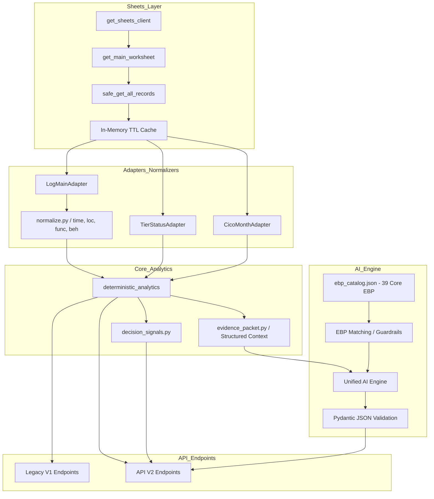

# PBSTeam 2.0 — Architecture Audit & Defect Map

## 1. P0 Critical Defects Matrix

| 결함 ID | 대상 파일 및 함수 | 문제점 요약 | 수정 방안 | 회귀 테스트 (Regression Test) |
|:---|:---|:---|:---|:---|
| **P0-01** | `backend/app/api/endpoints/bip.py` (`get_student_bip`) | 미정의 함수 `fetch_bip_by_code` 임포트 호출로 500 에러 | `sheets.py`의 `get_bip`으로 통일 | BIP 정상 조회 및 미존재 시 404/empty 반환 검증 |
| **P0-02** | `backend/app/services/sheets.py` (`toggle_tier2_status`) | `client` 변수 미정의로 `NameError` 크래시 | `client = get_sheets_client()` 추가 | Tier 2 토글 시 정상 시트 업데이트 검증 |
| **P0-03** | `backend/app/api/endpoints/student.py` (`update_tier`) | string tier 전달로 `TypeError` 발생 | dict 포맷(`{"Tier1": ...}`) 래핑 전달 | 학생 Tier 변경 API 200 반환 및 시트 반영 검증 |
| **P0-04** | `backend/app/api/endpoints/auth.py` | 평문 비밀번호 비교 및 비인가 엔드포인트 노출 | Hash 비교 및 백엔드 의존성 주입 | 비밀번호 해싱 검증 및 관리자 권한 검증 |
| **P0-05** | `frontend/src/app/components/AuthProvider.tsx` | localStorage 기반 프론트 전용 인증 우회 | React Context 전역 AuthProvider 구축 | 컴포넌트 간 실시간 로그인/로그아웃 동기화 검증 |
| **P0-06** | `frontend/src/app/student/[id]/page.tsx` | 클라이언트 사이드 인가 검사 (데이터 노출) | 백엔드 API에서 학급/학생 접근권한 선검증 | 비인가 학급 학생 데이터 API 403 차단 검증 |
| **P0-07** | `backend/app/main.py` | CORS `allow_origins=["*"]` 무제한 허용 | 명시적 허용 도메인 allowlist 설정 | 비허가 Origin CORS 차단 검증 |
| **P0-08** | `frontend/src/app/tier-status/page.tsx` | API 장애 시 하드코딩 210명 가짜 학생 fallback | 가짜 데이터 제거 및 `DATA_UNAVAILABLE` 표시 | API 에러 시 명시적 오류/빈 상태 렌더링 검증 |
| **P0-09** | `backend/app/services/analysis.py` | 빈도/강도 기반 Tier 2/Tier 3 자동 강제 판정 | 자동 변경 로직 제거, `DecisionSignal`로 분리 | `TierStatus` 시트의 Tier 값만 정답으로 유지됨을 검증 |
| **P0-10** | `backend/app/services/ai_insight.py` | 데이터 부족 시 고정된 가설(신체공격/과제회피) 자동 삽입 | 하드코딩 기본 가설 제거, `INSUFFICIENT_DATA` 출력 | 데이터 없을 시 가설 임의 생성 차단 검증 |
| **P0-11** | `frontend/src/app/student/[id]/bip/page.tsx` | AI 텍스트를 Regex로 1~8개 필드로 분할 파싱 | Pydantic JSON Schema 기반 구조화 출력 | AI 응답의 JSON 스키마 검증 및 UI 바인딩 검증 |
| **P0-12** | `backend/app/services/sheets.py` (`get_main_worksheet`) | `Log_Main` 미존재 시 자동 생성 fallback | 자동 생성 차단 및 `CRITICAL_DATA_CONTRACT_ERROR` 발생 | 보호 시트 부재 시 안전한 에러 발생 검증 |

---

## 2. Backend Service Dependency Graph

---

## 3. Dead Code & Refactoring Map

* **KEEP & ENHANCE**:
  - `normalize.py`: 시간대, 장소, 행동유형, 발생횟수 정규화 로직 계승
  - `evidence_packet.py`: 계산론적 통계 ➔ AI Context 압축 구조 계승
  - `ebp_catalog.json`: 39개 경기 Be-Able EBP 지식베이스 신규 표준화
* **REPLACE**:
  - `contagion.py` ➔ `interaction_signals.py` (인과추론 단정 및 학생 실명 하드코딩 제거)
  - `AuthProvider.tsx` ➔ React Context 기반 `<AuthContext.Provider>`로 전면 교체
  - `analysis.py`의 $O(N \times M)$ 선형 탐색 ➔ $O(1)$ 해시맵 벡터화
* **DELETE CANDIDATES** (검증 후 단계적 정리):
  - 루트 임시 스크립트: `do_push.py`, `push_fix.py`, `fix_cico_front.py`
  - 중복 normalizer 및 구버전 fallback 코드
